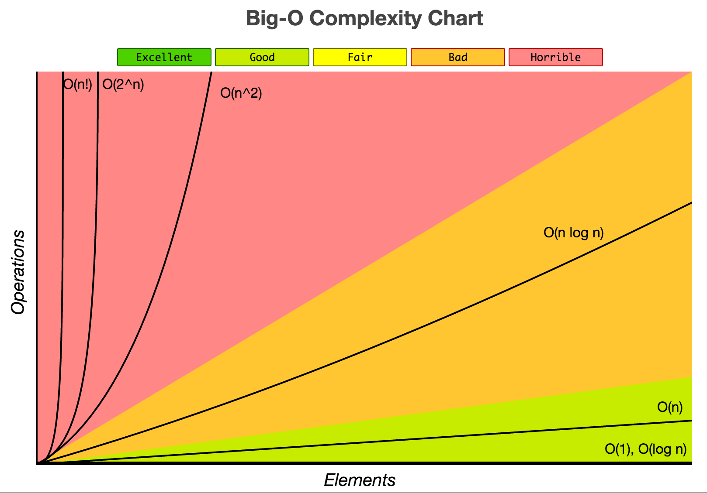
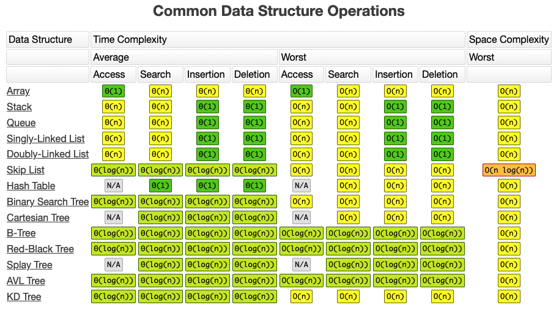
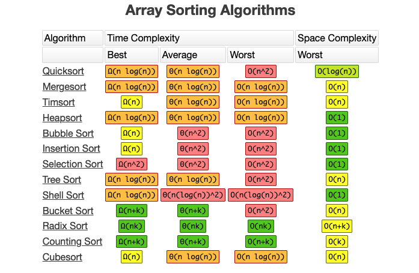

# 알고리즘의 성능을 판단하는 척도

- **정확성** (Output이 얼마나 정확한가?)
- **작업량** (얼마나 적은 연산을 필요로 하는가?)
- **메모리 사용량** (얼마나 적은 공간을 필요로 하는가?)
- **단순성** (얼마나 단순한가?)
- **최적성** (더 이상 개선할 여지가 없을만큼 최적화가 잘 되었는가?)

# 시간복잡도

**시간복잡도는 어떠한 문제를 해결하기 위해서 소요되는 시간을 의미하며 위의 척도 중에서 작업량에 중점을 둔 개념이다.** 프로그램의 실행시간은 연산의 양과 관련 있기 때문에 작업량을 기준으로 시간복잡도를 계산한다.

## 자료구조의 시간복잡도

## 정렬의 시간복잡도

# 공간복잡도

**공간복잡도는 어떠한 문제를 해결하기 위해서 소요되는 메모리 사용량을 의미한다.** 과거에는 기술적 한계로 인해 컴퓨터마다 충분한 메모리 공간을 확보할 수 없어서 크게 고려해야했지만 현재는 기술의 발전덕분에 그 중요성이 낮아졌다.

참고로 공간은 정적 공간과 동적 공간으로 나눌 수 있다. 즉, 이미 선언된 정적변수의 공간뿐만 아니라 재귀함수로 인해 동적으로 추가되는 공간도 포함한다는 의미이다.

# 표기법

알고리즘의 수행 시간과 사용 공간을 측정하기 위한 표기법은 아래와 같이 3가지가 있으며 **주로 빅-오 표기법을 사용한다.**

## 빅-Ω 표기법

**빅-오메가 표기법(Big-Omega Notation)은 최선의 경우를 나타낸다.** 즉, 아무리 상황이 좋아도 빅-오메가 표기법의 수준보다 빠를 수는 없다.

- 표기법: `Ω(증가함수)`
- Ex. `3n^2 + 5n + 2` -> `Ω(n^2)`

## 빅-Θ 표기법

**빅-세타 표기법(Big-Theta Notation)은 평균의 경우를 나타낸다.** 빅-세타 표기법의 증가함수는 빅-오와 빅-오메가 표기법을 모두 만족시키는 증가함수이다.

- 표기법: `Θ(증가함수)`
- Ex. `Θ( f(n) ) = O( f(n) ) ∩ Ω( f(n) )`

## 빅-O 표기법

**빅-오 표기법(Big-O Notation)은 최악의 경우를 나타낸다.** 즉, 아무리 열악한 환경일지라도 빅-오 표기법의 수준을 보장한다.

- 표기법: O(증가 함수)
- Ex. `3n^2 + 5n + 2` -> `O(n^2)`

# 참조

- https://www.bigocheatsheet.com/
- https://bit.ly/3uBpfwZ

 
