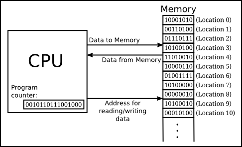

# 비트와 바이트 그리고 워드

먼저, 쉬운 이해를 위해서 컴퓨터의 기본 정보단위에 대해서 짚어보고자 한다.

## 비트(Bit)

**비트는 컴퓨터의 데이터 단위 중에 가장 작은 단위를 의미하며, 0(전류가 흐르지 않음), 1(전류가 흐름)이라는 2가지 상태를 저장할 수 있다.** 예를 들어, n개의 비트에 저장할 수 있는 상태의 수는 2^n 이다. 또한, 컴퓨터 자체가 0과 1이라는 2가지 상태를 제어할 수 있다는 개념에서 출발 했기 때문에 컴퓨터의 모든 연산에서는 2진수를 사용한다.

## 바이트(Byte)

**바이트는 8개의 비트들로 구성된 컴퓨터의 기본 데이터 단위를 의미하며, 256(2^8)개의 상태를 저장할 수 있다.** 여기서 누군가는 '왜 굳이 8비트를 1바이트로 정의한 것인가?'라는 의문을 가질 수 있는데, 개인적인 견해로는 컴퓨터가 미국에서 개발되었고, 컴퓨터 통신을 위해 미국이 개발한 ASCII코드(7byte) + 통신에러검출을 위한 Parity Byte(1Byte)를 토대로 1바이트에 통신을 위한 한 개의 문자를 저장하기 위함이 아니었을까라는 생각을 해본다.

## 워드(Word)

**워드는 컴퓨터 연산의 기본 단위를 의미한다.** 즉, 컴퓨터의 모든 명령은 워드의 길이에 기반해서 수행되고 보통 워드의 길이는 CPU내의 명령 레지스터(IR)의 길이와 동일하다. 통상적으로 사용되는 32비트 컴퓨터, 64비트 컴퓨터라는 명칭에서 해당 비트의 수가 워드의 길이를 의미한다. 예를 들어, 자신의 컴퓨터가 32비트라고 한다면 한번 연산할 때마다 32비트의 데이터를 처리한다는 뜻이다.

# 32비트와 64비트 시스템의 차이

이전보다 더 많은 데이터를 메모리에 저장하고 더 빠른 처리 속도를 요구하는 시대의 흐름에 따라 현재 대부분의 컴퓨터 시스템이 64비트로 변경되었다.

그렇다면 왜 대부분의 컴퓨터들이 64비트로 변경해야되었고, 32비트와 64비트 시스템의 차이는 무엇일까?
일단 **이 시스템간의 가장 큰 차이는 CPU가 구조적으로 수용할 수 있는 메모리 주소 공간의 크기 차이이다.**

## 이해를 위해 알아둘 CPU 용어

**명령 레지스터(Instruction Register) : 현재 실행중인 명령의 내용을 저장하는 레지스터**

**프로그램 카운터(Program Counter) : 다음에 실행할 명령어의 주소값을 저장하는 레지스터**

 

먼저, 32비트와 64비트 시스템은 앞서 언급했던 워드의 길이가 다르다. 이 말은 CPU내 명령 레지스터(IR)의 길이 역시 32비트 시스템은 4바이트, 64비트 시스템은 8바이트라는 의미이고 프로그램 카운터(PC)의 크기도 또한 4바이트와 8바이트로 이루어져있다. 참고로 메모리의 주소는 기본적으로 1바이트당 하나의 주소를 할당하는 방식이다.

여기서 32비트 시스템의 경우에 `2^32 Byte`의 메모리 공간을 사용할 수 있다. 이를 계산해보면, `4,294,967,296 Byte`로 약 `4.29GB`를 의미한다. 다시 말해 32비트 시스템에서는 메모리를 약 `4.29GB`만을 사용할 수 있다는 것이다.

그럴수 밖에 없는 예를 들면, 프로그램 카운터(PC)는 다음 CPU가 수행할 다음 명령어의 주소값을 저장해야하는데 구조적으로 길이가 부족해서 `2^32 Byte` 이상의 주소값을 저장할 수 없는 것이다. 이외에도 명령어 레지스트(IR), 버스(BUS)등의 구조적인 문제가 하나의 예가 될 수 있다.

여기까지의 내용과 현재 사용되는 대부분의 프로그램의 권장 메모리 용량을 생각해본다면, 왜 대부분의 컴퓨터 시스템들이 64비트로 변경되어야 할 수 밖에 없었는지에 대한 답이 되었을 것 같다.

# 64비트 시스템의 주소값 제한

그렇다면 앞에서 32비트 시스템의 가용 메모리 공간을 계산했듯이 현재의 64비트 시스템의 가용 메모리를 계산해보면 `2^64 Byte(약 18,446,744,073,709,551,616 = 약 18.4엑사바이트)`이기 때문에 `18.4엑사바이트`만큼 메모리의 공간을 할당해 사용할 것 같지만 **실제로는 `2^48 Byte`만 사용한다. 왜냐하면 너무나 큰 값이기 때문이다.**

정말 `2^48 Byte`만 사용하는지 확인하고 싶다면 64비트 시스템 환경에서 주소값을 출력해보면 `0x7ffeebf09768` 으로 주소값이 16진법으로 12자리로 출력되는 것을 확인할 수 있다. 16진법으로 12자리가 출력되므로 전체 메모리 주소의 크기는 `(2^4)^12 = 2^48 Byte`라는 것을 검증해볼 수 있다.

추가적으로 `2^48 Byte`를 우리에게 익숙한 단위로 환산해보면 `32TB`이기 때문에 이 정도로 제한해서 사용하더라도 먼 훗날 메모리를 `32TB`이상 사용할 때까지는 문제가 없다고 보면 된다.

# 참고

- 컴퓨터 저장용량 정리사이트 - https://www.aqua-calc.com/page/powers-of-two
- 주소값 지정 제한의 이유 - https://stackoverflow.com/questions/6716946/why-do-x86-64-systems-have-only-a-48-bit-virtual-address-space
