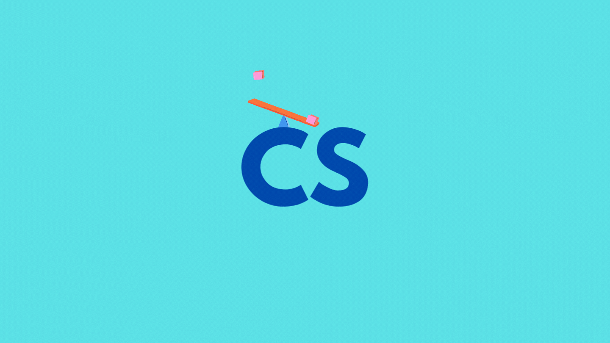
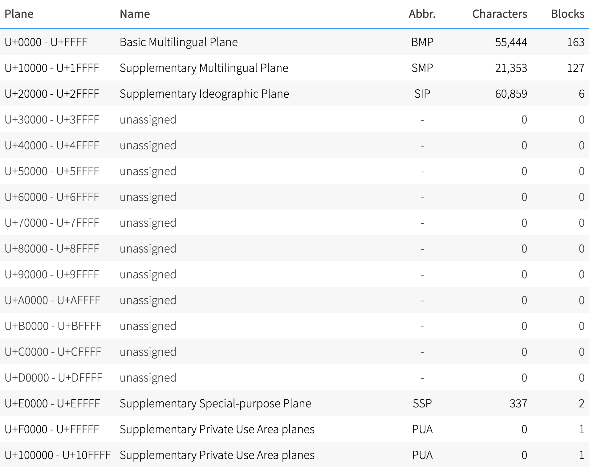

# 문자셋

**하나의 언어권에서 사용하는 언어를 표현하기 위한 모든 문자들의 집합을 문자셋(Charactor Set)**이라고 하며 byte의 길이에 따라 다음과 같이 분류한다.

- SBCS(Single Byte Charactor Set) : 문자 표현에 있어서 1byte만 사용하는 방식 (ASCII)
- MBCS(Multi Byte Charactor Set) : 문자 표현에 있어서 문자마다 가변적인 byte의 길이를 사용하는 방식
- WBCS(Wide Byte Charactor Set) : 모든 문자 표현을 2bytes만 사용하는 방식 (Unicode)

# 인코딩

**인코딩(Encoding)은 정의된 문자셋을 컴퓨터가 이해할 수 있도록 byte와 맵핑하는 과정이자 규칙이다.**
예를 들자면, ASCII 코드 문자 A의 코드 65를 컴퓨터가 이해할 수 있도록 byte code로 변환해주는 것이다.

# ASCII

**ASCII(American Standard Code for Information Interchange)는 미국에서 오직 영어만을 고려해서 정의한 표준화된 통신부호체계이자 최초의 문자열 인코딩이다.** 이는 7bits로 구성되어 있으며, 영어를 위한 문자와 숫자, 특수문자, 기호, 제어문자등 128개 문자를 표현할 수 있다.

다음의 표를 보면 0 ~ 32까지는 인쇄와 전송 제어에 사용되는 용어, 33 ~ 127까지는 알파벳 대소문자와 숫자 그리고 특수문자들로 이루어진 것을 볼 수 있다.

# ANSI

**ANSI(American National Standard Institute)는 ASCII 에서 한 비트를 확장한 8bits로 구성되고 256개의 문자를 표현할 수 있다.** 이는 영어외의 다른 언어들을 표현하기 위해 확장된 개념인데 고작 추가된 128개 문자로 모든 언어의 문자를 표현할 수 없었다. 그래서 생겨난 개념이 CodePage이다. 이는 각 언어별로 Code값을 주고 Code마다 다른 문자열 표를 배정하도록 했다.

**ANSI = ASCII(7bits) + CodePage(1bit)**

그러나 ANSI도 한국, 일본, 중국과 비유럽국가들의 문자를 표현하기에는 부족했고, 각 언어마다 CodePage가 따로 배정되어서 언어들을 혼합하여 사용할 수 없었다. 그래서 등장한 것이 마지막에 설명할 유니코드(Unicode)이다.

# EUC-KR

**EUC-KR(Extended Unix Code-Korea)은 한글 지원을 위해 유닉스 계열에서 나온 완성형 코드 조합이다.**

완성형 코드란 완성 된 문자 하나하나마다 코드 번호를 부여한 것이고 이와 반대되는 개념인 조합형 코드는 한글의 자음과 모음 각각에 코드 번호를 부여한 후 초성, 중성, 종성을 조합하여 하나의 문자를 나타내는 방식을 말한다.
EUC-KR은 ANSI를 한국에서 확장한 것으로 한국을 제외한 대부분 나라에서 지원이 불가하다.

# CP949

**CP949(Code Page 949)는 한글 지원을 위해 윈도우즈 계열에서 나온 완성형 코드 조합이며 마이크로소프트에서 만들었다고 해서 MS949라고도 부른다.**

EUC-KR은 2bytes의 완성형 코드로 2bytes 내에서는 표현할 수 있는 완성된 문자의 수는 한계가 있었다.
그래서 마이크로소프트에서 이를 확장하여 만든 것이 CP949 이다. 여기서 949는 페이지 번호를 의미하며 한국을 의미하고 언어마다 고유의 번호가 붙는다.

# 유니코드

**유니코드(Unicode)는 전 세계의 모든 문자를 컴퓨터에서 일관되게 표현할 수 있도록 고안된 코드 조합이다.** 유니코드는 이전에 비해 용량을 크게 확장한 `2byte(2^16 = 65,536)` 사용하였는데 유니코드 3.0까지는 이 2byte 영역을 다국어 기본 평면(BMP, Basic Multilingual Plane)라고 불렀다.

처음에는 65536개에 모든 언어를 담을 수 있을 거라고 생각했지만 이마저도 부족해서 이를 해결하기 위해 유니코드 3.0부터 보충언어판(Supplementary Plane)을 정의했다. 이는 BMP(다국어 기본 평면)의 일부를 상위대행(high surrogates, 1024자)과 하위대행(low surrogates, 1024자)으로 할당한 뒤 이 둘의 조합으로 생겨난 약 `백만자(1024 x 1024 = 1,048,576)`가 넘는 문자를 추가로 정의했다.

이로써, 유니코드에는 `65,536(BMP)` + `1,048,576(상,하위대행의 조합)` - `2,048(상,하위대행에 사용된 영역)` = `1,112,064자`의 문자를 지정할 수 있게 되었는데, 유니코드는 이를 아래의 표와 같이 17개 구역으로 나눴다.(참고로 전체 영역인 1,112,064를 2byte인 65,536으로 나눈 값이 약 16.96 이라서 17개 구역인 것 같다.)

추가로 유니코드의 각 문자는 코드포인트라는 숫자에 대응된다. 예를 들어 'A'는 U+41에 대응되고 여기서 U+는 코드포인트라는 의미이다.

# UTF - 8

대체로 유니코드와 UTF 인코딩 방식을 같은 개념으로 생각하는데, **유니코드는 인코딩이 아니다.**
유니코드는 전 세계의 모든 문자를 2bytes로 매핑한 방식의 코드표를 의미하고, **이 코드표를 컴퓨터가 이해할 수 있도록 하는 여러가지 인코딩 방식 중 하나가 UTF-8. UTF-16 등이다.**
(그래도 구분이 어렵다면 [여기](https://stackoverflow.com/questions/643694/what-is-the-difference-between-utf-8-and-unicode)를 참조하자.)

**UTF-8(Universal Coded Character Set + Transformation Format – 8 bit)은 유니코드를 위한 가변 길이 인코딩 방식이다.** 쉽게 말하면 문자마다 byte 크기가 다르다는 것이다.

첫 128자는 ASCII 코드 값으로 ANSI와 UTF-8이 동일하다. 때문에 영어를 사용할 경우 1byte만 사용한다.
하지만 많은 유럽지역의 나라들과 중동지역의 나라들의 언어는 2bytes를 사용하며, 한국,일본,중국등 동아시아권 나라들의 언어는 3bytes 이상을 사용한다.
UTF-8은 매우 일반적인 인코딩 방식이지만 3bytes 이상의 문자를 사용할 경우에는 비효율적일 수 있다.

UTF-16은 16bit 기반으로 저장하는 UTF-8의 변형이라고 보면 된다.
한글의 경우 UTF-8로 저장할 경우 3bytes가 필요한데, UTF-16로는 2bytes면 가능해서 용량의 이점이 있다. 그러나 특정한 경우에는 2bytes 이상을 사용하기도 해서 용량상의 큰 이점이 있다고 볼 수 없고 [엔디언](<https://ko.wikipedia.org/wiki/%EC%97%94%EB%94%94%EC%96%B8#:~:text=%EC%97%94%EB%94%94%EC%96%B8(Endianness)%EC%9D%80%20%EC%BB%B4%ED%93%A8%ED%84%B0,(Byte%20order)%EB%9D%BC%20%ED%95%9C%EB%8B%A4.>) 처리를 고려함에 따른 복잡성 증대나 ANSI와 호환이 안되는 단점이 있다.

UTF-32는 모든 문자를 4bytes로 인코딩한다. 문자 변환 알고리즘이나 가변 길이 인코딩 방식에 대한 고민을 하고 싶지 않을 때 유용할 수 있다. 그러나 메모리 사용이 비효율적이라서 자주 사용되지는 않는다.

유니코드를 UTF-8로 인코딩하는 과정은 [여기](https://ko.wikipedia.org/wiki/UTF-8)를 참조하면 된다.

# 참조

- ASCII Code 일람표 - https://m.blog.naver.com/ansdbtls4067/220624120433
- 문자열 인코딩 개념 - https://onlywis.tistory.com/2
- Unicode와 UTF-8 차이 - https://stackoverflow.com/questions/643694

 
