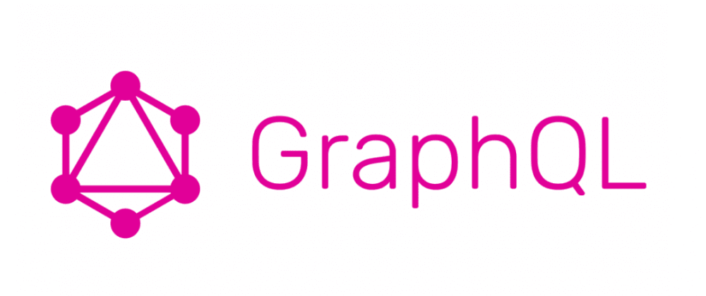
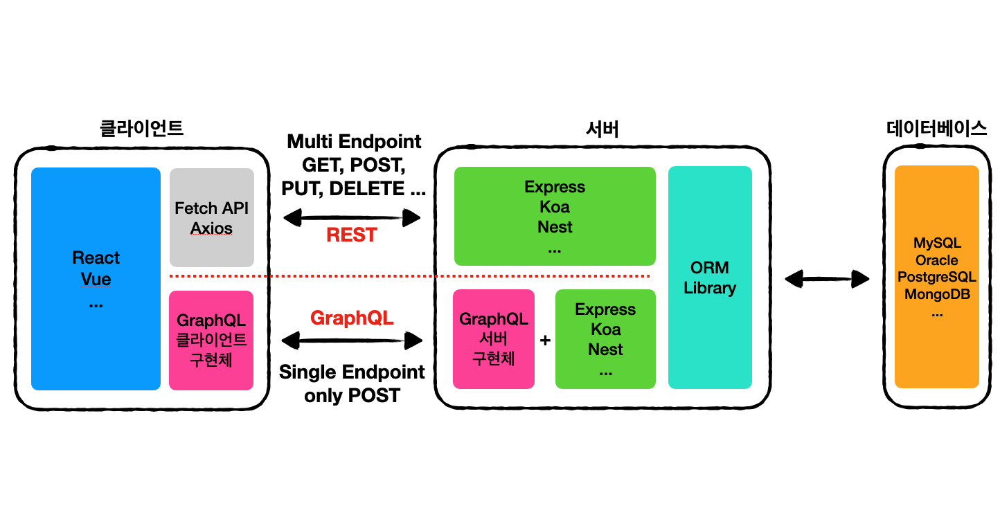
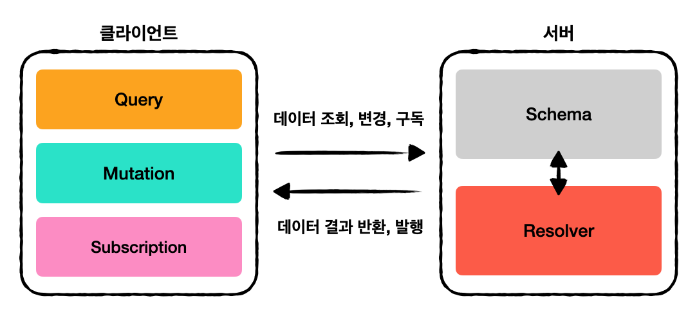

이 글은 [GitHub-Graph 프로젝트](https://github.com/Leo-Xee/github-graph)를 진행하면서 처음 사용해본 GraphQL의 개념을 정리합니다.

# GraphQL이란?



**GraphQL은 Graph Query Language의 약자로써 페이스북에서 내부적으로 사용하다가 2015년에 공개된 쿼리 언어이다.** 이는 REST의 대안이 되며 REST가 하나의 구현체가 아닌 명세이듯이 GraphQL도 구현체가 아닌 하나의 [명세](https://github.com/graphql/graphql-spec)이다. GraphQL의 구현체는 [공식문서](https://graphql.org/code/)에 정리되어있듯이 다양한데 프론트엔드 개발자 입장에서 익숙한 구현체는 Apollo, graphql-yoga, Relay, AWS Amplify 정도가 있겠다.

그럼 GraphQL은 정확히 어떤 역할을 하는걸까? 먼저 쿼리 언어라는 단어가 익숙하지 않을 수 있는데 우리는 이미 SQL이라는 쿼리 언어를 알고 있다. SQL은 Structed Query Language로써 서버가 DBMS한테 원하는 데이터를 요청하고 응답받는 것이 주요 역할이라면 **GraphQL은 클라이언트가 서버에게 데이터를 요청하고 응답받는것이 주요 역할이다. 즉, APIs를 위한 쿼리 언어인셈이다.**

## 등장 배경

새로운 기술은 기존 기술의 약점을 기반으로 자라는 법이다. 그렇다면 GraphQL이 개선하고자한 REST의 단점은 무엇이었을까? 예시를 통해 알아보자.

다음 예시는 GitHub REST API를 사용해 한 유저의 정보를 GET 요청해서 받은 응답이다.

```json
// GET /users/{username}

{
  "login": "octocat",
  "id": 1,
  "node_id": "MDQ6VXNlcjE=",
  "avatar_url": "https://github.com/images/error/octocat_happy.gif",
  "gravatar_id": "",
  "url": "https://api.github.com/users/octocat",
  "html_url": "https://github.com/octocat",
  "followers_url": "https://api.github.com/users/octocat/followers",
  "following_url": "https://api.github.com/users/octocat/following{/other_user}",
  "gists_url": "https://api.github.com/users/octocat/gists{/gist_id}",
  "starred_url": "https://api.github.com/users/octocat/starred{/owner}{/repo}",
  "subscriptions_url": "https://api.github.com/users/octocat/subscriptions",
  "organizations_url": "https://api.github.com/users/octocat/orgs",
  "repos_url": "https://api.github.com/users/octocat/repos",
  "events_url": "https://api.github.com/users/octocat/events{/privacy}",
  "received_events_url": "https://api.github.com/users/octocat/received_events",
  "type": "User",
  "site_admin": false,
  "name": "monalisa octocat",
  "company": "GitHub",
  "blog": "https://github.com/blog",
  "location": "San Francisco",
  "email": "octocat@github.com",
  "hireable": false,
  "bio": "There once was...",
  "twitter_username": "monatheoctocat",
  "public_repos": 2,
  "public_gists": 1,
  "followers": 20,
  "following": 0,
  "created_at": "2008-01-14T04:33:35Z",
  "updated_at": "2008-01-14T04:33:35Z"
}
```

하지만 내가 실제로 필요한 데이터가 `login`, `name`, `company`, `email`, `html_url`, `avatar_url`, `location` 정도라면 나머지 데이터는 네트워크 비용만 낭비하는 것이다. 이런 문제를 Over-Fetching 이라고한다. 또한 이 문제를 해결하고자 API를 더 쪼갠다면 요청한 데이터가 충분하지 않아서 추가적인 요청을 해야하는 Under-Fetching 문제가 필연적으로 발생할 것이다.

- Over-Fetching : 필요하지 않은 데이터를 너무 많이 가져오는 것
- Under-Fetching : 데이터를 충분히 가져오지 못해서 추가 요청을 해야하는 것

<br>

**이러한 문제를 GraphQL은 클라이언트에서 필요한 데이터의 구조를 정의해서 요청할 수 있도록 해서 REST의 문제를 해결한다.**

아래의 코드는 위 예시에서 필요한 데이터만 요청하는 GraphQL의 Query와 응답이다. 원하는 데이터의 구조로 요청해서 응답을 받을 수 있음을 확인할 수 있다.

```q
query {
  user(login: "leo-xee") {
    login
    name
    email
    websiteUrl
    company
    avatarUrl(size: 200)
    location
	}
}}
```

```json
{
  "data": {
    "user": {
      "login": "Leo-Xee",
      "name": "Jangmin Lee",
      "email": "jang.xmin@gmail.com",
      "websiteUrl": "https://leo-xee.github.io",
      "company": null,
      "avatarUrl": "https://avatars.githubusercontent.com/u/21965795?s=200&u=d5bd04940150788a2aa483bec04af776b26f5906&v=4",
      "location": "Seoul, South Korea"
    }
  }
}
```

## REST와 비교

REST와 GraphQL의 동작 방식의 대략적인 과정을 비교해보면 다음과 같다.


### REST

- URL과 HTTP 메소드를 조합해서 사용하기 때문에 다양한 엔드포인트를 사용한다.
- 응답 구조가 미리 정의되어 있기 때문에 HTTP에 의해 캐시를 확실하게 관리할 수 있다.
- 네트워크 요청의 횟수가 많아질 수 있고 불필요한 데이터를 포함한 응답을 받을 수 있다.

### GraphQL

- 오직 하나의 엔드포인트만을 사용하고 주로 POST 메소드을 사용한다.
- 파일과 같은 미디어 전송 처리가 REST보다 복잡하다.
- 일반적인 경우에 네트워크 요청의 횟수와 사이즈를 줄일 수 있다.
- 고정된 요청과 응답만을 할 경우에는 REST보다 네트워크 비용이 더 커질 수 있다.

<br >

**위의 비교에서 확인할 수 있듯이 GraphQL이 REST의 문제를 해결하기는 하지만 무조건 GraphQL이 좋다고는 할 수 없다. 그렇기 때문에 애플리케이션에 성격에 따라서 이점을 검토해보고 선택하는 것이 바람직할 것 같다.**

# GraphQL의 구성요소



## Query와 Mutation 그리고 Subscription

**GraphQL은 작업을 위한 타입으로 데이터 조회를 위한 Query와 데이터 추가, 수정, 삭제를 위한 Mutation 그리고 실시간 데이터 반영을 위한 Subscription을 제공한다.**

- Query, Mutation : 서버/클라이언트 모델, HTTP 프로토콜 사용
- Subscription : 발행/구독 모델, Web Socket 프로토콜 사용

## Schema

**Schema는 Query, Mutation, Subscription이 요청할 객체 데이터의 타입을 미리 정의해두는 역할을 한다.**

Schema는 다음과 같은 구조를 가지며 `Scalar Types`를 기반으로 타입이 정의 되어야한다.

```q
type Character {
  name: String!
  appearsIn: [Episode!]!
}
```

### Scalar types

- `Int` : 부호가 있는 32비트 정수
- `Float` : 부호가 있는 부동소수점
- `String` : UTF-8기반 문자열
- `Boolean` : 논리값
- `ID` : 유일한 식별자

### Object types

- `Charactor` : GraphQL의 객체 타입
- `String!` : `null`이 될수 없는 `String` 타입
- `[Episode!]!` : `null`이 될 수 없는 `Episode` 객체 타입을 요소로 가지는 `null`이 될 수 없는 배열

## Resolver

**Resolver는 Query, Mutation, Subscription의 요청을 서버에서 처리하는 역할을 한다. 다음 코드와 같이 요청마다 어떻게 처리해서 응답을 줄지는 직접 구현해야한다.**

```ts
Query: {
  human(obj, args, context, info) {
    return context.db.loadHumanByID(args.id).then(
      userData => new Human(userData)
    )
  }
}
```

<br/>

# 참조

- https://graphql.org/learn/
- https://tech.kakao.com/2019/08/01/graphql-basic/

<br/>
