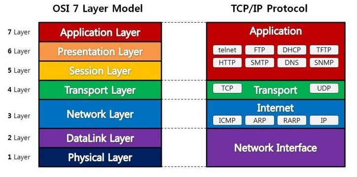

# OSI 7 Layer와 TCP/IP 4 Layer

일단 네트워크에 대한 학습을 하기 전에 필요한 핵심 개념이 OSI 7 Layer이다.

**OSI 7 Layer는 국제표준화기구(ISO)에서 개발한 추상적인 모델이다.** 추상 모델인 이유는 실제 상세한 구현에 대한 내용이 아닌 개념 모델이기 때문이다. 이 모델의 개발 이전에는 다수의 통신업체들의 장비들이 서로 호환되지 않아 전체의 비용증가를 동반한 비효율이 발생했다. 이런 문제를 ISO에서 7개의 계층의 모델을 표준으로 지정함으로 해결했다고 볼 수 있다.

인터넷이 크게 성공하고 대중화 되면서 이후에는 OSI 7 Layer의 복잡함을 간략화한 TCP/IP 4 Layer가 등장한다. 참고로 이는 ISO에서 만든 모델은 아니다.

**간단함을 추구하는 시대의 흐름과 시장의 트렌드를 따라 결과적으로 실무에서 가장 많이 쓰이는 방식은 TCP/IP 4 Layer 방식이 되었는데 그렇다고 OSI 7 Layer가 사용되지 않는 것은 아니다.** 공식 표준은 OSI 7 Layer이기 때문에 전반적인 이론이나 문서는 이를 참고하는게 좋다.

# 통신 프로토콜

## 개념과 구성요소

사람들이 의사소통을 하기 위해서는 언어의 문법이라는 일련의 약속이 필요하다. 이처럼 **통신 프로토콜(Communication Protocol)이란 컴퓨터나 통신장비들 사이에서 원활한 데이터 교환을 수행하기 위해 표준화한 통신 규약이다.**

통신 프로토콜은 다음과 같은 요소로 이루어져있다.

- **구문(Syntax)** : 전송하고자 하는 데이터의 형식, 부호화, 신호 레벨등을 규정
- **의미(Semantics)** : 두 기기 간의 효율적이고 정확한 정보 전송을 위한 협조 사항과 오류 관리를 위한 제어 정보를 규정
- **시간(Timing)** : 두 기기 간의 통신 속도, 메시지의 순서 제어 등을 규정

## 주요 기능

- **단편화와 재결합**
  - 송신 측에서 전송할 데이터를 전송에 알맞은 일정 크기의 작은 블록으로 자르는 작업을 단편화(Fragmentation)이라 하고, 수신 측에서 단편화된 블록을 원래의 데이터로 모으는것을 재결합(Reassembly)이라고 한다.
- **캡슐화**
  - 캡슐화(Encapsulation)는 단편화된 데이터에 송,수신지 주소, 오류 검출 코드, 프로토콜 기능을 구현하기 위한 프로토콜 제어 정보 등의 정보를 부가하는 것이다.
- **흐름제어**
  - 흐름제어(Flow Control)는 수신 측의 처리 능력에 따라 송신 측에서 송신하는 데이터의 전송량이나 전송 속도를 조절하는 기능이다.
- **오류제어**
  - 오류제어(Error Control)는 전송중에 발생하는 오류를 검출하고 정정하여 데이터나 제어 정보의 파손에 대비하는 기능이다.
- **동기화**
  - 동기화(Synchronization)는 송, 수신 측이 같은 상태를 유지하도록 타이밍(Timing)을 맞추는 기능이다.
- **순서지정**
  - 부여하는 기능으로, 연결 위주의 데이터 전송 방식에만 사용됩니다. 송신 데이터들이 순서적으로 전송되도록 함으로써 흐름 제어 및 오류 제어를 용이하게 하는 기능이다.
- **다중화**
  - 주소지정(Addressing)은 데이터가 목적지까지 정확하게 전송될 수 있도록 목적지 이름, 주소, 경로를 부여하는 기능입니다. 목적지 이름은 전송할 데이터가 가리키는곳, 주소는 목적지의 위치, 경로는 목적지에 도착할 수 있는 방법이다.
- **경로제어**
  - 경로제어(Routing)는 송, 수신 측 간의 송신 경로 중에서 최적의 패킷 교환 경로를 설정하는 기능이다.

## 주요 통신 프로토콜의 종류

### L7 - 응용 계층 (Application Layer)

**HTTP(HyperText Transfer Protocol)**

- WWW(World Wide Web) 상에서 데이터를 주고 받을 수 있는 프로토콜
- 주로 HTML문서를 주고 받는 것에 사용되고 TCP와 UDP를 사용
- 80번 포트 사용

**SMTP(Simple Mail Transfer Protocol)**

- 인터넷 상에서 이메일을 주고 받기 위해 사용되는 프로토콜
- TCP를 사용
- 25번 포트 사용

**FTP(FIle Transfer Protocol)**

- 통신 기기들간의 파일을 전송하는데 사용되는 프로토콜
- 데이터 전달은 20번 포트, 제어정보전달은 21번 포트 사용

**TELNET**

- 인터넷이나 로컬 영역 네트워크 연결에 쓰이는 네트워크 프로토콜
- 보안 문제로 거의 사용되지 않으며 원격제어를 위해 SSH로 대체

### L6 - 표현 계층(Presentation Layer)

**SSL(Secure Socket Layer)**

- 네트워크 레이어의 암호화 방식, HTTP뿐만 아니라 FTP등에도 사용
- 인증, 암호화, 무결성을 보장하는 프로토콜

**ASCII(American Standard Code for Information Interchange)**

- 7비트의 인코딩으로 33개의 제어 문자와 95개의 영어문자로 이루어짐

### L5 - 세션 계층(Session Layer)

**NetBIOS**

- 네트워크의 기본 입출력을 정의한 규약

**RPC(Remote Procedure Call)**

- Windows OS에서 사용하는 원력 프로시저 호출 프로토콜

**WinSock(Windows Socket)**

- 유닉스 기반의 OS에서 TCP/IP 통신시에 사용하는 Socket을 Windows에서 구현한 것

### L4 - 전송 계층(Transport Layer)

**TCP(Transmission Control Protocol)**

- 연결지향적인 전송제어 프로토콜, 네트워크의 데이터 전달을 통제하는 프로토콜
- 데이터의 전달을 보증하고 보낸 순서대로 받을 수 있음
- 3 Way Handshaking과 4 Way Handshaking 을 통해 연결지향적이고 신뢰성 있는 전송 가능

**UDP(User Datagram Protocol)**

- 비연결적이고 신뢰적이지 않으며 순서화되지 않은 Datagram 전송을 통제하는 프로토콜
- UDP는 신뢰성이 낮더라도 빠른 응답이 필요한 시스템에 적합(ex.통화 시스템)

### L3 - 네트워크 계층(Network Layer)

**IP(Internet Protocol)**

- 송수신 호스트가 패킷 교환 네트워크에서 정보를 주고받는데 사용하는 정보 위주의 규약
- 호스트의 주소지정과 패킷 분할 및 조립 기능을 담당

**ICMP(Internet Control Message Protocol)**

- TCP/IP에서 IP 패킷을 처리할 때 발생되는 오류를 보고
- IP에서 필요한 진단과 오류검출등과 같은 기타 기능들을 수행하기 위해 사용되는 프로토콜

**IGMP(Internet Group Management Protocol)**

- IP 멀티캐스트를 실현하기 위한 통신 프로토콜
- 클라이언트가 멀티캐스트로 통신할 수 있다는 것을 라우터에게 알기 위한 규약

### L2 - 데이터 링크 계층(Data Link Layer)

**Ethernet**

- 비연결성 모드, 전송속도 10Mbps 이상, LAN 구현 방식을 의미

**HDLC(High-Level Data-Link Control)**

- 고속 데이터 전송에 적합하고, 비트 전송을 기본으로 하는 범용 데이터 링크 전송 제어절차

**PPP(Point-to-Potin Protocol)**

- 전화선과 같이 양단간의 비동기 직렬 링크를 사용하는 기기간의 통신을 지원하는 프로토콜

### L1 - 물리 계층(Physical Layer)

**RS-232**

- 보통 15m이하의 단거리에서 38400bps로 전송을 위한 직렬 인터페이스

**X.25/X.21**

- X.25는 패킷교환망, X.21은 회선교환망을 위한 액세스 표준

# 참조

- Layer별 주요 프로토콜 종류 - https://needjarvis.tistory.com/158
- 프로토콜의 정의 - https://bit.ly/3h35eXK
- OSI 7 Layer 이해 - https://velog.io/@devzunky/TIL-no.89-Network-The-7-Layers-of-the-OSI-Model

 
