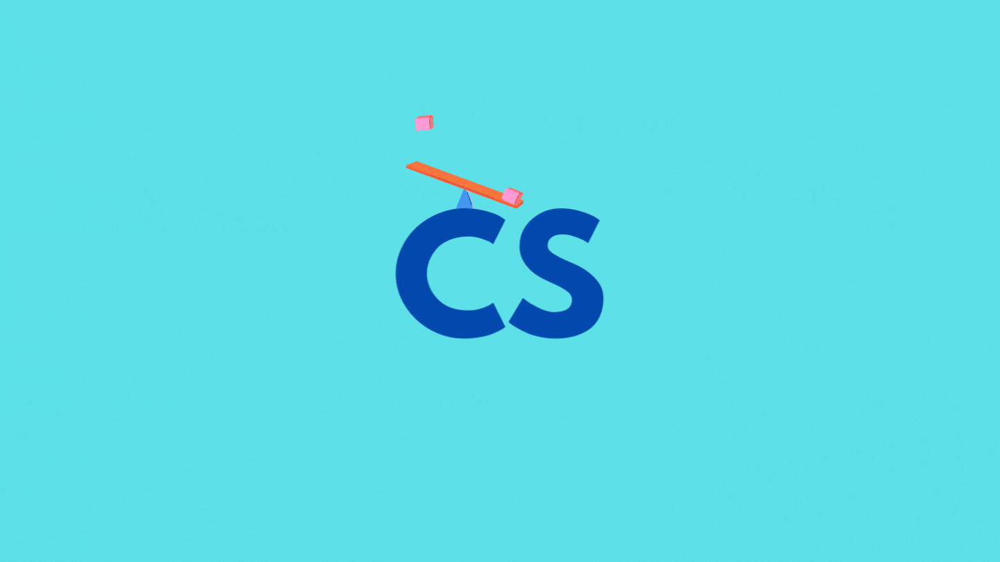
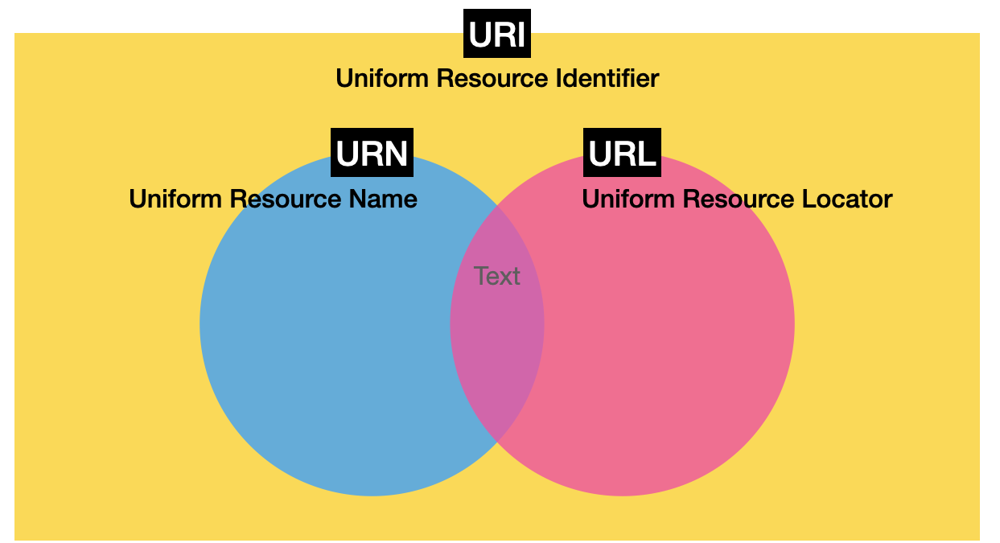
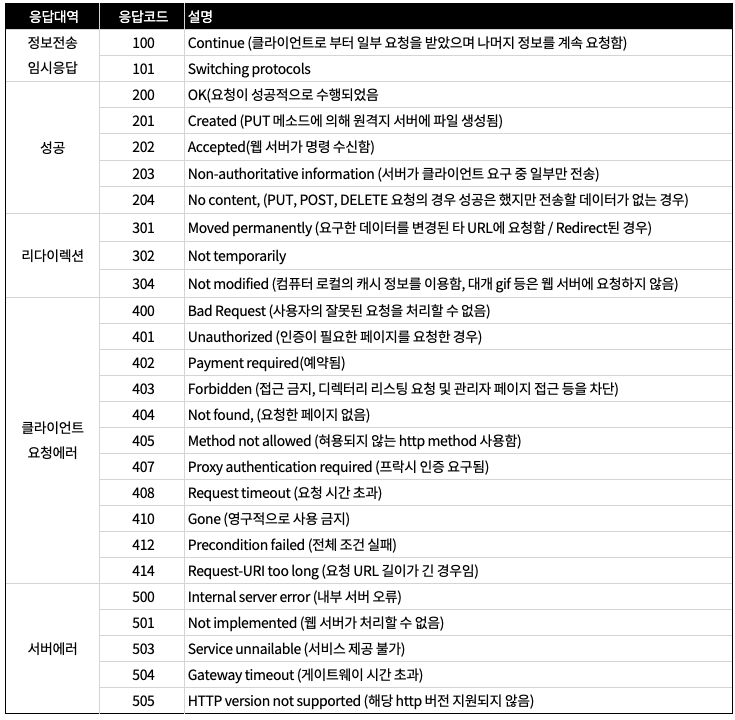

# REST API란?

**REST(REprecentational State Transfer)는 HTTP 통신에서 어떤 자원에 대한 CRUD 요청을 Resource와 Method로 표현하여 특정한 형태로 전달하는 아키텍쳐 스타일을 의미한다.** 이는 HTTP의 주요 저자 중 한 사람인 로이 필딩(Roy Fielding)의 2000년 박사학위 논문에서 소개되었다. REST 아키텍쳐 형식을 따르는 시스템에 RESTful이라는 표현을 주로 사용하고 REST형식을 따라 API를 구현했을 때 이를 RESTful API라고 한다.

# 구성 요소

REST API는 다음과 같이 구성되어 있다.

**자원(Resource)**

URI서버는 유일한 Resource를 가지고 있고 클라이언트는 Resource에 요청을 보낸다. 여기서 Resource를 URI라고 일컫는다.

**행위(Verb)**

HTTP METHOD서버에 요청을 보내기 위한 방식으로 GET, POST, PUT, DELETE가 있다. CRUD 연산 중에서 처리를 위한 연산에 Method를 사용해 서버에 요청을 한다.

**표현(Representations)**

클라이언트와 서버가 데이터를 주고 받는 형태로 주로 JSON을 사용한다.

## URI와 URL의 차이

**URI는 어떤 자원을 식별하기 위한 데이터 서식을 정의한 기술표준이다.** 어떤 자원을 식별하기 위한 방식으로 두 가지가 있는데 바로 `URN`과 `URL`이다. URN은 자원의 이름으로 식별하는 방식이고 `urn:namespace:the:Id:for:file`와 같은 형식으로 사용되며 `URL`은 자원의 위치로 식별하는 방식이고 `https://github.com/leo-xee`와 같은 형식으로 사용된다.

# 특징

**Uniform Interface**

Uniform Interface는 URI로 지정한 리소스에 대한 조작을 통일되고 한정적인 인터페이스로 수행하는 아키텍처 스타일을 의미한다.

**Stateless(무상태성)**

REST는 작업을 위한 상태정보를 따로 저장 및 관리하지 않는다. 세션이나 쿠키정보를 별도로 저장하고 관리하지 않기 때문에 API 서버는 요청만 처리하면 된다. 이 덕분에 서비스의 자유도가 높아지고 서버에서 불필요한 정보를 관리하지 않음으로 구현이 단순해진다.

**Cache(캐시)**

REST는 HTTP이라는 웹표준으로 그대로 사용하기 때문에 HTTP의 인프라를 그대로 활용할 수 있다. 따라서 HTTP가 가진 캐싱 기능(Last-Modifed, E-Tag)이 적용 가능하다.

**Self-descriptiveness(자체 표현구조**)

REST API 메시지만으로도 목적을 쉽게 이해할수 있는 자체 표현 구조로 되어 있다.

**Client-Server(클라이언트-서버)**

REST에서 서버와 클라이언트는 각각의 역할이 확실하게 구분되기 때문에 서로에 대한 복잡한 의존성이 줄어든다.

**Layered System(계층형 구조)**

REST에서 서버는 다중 계층으로 구성될 수 있기 때문에 구조상의 유연성을 가질 수 있다.

# 디자인 가이드

REST API 설계 시 가장 중요한 항목은 다음의 2가지로 요약할 수 있다.

**URI는 정보의 자원을 표현해야 한다.**

- `GET /posts/delete/1` ----- (x)

- `GET /posts/1` ----- (o)

**자원에 대한 행위는 HTTP Method(GET, POST, PUT, PATCH, DELETE)로 표현한다.**

- `GET` : GET으로 해당 리소스를 조회
- `POST` : POST로 해당 URI로 요청하면 리소스를 생성
- `PUT`: PUT으로 해당 리소스를 수정(전체 교체)
- `PATCH`: PATCH로 해당 리소스를 수정(부분 교체)
- `DELETE` : DELETE로 해당 리소스를 삭제

# 주의 사항

`/`는 계층 관계를 나타내는데 사용해야한다.

- URI 마지막 문자로 `/`를 사용하지 않는다.
- `-`을 URI의 가독성을 높이기 위해 적극 사용한다.
- `_`를 URI에 사용하지 않는다. (잘 보이지 않음)
- URI에 주로 알파벳 소문자를 사용한다.
- URI에 파일 확장자를 포함시키지 않는다.

# 응답 코드

# 참조

- https://ko.wikipedia.org/wiki/REST
- https://www.ics.uci.edu/~fielding/pubs/dissertation/rest_arch_style.htm
- https://javaplant.tistory.com/18
