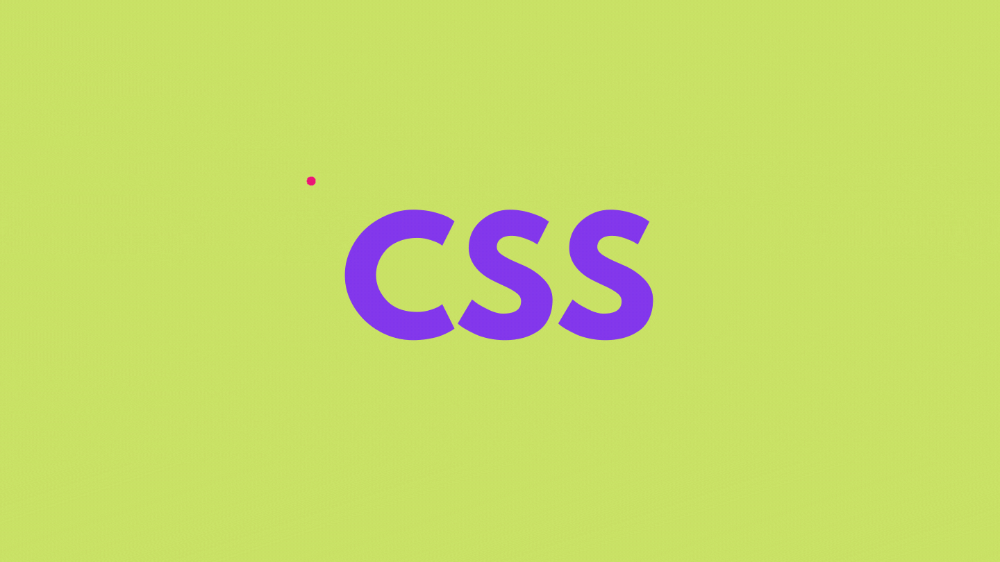
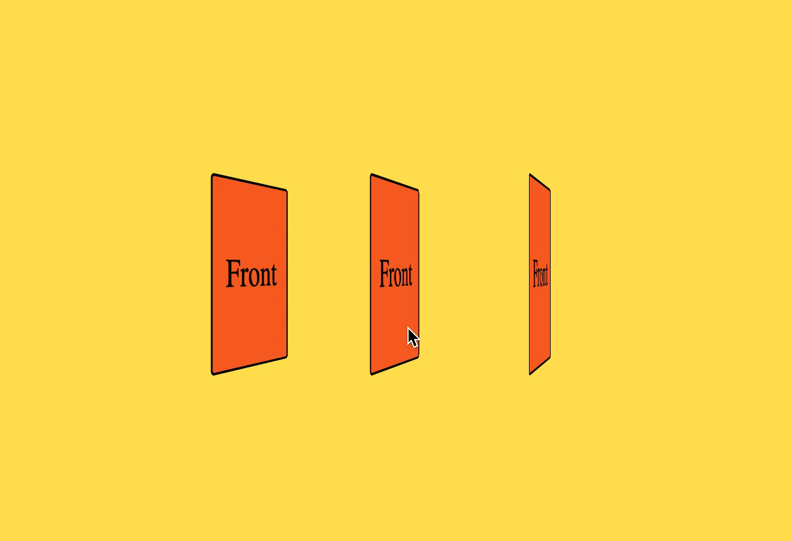
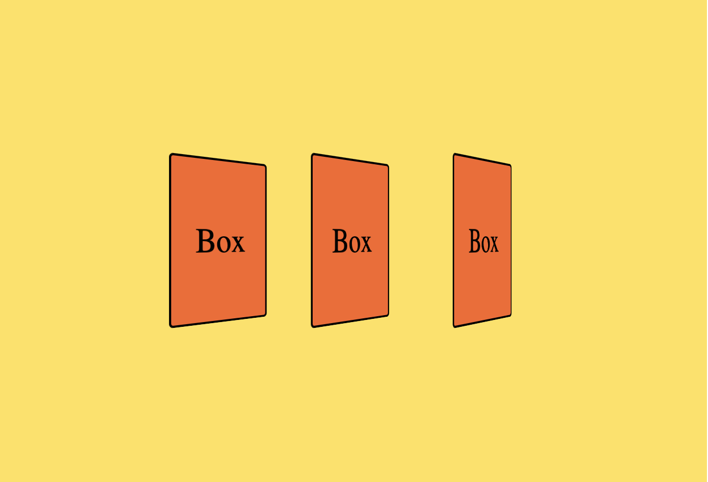
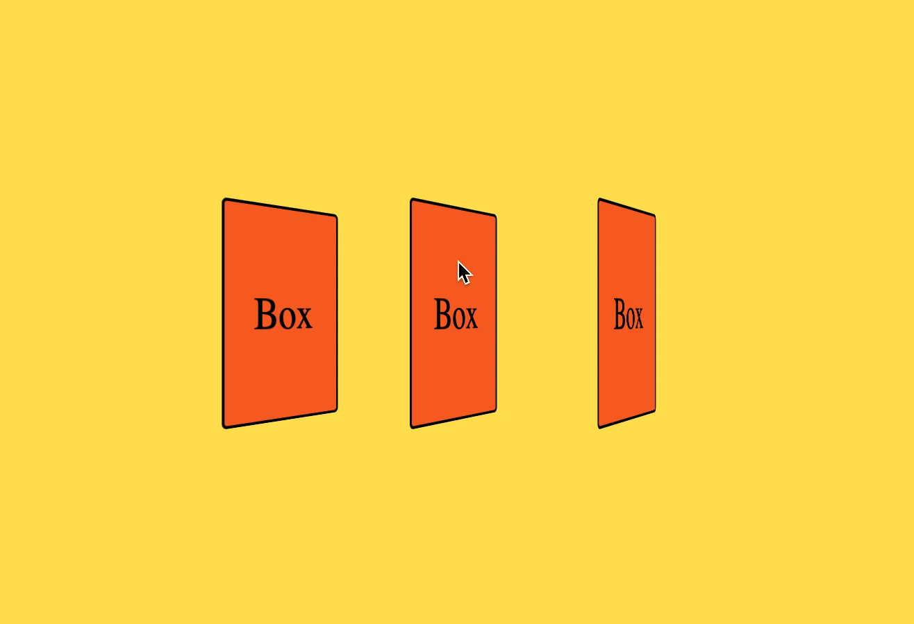
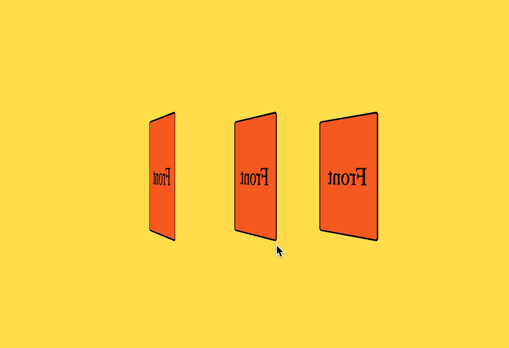

이 글은 [1분코딩](https://www.inflearn.com/course/interactive_web/dashboard)님의 '인터렉티브 웹개발 제대로 시작하기' 내용의 일부를 정리한 내용입니다.

# 카드 뒤집기 효과 구현하기



# Perspective

element가 3D 효과를 가지기 위해서는 element를 포함하는 container를 3D 공간으로 지정해줘야한다. 이를 지정해주는 것이 perspective 속성이다.



## Container에 적용

container 안에 있는 element들이 특정 관점에 따라 각각 다른 형태를 가진다.(현실 세계와 동일한 형태)

> perspective의 값
> : 현실 세계에서 우리의 관점에서 생각해 볼 때 가까이서 보는 변화가 더 극적이고(변화가 많고) 멀리서 보는 변화는 상대적으로 덜 극적(변화가 적다)여 보인다. 이처럼 perspective의 값이 작을수록 더 큰 변화가 일어나고 값이 클수록 변화가 적게 일어난다.

```css
.container {
  /* 생략 */
  perspective: 500px;
}
.box {
  /* 생략 */
  transform: rotateY(45deg);
}
```

## Element에 적용

모든 element이 관점에 상관없이 동일한 3D 형태를 가진다.

```css
.box {
  /* 생략 */
  transform: perspective(500px) rotateY(45deg);
}
```

# 3D 카드 만들기

앞면과 뒷면이 완전히 독립된 3D 카드를 만들어보자.

## 문제의 기존 카드

지금까지 공부했던 내용으로 만들어보면 카드 앞과 뒷면이 좌우 반전된 채로 그대로 출력된다.



```html
<!-- HTML -->
<body>
  <div class="container">
    <div class="card">Box</div>
    <div class="card">Box</div>
    <div class="card">Box</div>
  </div>
</body>
```

```css
/* CSS */
.container {
  margin: 0 auto;
  display: flex;
  justify-content: center;
  align-items: center;
  width: 80vw;
  height: 50vh;
  font-size: 32px;
  background-color: #ffe156;
  perspective: 500px;
}
.card {
  display: flex;
  justify-content: center;
  align-items: center;
  width: 100px;
  height: 150px;
  margin: 10px;
  border: 2px solid black;
  background-color: #f86624;
  border-radius: 4px;
  font-size: 1em;
  transform: rotateY(0deg);
  transition: 1s;
}
.container:hover .card {
  transform: rotateY(180deg);
}
```

## 카드 구조 재설계

앞면과 뒷면을 독립적으로 가지는 카드를 만들기 위해서는 각각 독립적인 element로 구성해야할 필요가 있다. 그러므로 HTML의 구조를 다음과 같이 수정한다.

```html
<!-- HTML -->
<body>
  <div class="container">
    <div class="card">
      <div class="card-side card-front">Front</div>
      <div class="card-side card-back">Back</div>
    </div>
    <div class="card">
      <div class="card-side card-front">Front</div>
      <div class="card-side card-back">Back</div>
    </div>
    <div class="card">
      <div class="card-side card-front">Front</div>
      <div class="card-side card-back">Back</div>
    </div>
  </div>
</body>
```

## 앞면과 뒷면을 서로 포개기

앞면과 뒷면이 card 클래스안의 같은 위치에 포개져야 하나의 카드의 양면을 표현할 수 있다.

```css
/* CSS */
.container {
  margin: 0 auto;
  display: flex;
  justify-content: center;
  align-items: center;
  width: 80vw;
  height: 50vh;
  font-size: 32px;
  background-color: #ffe156;
  perspective: 500px;
}
.card {
  position: relative;
  width: 100px;
  height: 150px;
  margin: 10px;
  transform: rotateY(0deg);
  transition: 1s;
}
.card-side {
  display: flex;
  justify-content: center;
  align-items: center;
  position: absolute;
  left: 0; /* 시작점 지정 */
  top: 0;
  width: 100%; /* 상위 요소에 가득 채우기 위해서 지정 */
  height: 100%;
  border: 2px solid black;
  border-radius: 4px;
  font-size: 1em;
}
.card-front {
  z-index: 1; /* 단순히 front가 앞면으로 보이도록 하기위해서 지정 */
  background-color: #f86624;
}
.card-back {
  background-color: #2ec4b6;
}
.container:hover .card {
  transform: rotateY(180deg);
}
```

## 뒷면을 y축을 기준으로 뒤집기

현재 앞면과 뒷면 모두 겹쳐진 상태에서 정면을 바라보고 있다. 그러므로 뒷면은 정면의 반대편을 바라보도록 y축을 기준으로 뒤집어준다.

```css
/* CSS */
.card-back {
  background-color: #2ec4b6;
  transform: rotateY(180deg); /* 이 부분만 추가 */
}
```

## transform-style: preserve-3d 적용하기

현재 HTML의 구조를 살펴보면 `.container > .card > .card-side` 로 이어진다. 하지만 3D 공간으로 만들어주는 `perspective` 가 적용된 `.container` 와 실제 3D element인 `.card-side` 사이에 일반 element가 위치하고 있어서 perspective를 연결을 막고 있다. 이 경우 중간 element인 `.card` 에 `transform-style: preserve-3d` 를 적용해주면 3D 공간이 연결된다.



```css
/* CSS */
.card {
  position: relative;
  width: 100px;
  height: 150px;
  margin: 10px;
  transform: rotateY(0deg);
  transition: 1s;
  transform-style: preserve-3d; /* 이 부분만 추가 */
}
```

## backface-visibility: hidden 적용하기

위의 과정을 완료하면 앞면과 뒷면의 배경색이 서로 번갈아가며 이상하게 출력되는 것을 확인할 수 있다. 이는 카드의 앞면과 뒷면의 개별적인 각자의 앞뒷면이 서로 교차하기 때문이다.

이를 해결하기 위해서는 앞면과 뒷면의 공통 클래스인 `.card-side` 에 `backface-visibility: hidden` 를 적용해주면 각자의 뒷면이 보이지 않고 해결된다.


```css
/* CSS */
.card-side {
  display: flex;
  justify-content: center;
  align-items: center;
  position: absolute;
  left: 0;
  top: 0;
  width: 100%;
  height: 100%;
  border: 2px solid black;
  border-radius: 4px;
  font-size: 1em;
  backface-visibility: hidden; /* 이 부분만 추가 */
}
```

# 참조

- https://www.inflearn.com/course/interactive_web/dashboard

<br>
