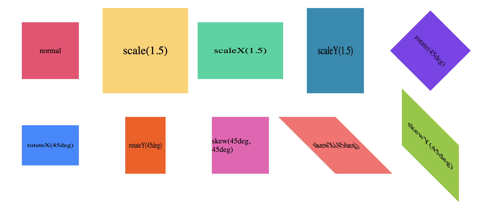
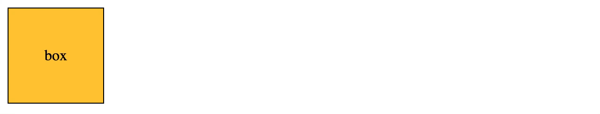

이 글에서는 CSS의 애니메이션 관련 속성들을 간단히 정리합니다.

# Transform

**브라우저의 렌더링을 위해서는 보통 CPU를 사용하지만 Transform의 경우에는 GPU를 사용한다.** 즉, 애니메이션에서 성능적 개선이 필요할 경우에는 Transform을 사용하는 것이 좋고 관련 내용에 더 알고 싶다면 **하드웨어 가속(Hardware Acceleration)** 키워드로 찾아보도록 하자.



- **`scale(N)` : 크기를 N배만큼 x,y축으로 확대시킨다.**

  - `scaleX(N)` : 크기를 N배만큼 x축으로 확대시킨다.
  - `scaleY(N)` : 크기를 N배만큼 y축으로 확대시킨다.

- **`rotate(deg)`: deg만큼 회전시킨다.**

  - `rotateX(deg)` : x축을 기준으로 deg만큼 회전시킨다.
  - `rotateY(deg)` : y축을 기준으로 deg만큼 회전시킨다.

- **`skew(Xdeg, Ydeg)` : x, y축으로 deg만큼 회전시킨다.**

  - `skewX(deg)` : x축으로 deg만큼 회전시킨다.
  - `skewY(deg)` : y축으로 deg만큼 회전시킨다.

- **`translate(x, y)` : x축으로 x만큼, y축으로 y만큼 이동시킨다.**
  - `translateX(x)` : x축으로 x만큼 이동시킨다.
  - `translateY(y)` : y축으로 y만큼 이동시킨다.
  - `transform-origin` : tranform을 적용하는 기준점을 지정한다.

```js
transform: scale(1.5);            // x,y축으로 1.5배 확대
transform: rotate(30deg);         // 30도 회전
transform: skew(45deg, 30deg);    // x축으로 45도 y축으로 30도 회전
transform: translate(30px, 30px); // x축으로 30px, y축으로 30px 이동
transform: translateY(50px);      // y축으로 50px 이동

transform-origin: left top;       // default 기준점
transform-origin: 0 0;            // default 기준점(수치로 표기)
transform-origin: 100% 100%;      // right bottom과 동일
```

# Transition

- `transition-property` : 전환이 적용될 CSS속성이나 이름을 지정한다.
- `transition-duration` : 전환이 지속되는 시간을 지정한다.
- `transition-time-function` : 전환하는 가속도를 지정한다.
- `transition-delay` : 전환이 동작하기까지의 지연시간을 지정한다.

<br>



```css
.box {
  display: flex;
  justify-content: center;
  align-items: center;
  width: 100px;
  height: 100px;
  background-color: #ffca3a;
  border: 1px solid black;
  transition: 1.5s;
}
.box:hover {
  background-color: #ff595e;
  transform: translateX(500px);
}
```

## Chrome Tool

Chrome 개발자 도구를 사용하면 `transition-time-function`을 원하는 데로 조정하고 그 값(`cubic-bezier(...)`)을 CSS에 적용해볼 수 있다.


# Animation

- `animation-duration` : 애니메이션의 지속시간을 지정한다.
- `animation-time-function` : 애니메이션의 가속도를 지정한다
- `animation-delay` : 애니메이션이 동작하기까지의 지연시간을 지정한다.
- `animation-iteration-count` : 애니메이션을 반복한 횟수를 지정한다.
- `animation-direction` : 애니메이션이 어느방향으로 시작할지 지정한다.
- `animation-fill-mode` : 애니메이션이 끝난 후 어디에 위치할지를 지정한다.
- `animation-play-state` : 애니메이션을 동작시킬지 정지시킬지 지정한다.
- `animation-name` : 적용할 @keyframe의 이름을 지정한다.

```css
@keyframes moving-box {
  0% {
    transform: translate(0, 0);
  }
  50% {
    transform: translate(250px, 250px);
  }
  100% {
    transform: translate(250px, 0);
  }
}
.box {
  display: flex;
  justify-content: center;
  align-items: center;
  width: 100px;
  height: 100px;
  background-color: #ffca3a;
  border: 1px solid black;
  animation: moving-box 2s alternate infinite;
}
```

# 참조

- https://developer.mozilla.org/en-US/docs/Web/CSS/transform
- https://d2.naver.com/helloworld/2061385

<br>
