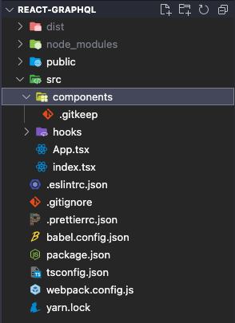

# 빈 디렉터리에 .gitkeep 추가하기

팀 프로젝트를 진행 할 때 프로젝트의 초기 환경을 세팅하면서 기본적인 디렉터리 구조를 포함해서 원격 저장소에 올리고 싶은 경우가 있다. 하지만 Git은 빈 디렉토리를 추적하지 않고 이에 대한 부가적인 기능 또한 제공하지 않는다.

그렇기 때문에 원격 저장소에 올리고 싶은 빈 디렉토리안에 빈 파일을 하나 작성하는 방식을 사용하는데 이 때 이 빈 파일 이름은 관례상으로 `.keep` 또는 `.gitkeep` 이라는 명을 사용한다.

예를 들어서 `components` 라는 빈 폴더를 Git에 포함하고 싶을 경우 아래의 그림과 같이 작성한 다음 원격 저장소에 올리면 된다.

 
