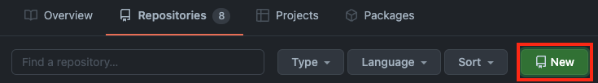
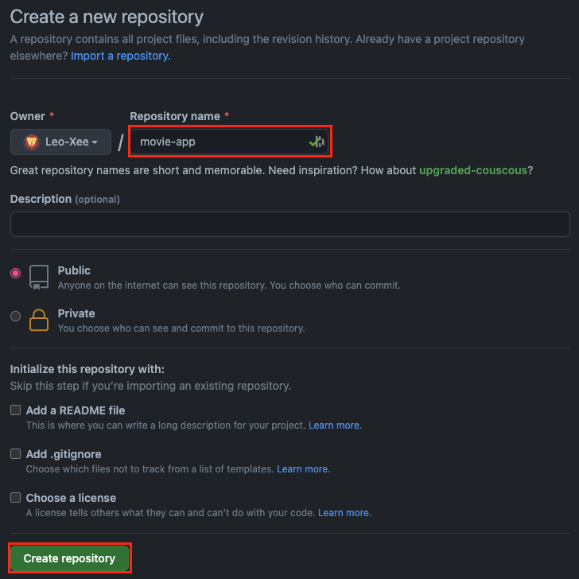
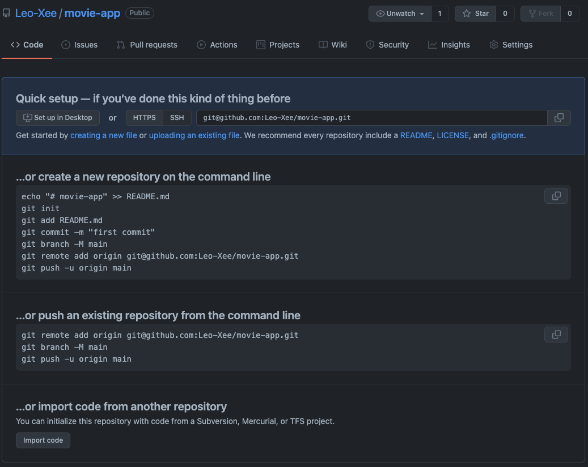

# 원격 저장소 생성

Github에 회원가입과 로그인을 하고 Repositories -> New로 이동한다.



원격 저장소의 이름을 입력하고 생성한다.



# 원격 저장소에 연결

원격 저장소를 생성하면 다음과 같이 친절하게 상황별 가이드를 준다. 나는 이미 로컬 저장소에서 프로젝트를 관리하고 있으므로 두 번째 가이드를 따르겠다.



로컬 저장소의 위치에서 원격 저장소를 아래의 명령어로 추가한다.

```bash
# git remote add <원격 저장소 이름> <원격 저장소 주소>
$ git remote add origin git@github.com:Leo-Xee/movie-app.git
```

위 명령어로 로컬 저장소에 원격 저장소의 이름과 주소를 저장한다. 그 다음 정상적으로 동작했는지 확인하기 위해 `git remote -v` 명령어를 사용하면 다음과 같이 원격 저장소가 추가된 것을 확인 할 수 있다.

브랜치 이름을 아래의 명령어로 변경한다.

```bash
# git branch -M <변경할 브랜치명>
$ git branch -M main
```

위 명령어는 로컬 브랜치 이름을 변경해준다. `git init`으로 프로젝트 관리를 시작하면 기본값으로 `master`라는 이름의 브랜치가 생성되는데 이를 `main`으로 변경해주는 것이다.

`Git`에서 `master`보다는 `main`이라는 이름을 사용하도록 권고하고 있고 연결할 때마다 매번 변경하는 것이 귀찮으므로 브랜치 이름의 기본값을 아래의 명령어로 변경해주도록 하자.

```bash
# git config --global init.defaultBranch <설정할 브랜치명>
$ git config --global init.defaultBranch main
```

원격 저장소로 Push 하기

```bash
# git push <옵션> <원격 저장소명> <브랜치명>
$ git push -u origin main
```

여기서 `-u`옵션은 `--set-upstream`의 약어로써 해당 원격 저장소를 `upstream`으로 설정한다는 의미이다. 이렇게 설정하면 원격 저장소명과 브랜치명을 따로 입력하지 않고 `push`나 `pull`을 하더라도 정상적으로 동작한다.

그 이유는 해당 옵션으로 로컬 저장소는 `downstream`, 원격 저장소는 `upstream`관계로 지정되었기 때문이다. 이 내용은 추후에 따로 자세히 정리할 예정이다.

# 원격 저장소와 연결 끊기

먼저 로컬 저장소에 원격 저장소가 연결되어 있는지 확인한다.

```bash
$ git remote -v
```

원격 저장소와의 연결정보를 삭제한다.

```bash
# git remote remove <삭제할 원격 저장소명>
$ git remote remove origin
```

<br/>
