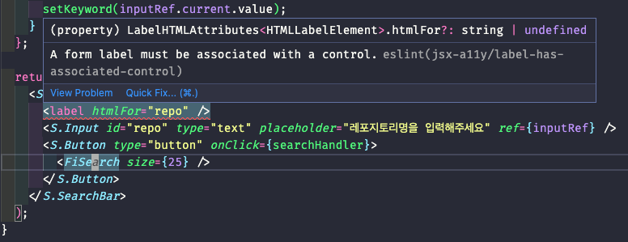

# ⚠️ 에러 내용

키워드 검색 기능을 구현하는 중에 Input과 label을 `htmlFor`과 `id`로 연결시켜줬음에도 불구하고 다음과 같이 ESLint 에러가 발생했다.



# 📌 에러 원인

ESLint의 `label-has-associated-control`은 접근성을 위해서 label과 input이 연관됨을 강요하는 규칙이다. 하지만 `htmlFor` 과 `id` 로 연결시켜줘도 에러가 발생하는 이유는 [여기](https://github.com/jsx-eslint/eslint-plugin-jsx-a11y/blob/main/docs/rules/label-has-associated-control.md)를 참고하고 이해한 바로는 확실하지는 않지만 React와 같이 SPA 라이브러리에서는 컴포넌트 재사용으로 인해 `id`의 유일성을 보장하지 못하기 때문에 추가적인 옵션이 필요해서인 것 같다.

> 정확한 이유를 아시는 분이 계시다면 댓글 부탁드립니다. : )

# ✅ 해결 방법

`.eslintrc.json` 파일에 규칙과 옵션을 다음과 같이 추가하면 더이상 에러가 발생하지 않는다.

```tsx
/* .eslintrc.json */

{
	// ...
  "rules": {
		// ...
    "jsx-a11y/label-has-associated-control": [
      2,
      {
        "labelAttributes": ["htmlFor"]
      }
    ]
  }
}
```

# 참고

- https://github.com/jsx-eslint/eslint-plugin-jsx-a11y/
- https://github.com/jsx-eslint/eslint-plugin-jsx-a11y/issues/457

<br/>
