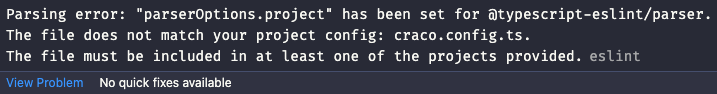
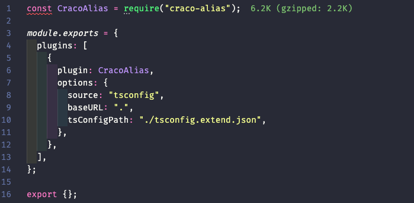

# ⚠️ 에러 내용

CRA의 타입스크립트 프로젝트에 절대 경로를 사용하기 위해서 `@craco/craco`와 `craco-alias` 패키지를 설치했다. 그리고 세팅하던 중에 `craco.config.ts` 파일에서 아래와 같은 에러가 발생했다.





# 📌 에러 원인

타입스크립트의 ESlint 규칙을 사용할 때 `tsconfig.json` 파일의 `include` 옵션 부분에 명시되지 않은 파일에 ESlint를 적용을 자꾸 시도하려고 할 때 발생하는 에러이다.

[이 글](https://stackoverflow.com/questions/64271575/error-with-my-eslintrc-js-file-parsing-error-parseroptions-project-has/64283139#64283139)에서 자세한 원인을 설명해주지만 여기에서 제시해준 방법으로는 나의 경우에 해결되지 않았다. 그래서 구글링한 끝에 [이 글](https://stackoverflow.com/questions/63118405/how-to-fix-eslintrc-the-file-does-not-match-your-project-config)에서 제시한 방법인 해당 파일을 그냥 무시해주는 방법으로 해결했다.

# ✅ 해결 방법

`.eslintrc.json` 파일에 아래와 내용을 추가하니 해결되었다.

```json
/* .eslintrc.json */

{
  /* ... */
  "ignorePatterns": ["craco.config.ts"]
}
```

<br/>
