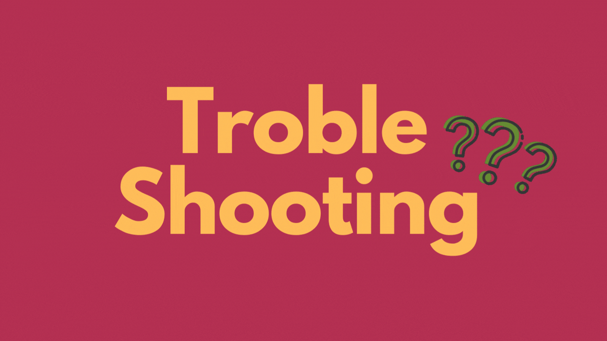
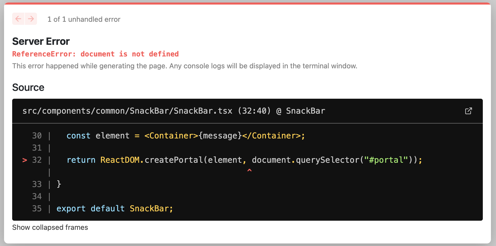
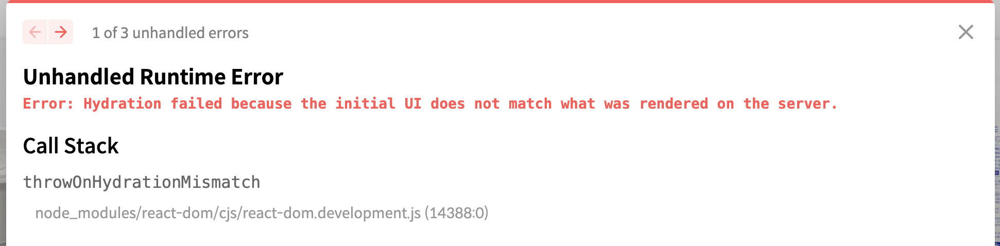

# ⚠️ 에러 내용

## 첫 번째 에러

Next.js에서 `createPortal`로 SnackBar 컴포넌트를 구현하던 중에 `document` 객체를 이용할 때 다음과 같은 에러가 발생했다.



```tsx
function SnackBar({ message }: SnackBarProps) {
  const element = <Container>{message}</Container>

  return ReactDOM.createPortal(element, document.querySelector('#portal'))
}

export default SnackBar
```

## 두 번째 에러

첫 번째 문제를 해결하기 위해서 구글링을 하다가 [이 글](https://www.webtutpro.com/solve-document-is-not-defined-errors-in-next-js-26fea778b868)을 보고 `window` 객체가 존재할 때만 동작하도록 코드를 다음과 같이 수정했지만 또 다른 에러 메시지를 받았다.



```tsx
function SnackBar({ message }: SnackBarProps) {
  const element = <Container>{message}</Container>

  if (typeof window !== 'undefined') {
    return ReactDOM.createPortal(element, document.querySelector('#portal'))
  }

  return null
}

export default SnackBar
```

# 📌 에러 원인

먼저 Next.js는 SSR과 CSR의 장점을 적절히 활용해서 둘 중 하나의 방식을 이용한 것보다 더 좋은 사용자 경험을 제공한다. 이에 대한 내용은 [이 글](https://helloinyong.tistory.com/248)을 꼭 참조하도록 하자.

**첫 번째 에러는 해당 코드가 초기 View를 Pre-Rendering하는 SSR 과정에서 존재하지 않는 `document`에 접근하려고 했기 때문이다.** WEB API 중 하나인 `window` 객체 안에 존재하는 `document`는 말그대로 클라이언트 단에서 제공하는 API이기 때문에 SSR 과정이 완료되어서 클라이언트로 넘어오기 전까지 `document`는 아직 존재하지 않는다. 그래서 에러가 발생한 것이다.

**두 번째 에러는 첫 번째 에러만을 해결하기 위해서 작성한 if문이 Hydration 과정에서 비교할 렌더 트리를 다르게 만들었기 때문이다.** 초기에 View를 Pre-Rendering 했던 렌더 트리는 `null`을 반환한 컴포넌트로 이루어져 있고 Hydration을 하기 위해 클라이언트에서 자바스크립트 파일을 실행한 렌더 트리는 `createPortal의 반환값`으로 구성된 컴포넌트로 이루어져 있기 때문에 트리상의 불일치가 발생해서 Hydration을 정상적으로 실행할 수 없는 것이다.

**그렇다면 이 에러들을 어떻게 해결할 수 있을까??**

# ✅ 해결 방법

해결 방법은 [Next.js의 공식 페이지](https://nextjs.org/docs/messages/react-hydration-error)에서 찾았다. 정리하면 클라이언트 단에서 처음 렌더링되는 `useState`와 `useEffect`를 사용해서 `window`와 같은 WEB API를 숨기는 것이다.

다음과 같이 사용하면 더이상 에러가 발생하지 않고 잘 동작하는 것을 확인할 수 있다.

```tsx
function SnackBar({ message }: SnackBarProps) {
  const [target, setTarget] = useState<Element | null>(null)

  const element = <Container>{message}</Container>

  useEffect(() => {
    if (document) {
      setTarget(document.querySelector('#portal'))
    }
  }, [])

  if (!target) return <></>

  return ReactDOM.createPortal(element, target)
}

export default SnackBar
```

# 참조

- [https://www.webtutpro.com/solve-document-is-not-defined-errors-in-next-js-26fea778b868](https://www.webtutpro.com/solve-document-is-not-defined-errors-in-next-js-26fea778b868)
- [https://nextjs.org/docs/messages/react-hydration-error](https://nextjs.org/docs/messages/react-hydration-error)
- [https://helloinyong.tistory.com/248](https://helloinyong.tistory.com/248)
- [https://nextjs.org/docs/messages/react-hydration-error](https://nextjs.org/docs/messages/react-hydration-error)

<br/>
