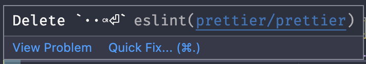
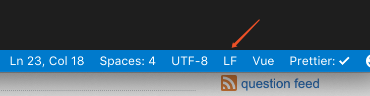

# ⚠️ 에러 내용

최근에 팀 프로젝트를 진행하면서 내가 Eslint와 Prettier를 포함한 초기 개발 환경 세팅을 담당하게 되었는데 이를 pull 받은 팀원 중 일부의 VSC 상에서 다음과 같은 에러가 발생한다는 피드백을 받았다.



# 📌 에러 원인

뜬금없는 에러 내용이라서 당황했지만 에러가 발생하는 팀원들이 공통적으로 Windows OS 환경에서 작업하고 있다는 것다는 것을 찾아내서 이에 대해 검색해보다가 원인을 찾아냈다.

이 에러가 발생하는 원인은 줄바꿈(new Line)에 대해서 **Windows는 CR 방식을, Linux는 LF 방식을 기본 설정하고 있기 때문이다.**

그렇다면 CR와 LF는 대체 뭘까? **CR은 Carriage Reture을 의미하며 아스키코드로는 13이고 2진수로는 00001101을 나타낸다.** **LF는 Line Feed를 의미하며 아스키코드로는 10이고 2진수로는 00001010을 나타낸다.** 이 두가지 방식 모두 줄바꿈이라는 동일한 기능을 한다. 하지만 컴퓨터의 입장에서는 각각의 바이트값이 다르기 때문에 동일하게 인식하지 못하는 것이다.

추가로 이 방식들에 대한 유래는 옛날 다큐멘터리에서 많이 볼 수 있는 Typewirter라는 타자 기계에서 시작된다. 하지만 이에 대한 내용은 생략하겠다.

# ✅ 해결 방법

해결 방법은 크게 2가지가 있다.

## VSC의 줄바꿈(newLine) 방식을 변경



## Prettier의 endOfLine에 대한 규칙의 옵션 수정

```json
// .eslintrc.json

{
  /* ... */
  "rules": {
    /*... */
    "prettier/prettier": ["error", { "endOfLine": "auto" }]
  }
}
```

# 참조

- https://stackoverflow.com/questions/53516594/why-do-i-keep-getting-delete-cr-prettier-prettier
- https://velog.io/@jakeseo_me/LF%EC%99%80-CRLF%EC%9D%98-%EC%B0%A8%EC%9D%B4-Feat.-Prettier

<br/>
