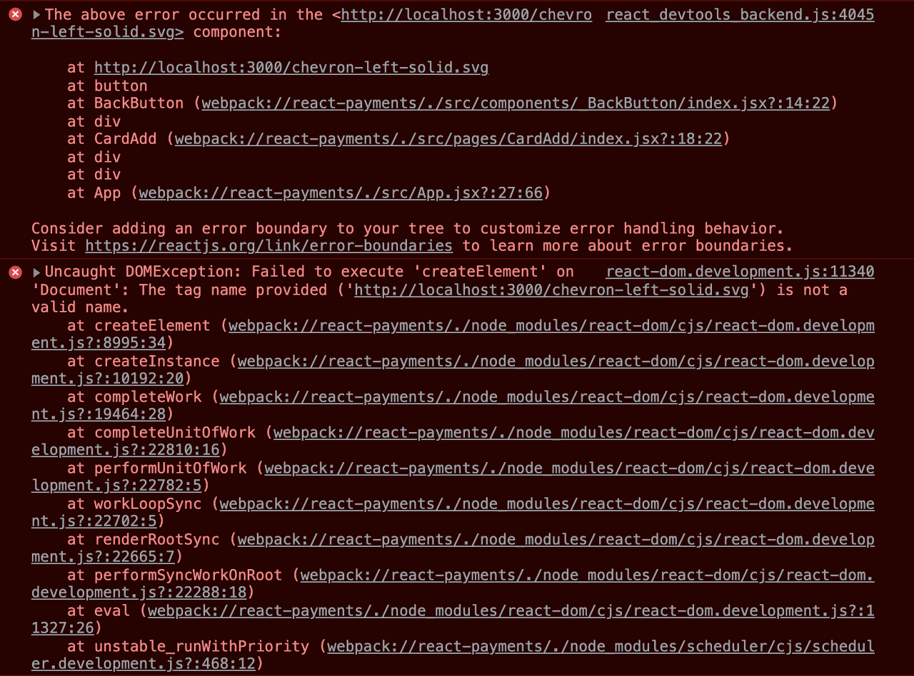

# ⚠️ 에러 내용

React에서 SVG 파일을 다음과 같이 사용할 때

```jsx
...
import { ReactComponent as Back } from "../../assets/chevron-left-solid.svg";

const BackButton = ({ onClick }) => {
    return (
        <button onClick={onClick}>
            <Back />
        </button>
    );
};

BackButton.propTypes = {
    onClick: PropTypes.func.isRequired,
};

export default BackButton;
```

다음과 같은 에러가 발생했다.



# 📌 에러 원인

React를 직접 세팅한 프로젝트에서 이런 에러가 발생해서 내가 세팅 과정에서 잘못해서 발생한 줄 알았는데 [Github issues](https://github.com/boopathi/react-svg-loader/issues/197)를 보면 CRA로 세팅해서 eject한 프로젝트에서도 동일하게 발생하는 걸 보니 그건 아닌 것 같다.

대충 webpack과 babel에서 변환해주는 과정에서 발생하는 에러 같은데 정확한 원인은 아직 잘 모르겠다.

# ✅ 해결 방법

Babel 플러그인을 다음과 같이 설치한다.

```bash
$ yarn add -D babel-plugin-inline-react-svg
```

프로젝트 루트에 `bable.config.json`을 생성하고 `plugins`에 아래과 같이 추가한다.

```json
/* bable.config.json */
{
  "presets": ["@babel/preset-react", "@babel/preset-env"],
  "plugins": ["babel-plugin-styled-components", "inline-react-svg"] // 추가
}
```

SVG 파일을 컴포넌트를 import하는 것처럼 아래의 예시와 같이 사용한다.

```jsx
...
import Back from "../../assets/chevron-left-solid.svg";

const BackButton = ({ onClick }) => {
    return (
        <button onClick={onClick}>
            <Back />
        </button>
    );
};

BackButton.propTypes = {
    onClick: PropTypes.func.isRequired,
};

export default BackButton;
```

<br/>
