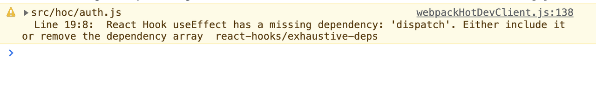
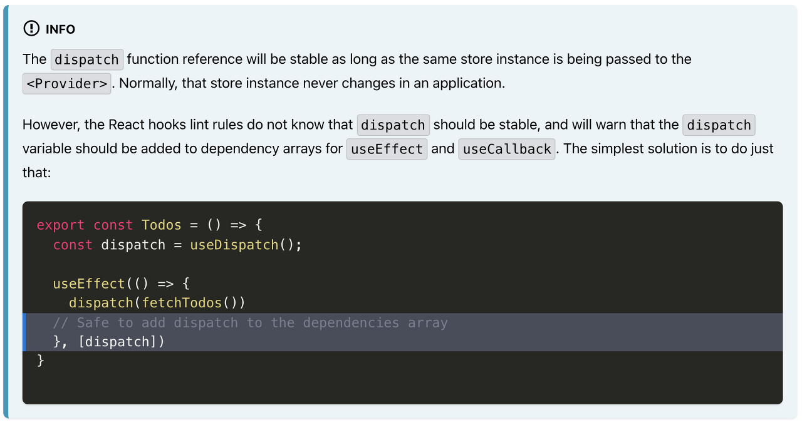

# ⚠️ 에러 내용

`HOC(Higher Order Component)`를 사용해서 페이지 인증을 구현하기 위해서 `useEffect()`내부에서 `dispatch()`를 사용하는데 다음과 같은 에러가 발생했다.



분명히 특정 페이지가 마운트 되기 전에 인증을 한번만 처리해주면 되기 때문에 의존성을 빈 배열로 넘겨주는 것이 맞는데 에러가 발생해서 의문이 들었다.

```js
/* auth.js */

import { useEffect } from 'react'
import { useDispatch } from 'react-redux'
import { authUser } from '../_action/user_action'

export default function auth(SpecificComponent, option, admin = null) {
  function AuthenticationCheck(props) {
    const dispatch = useDispatch()

    useEffect(() => {
      dispatch(authUser()).then(res => {
        console.log(res)
        // 인증 로직...
      })
    }, [])

    return <SpecificComponent />
  }
  return AuthenticationCheck
}
```

# 📌 에러 원인

이와 동일한 에러 발생 원인을 이미 스택오버플로우의 [이 글](https://stackoverflow.com/questions/66604122/understanding-react-hooks-exhaustive-deps-useeffect-and-dispatching-events)에서 잘 설명해놨으니 참고하자.



위와 같이 [Redux 공식 홈페이지](https://react-redux.js.org/api/hooks#usedispatch)에서도 확인할 수 있는데 이를 번역을 해보자면 다음과 같다.

`useDispatch`의 참조는 동일한 `Store`의 인스턴스가 `Provider`를 통해 전달되기만 하면 변화가 없다. 보통 `Store`의 인스턴스가 하나의 애플리케이션 내에서 절대 변하지는 않는다.

그러나 `React hooks`의 `lint rule`은 `dispatch`가 변하지 않는 것을 모르고 `useEffect`와 `useCallback`의 의존성 배열에 `dispatch`를 추가해야한다고 경고할 것이다. 이에 대한 해결 방법은 추가해줘도 안전하기 때문에 그냥 추가해주는 것이다.

# ✅ 해결 방법

`dispatch`를 의존성 배열에 추가하니 에러가 사라졌다. 😊

```js
import { useEffect } from 'react'
import { useDispatch } from 'react-redux'
import { authUser } from '../_action/user_action'

export default function auth(SpecificComponent, option, admin = null) {
  function AuthenticationCheck(props) {
    const dispatch = useDispatch()

    useEffect(() => {
      dispatch(authUser()).then(res => {
        console.log(res)
        // 인증 로직...
      })
    }, [dispatch])

    return <SpecificComponent />
  }
  return AuthenticationCheck
}
```

<br/>
