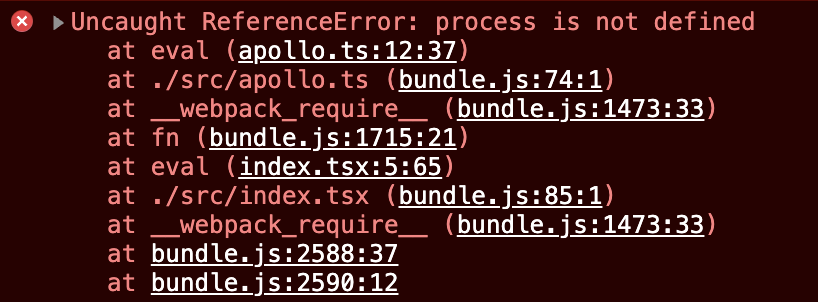

# ⚠️ 에러 내용

Webpack으로 번들링된 프로젝트에서 환경변수의 사용을 위해서 `process.env`를 사용할 때 다음과 같은 에러가 발생했다.



# 📌 에러 원인

[여기](https://stackoverflow.com/questions/65018431/webpack-5-uncaught-referenceerror-process-is-not-defined)에 따르면 Webpack v5부터 node.js polyfill이 자동적으로 적용되는 기능이 제거된 것이 원인이라고 한다. 그래서 클라이언트 단에서 process 모듈을 직접 추가해줘야한다.

# ✅ 해결 방법

먼저 `process` 패키지를 개발의존성으로 설치한다.

```bahs
$ yarn add -D process
```

그 다음, `webpack.config.js`에 다음과 같이 추가해주면 정상적으로 동작한다.

```js
module.exports = {
  ...
  plugins: [
      new webpack.ProvidePlugin({
             process: 'process/browser.js',
      }),
  ],
}
```

<br/>
