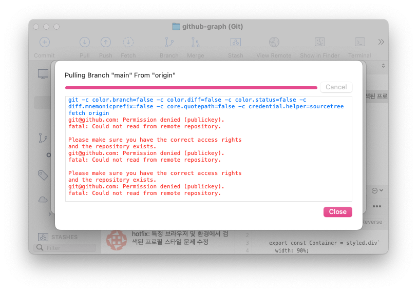

# ⚠️ 에러 내용

로컬에서 SSH Public Key를 생성하고 GitHub에 등록시켜줬음에도 불구하고 Sourcetree에서는 SSH 인증이 동작하지 않고 계속 Password를 요구하거나 다음과 같은 에러를 발생시키는 문제가 있었다.



# 📌 에러 원인

터미널 상에서는 정상적으로 동작하는데 Sourcetree에서만 동작하지 않는 걸로 봐서 SSH 생성까지는 문제가 없었다. 그래서 그 이후 과정에 대해서 구글링해보니 이 문제는 Sourcetree가 SSH를 인식하지를 못해서 발생하는 것이었다.

# ✅ 해결 방법

다음 명령어를 사용해서 SSH를 새로 생성한다.

```bash
# .ssh로 이동
$ cd ~/.ssh

# id_rsa, id_rsa.pub 제거
$ rm id_rsa, id_rsa.pub

# SSH 새로 생성 (비밀번호만 입력)
$ ssh-keygen
```

GitHub에 새로 생성한 `id_rsa.pub`를 등록한다.

ssh-agent를 다음 명령어로 백그라운드로 실행시킨다. (자세한 내용은 [여기](https://viiviii.github.io/setting-ssh-agent-in-git/)를 참고하자.)

```bash
$ eval $(ssh-agent -s)
```

다음 명령어로 ssh-agent에 등록된 Key가 있는지 확인하고 없다면 로컬에 추가한다.

```bash
# ssh-agent에 등록된 키가 있는지 확인
$ ssh-add -l

# The agent has no identities. 라고 나오면 다음 명령어로 로컬에 추가
$ ssh-add -K ./id_rsa
```

Keychain Access에 git을 입력해서 다음과 같은 목록을 삭제한다.

- `github.com Access Key for git`

<br/>

다음과 같이 비밀번호를 요구하면 **SSH 생성 시에 입력했던 비밀번호**를 입력해주면 정상적으로 동작하는 것을 확인할 수 있을 것이다.


<br/>
