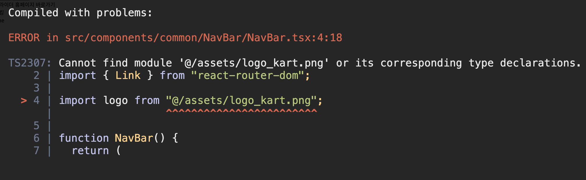

# ⚠️ 에러 내용

React Typescript에서 이미지를 `import`할 때 아래와 같은 에러가 발생했다.



# 📌 에러 원인

이는 `import`하려는 이미지의 확장자인 `png`를 타입스크립트에게 허용해주지 않아서 발생하는 문제이다.

# ✅ 해결 방법

`src` 위치에 `@types`와 그 내부에 `global` 디렉터리를 생성하고 아래와 같이 작성하면 문제가 해결된다.

```tsx
/* src/@types/global/index.d.ts */

declare module '*.png'
```

<br/>
