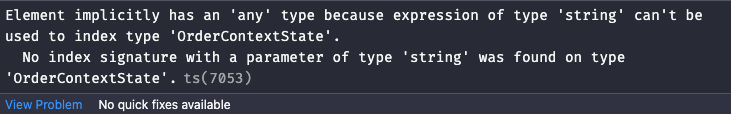

# ⚠️ 에러 내용

React의 ContextAPI를 사용해서 코드를 작성하다가

```tsx
import React, { createContext, useState, useMemo } from 'react'

const OrderContext = createContext(null)

type OrderContextState = {
  products: Map<string, number>
  options: Map<string, number>
}

function OrderContextProvider(props: any) {
  const [orderCounts, setOrderCounts] = useState<OrderContextState>({
    products: new Map<string, number>(),
    options: new Map<string, number>(),
  })

  const value = useMemo(() => {
    const updateItemCount = ({
      itemName,
      newItemCount,
      orderType,
    }: {
      itemName: string
      newItemCount: number
      orderType: string
    }) => {
      const newOrderCounts = { ...orderCounts }
      const orderCountMap = orderCounts[orderType] // <-- 타입에러 발생
      orderCountMap.set(itemName, newItemCount)

      setOrderCounts(newOrderCounts)
    }

    return [{ ...orderCounts }, updateItemCount]
  }, [orderCounts])

  return <OrderContext.Provider value={value} {...props} />
}

export default OrderContextProvider
```

다음과 같은 타입에러가 발생했다.



# 📌 에러 원인

내가 생각했을 때는 `updateItemCount` 함수의 파라미터 중 하나인 `orderType`은 `string` 타입만을 전달받기 때문에 단순하게 타입을 `string` 으로 선언했었다. 하지만 타입스크립트 컴파일러는 `State`로 관리되고 있는 `orderCounts` 객체의 `key값`으로 `products`, `options`가 아닌 문자열이 들어왔을 때는 에러가 발생할 수 있기 때문에 이를 더 안전하게 처리해달라는 의미인 것 같다.

# ✅ 해결 방법

`updateItemCount` 함수의 파라미터인 `orderType`에 다음과 같이 유니온 타입을 사용해서 `orderCounts` 객체의 `key`값으로 제한하면 해결된다.

```tsx
// ...
const updateItemCount = ({
  itemName,
  newItemCount,
  orderType,
}: {
  itemName: string
  newItemCount: number
  orderType: 'products' | 'options' // <-- 수정
}) => {
  const newOrderCounts = { ...orderCounts }
  const orderCountMap = orderCounts[orderType] // <-- 타입에러가 발생했던 부분
  orderCountMap.set(itemName, newItemCount)

  setOrderCounts(newOrderCounts)
}
```

<br/>
