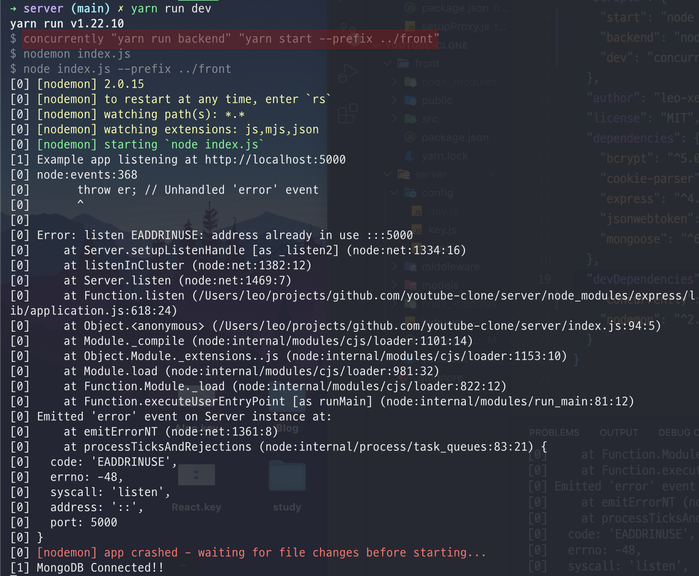
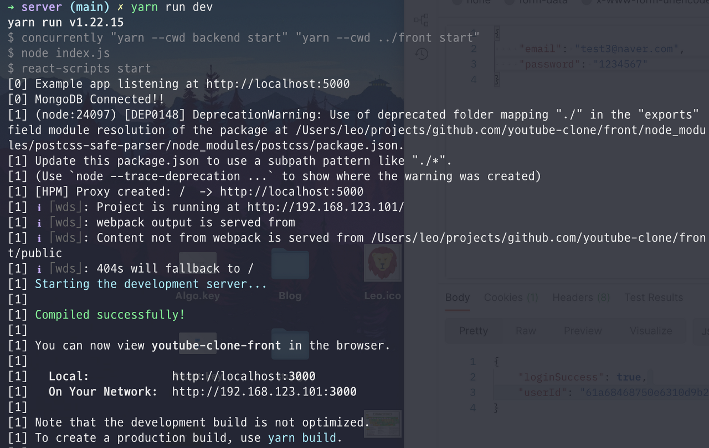

# ⚠️ 에러 내용

`yarn`과 `concurrently`를 사용하는데 아래와 같은 에러가 발생했다.

# 📌 에러 원인

`concurrently`에 묶인 2개의 명령어 중에 두 번째 명령어인 `yarn start —prefix ../front`가 정상적으로 동작하지 않아서 front에서 동작하지 않고 첫 번째와 동일하게 server에서 동작하고 있어서 5000번 포트를 2번 열려고 하니 생기는 문제였다.

그래서 찾아보니 `npm`과`yarn`의 `working directory`를 변경하는 옵션이 서로 달랐다. 차이는 다음과 같다.

~~동일하게 만들어주지.. ; (~~

npm

- `npm <command> -—prefix <path>`

yarn

- `yarn —-cwd <path> <command>`

# ✅ 해결 방법

위와 같이 `yarn`의 옵션과 명령어 순서로 변경해서 실행했더니 server와 front가 정상적으로 동작한다.

 
