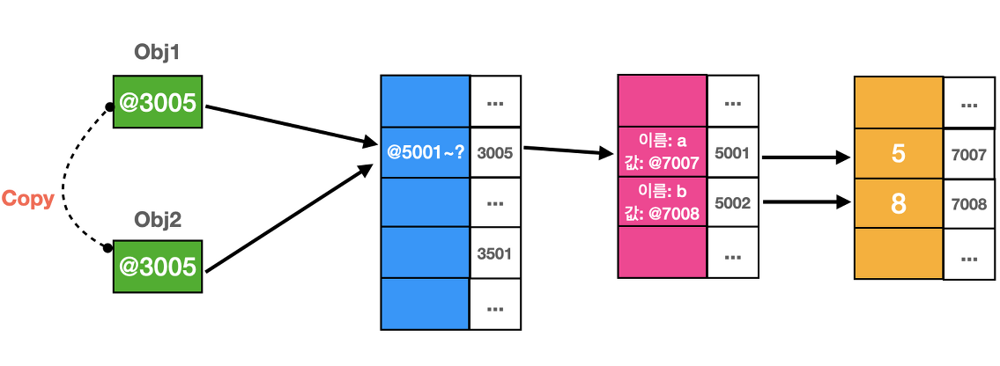
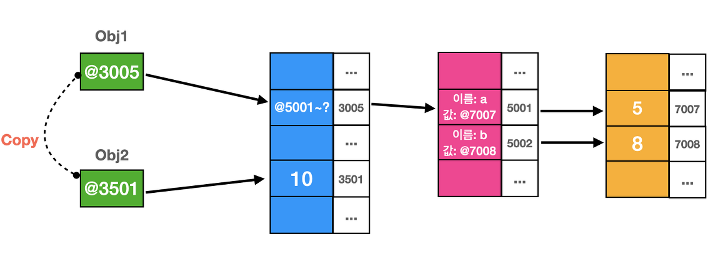

**`call by value`와 `call by reference`는 함수의 인자(argument)로 변수가 들어와서 매개변수(parameter)로 전달되는 경우에 어떤 방식으로 전달되는 지를 결정하는 방식입니다.** 일단 인자와 매개변수의 개념부터 정리하고 본론으로 넘어가겠습니다.

```js
function sum(a, b) {
  // a과 b는 매개변수(parameter)
  return a + b
}
sum(10, 20) // 10과 20은 인자(argument)
```

# 인자와 매개변수

인자(argument)는 어떤 함수가 호출될 때 전달되는 값을 의미하고 매개변수(parameter)는 전달된 값을 받아들이는 변수를 의미한다.

# Call by value

**Call by value는 말 그대로 복사된 값을 인자로 넘겨서 매개변수로 전달하는 방식이다.** 자바스크립트의 기본형 변수 타입(Primitive type)의 경우에는 call by value 방식으로 전달된다.

```js
function foo(param) {
  param = 10
  console.log(param) // 10
}

foo(num)
console.log(num) // 5
```

- 복사된 `num`의 값이 `foo()`의 인자로 전달된다.

# Call by Reference

**Call by reference는 실제의 원본 데이터가 위치하는 주소의 값을 인자로 넘겨서 매개변수로 전달하는 방식이다.** 참조형 변수 타입(Reference type)인 `Object`, `Array`, `Function`... 등이 Call by reference 방식으로 전달된다.

# 자바스크립트는 항상 call by value

**하지만 일반적으로 자바스크립트는 항상 Call by value로 전달 방식을 결정한다고 말한다.**

'앞에서 변수의 타입에 따라서 다르게 적용된다고 다 설명해놓고 이게 대체 무슨 소리인가?'라고 생각할 수도 있다. **그 이유는 자바스크립트에서의 Call by reference 전달 방식은 완전하지 않기 때문이다.**

다음 예시를 통해서 그 이유를 알아보자.

```js
function foo(obj2) {
  obj2 = 10
  console.log(obj2) // 10
}

let obj1 = { a: 5, b: 8 }
foo(obj1)
console.log(obj1) // C, C++에서는 10을 출력하지만 JS는 { a: 5, b: 8 }을 출력!!
```

- 포인터와 완전한 Call by reference 전달 방식의 개념을 가지고 있는 C, C++ 언어의 경우에는 2번째 줄의 `obj2 = 10;`에 의해서 원본 데이터인 `obj1`의 값이 `10`으로 변경된다. 왜냐하면 완전한 주소값의 참조로 연결되어 있기 때문이다.
- 하지만 자바스크립트의 경우에는 객체의 프로퍼티 값이 아닌 객체 자체의 변경을 허용하지 않는다. 그 이유는 겉보기에는 주소값을 참조하는 듯이 보이지만 실제로는 주소값의 복사본을 만들어서 전달하기 때문이다.

<br/>

아래 그림을 통해서 자세히 설명해보겠다.



`foo(obj1);`에서 `obj1`이 `foo()`의 인자로 전달되어서 `obj2`라는 매개변수에 할당된다. 이 때에 `obj1`이 가리키고 있는 주소값의 원본이 아닌 주소값의 복사본을 전달해서 `obj2`에 할당한다.



즉, `obj2`에 할당된 주소값은 복사본이기 때문에 `foo()` 내부에서 `obj2 = 10;`와 같이 변경되면 `obj2`의 주소값이 `10`이 저장된 새로운 주소값으로 변경된다. 결론적으로 `obj1`과 `obj2`는 서로 다른 객체가 된다.

이와 같이 자바스크립트에서의 Call by reference는 C와 C++의 완전한 Call by reference 방식과는 차이가 있기 때문에 **Call by sharing이라는 용어를 사용하기도 한다.**

<br/>
