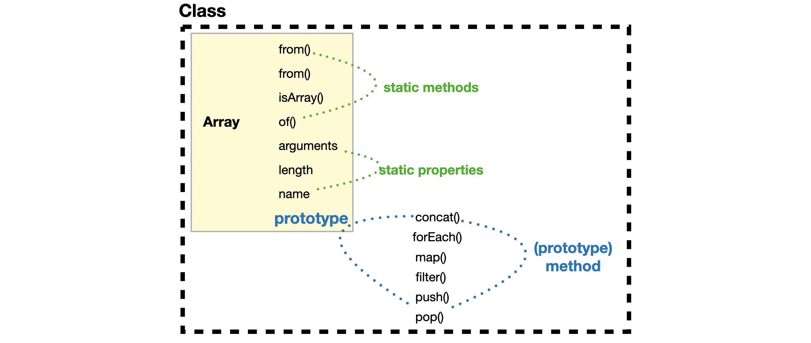
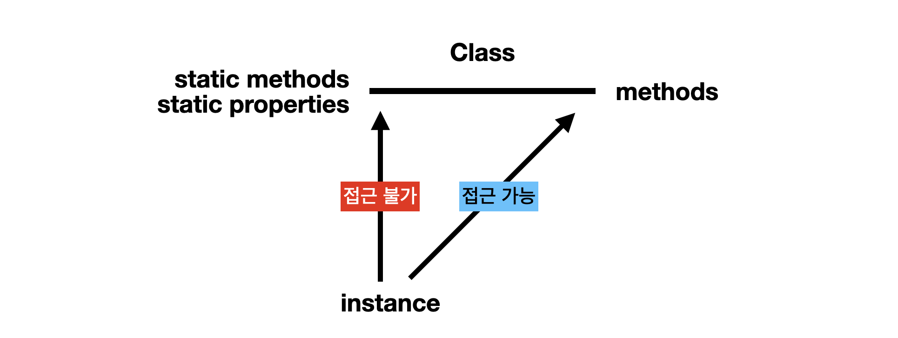
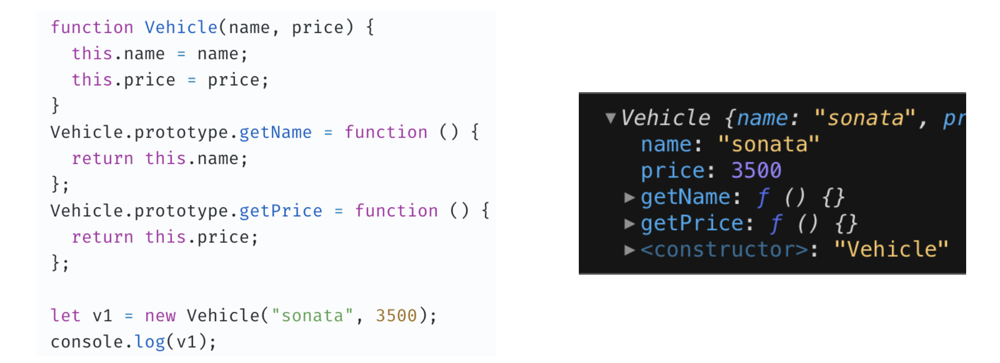
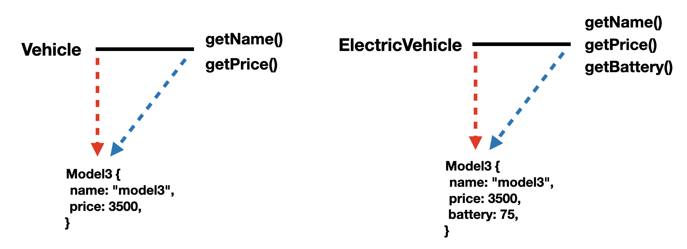
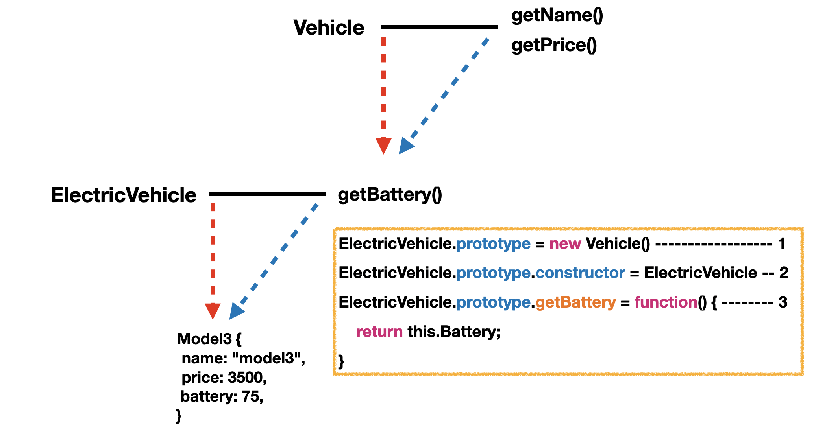
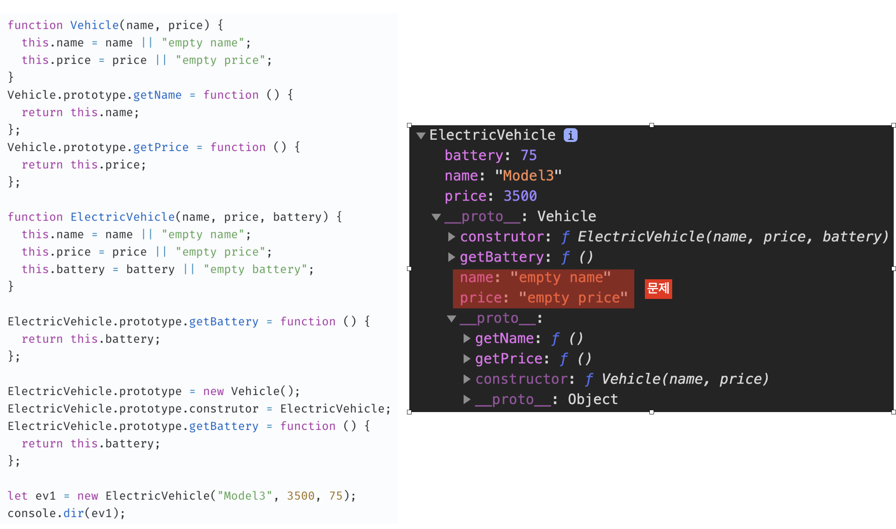
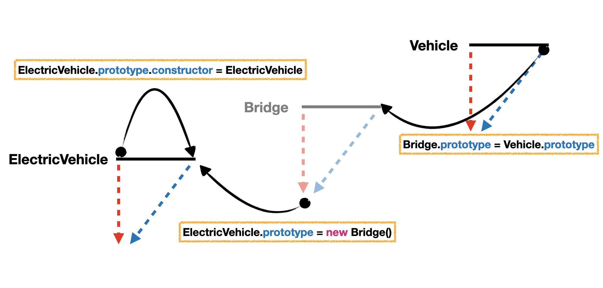
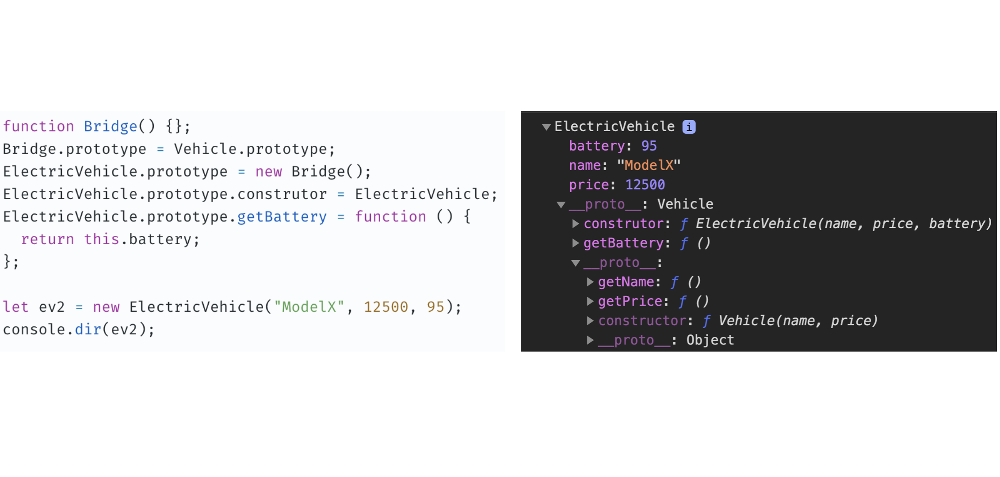

이 글에서는 ES6에서 클래스가 도입되기 전까지 사용된 방식인 프로토타입으로 클래스를 구현하는 방법과 원리를 정리합니다.

# ES5의 클래스

대부분의 객체지향 프로그래밍 언어와는 다르게 자바스크립트는 만들어 질 때부터 객체를 정의하고 사용하는 데에 클래스와 클래스상속을 지원하지 않았다. 이 때문에 객체지향 프로그래밍에 익숙해져있던 개발자들이 다양한 클래스 관련 라이브러리를 만들어 사용하고 있었다. 이런 배경이 결론적으로 ES6에서 Class 문법이 포함되도록 만들었다.

하지만 그렇다고 자바스크립트의 본질인 프로토타입 기반의 설계가 바뀐 것은 아니다. 내부적으로는 여전히 프로토타입으로 클래스를 구현하고 있기 때문이다. 이 때문에 보통 Class 문법은 단순히 문법 설탕(Syntax Suger)에 지나지 않는다고도 말한다. 그러므로 ES5의 프로토타입으로 구현된 클래스를 이해하는 것은 ES6의 클래스 문법의 내부 원리를 이해하는 데에 도움이 될 수 있다.

# ES5의 클래스 구조

일단 Array 생성자 함수를 예로 들면 다음과 같다.



Array 생성자 함수는 자신만이 접근할 수 있는 `static method`, `static property` 그리고 `prototype`을 가진다. `prototype`은 `new` 연산자로 만들어진 인스턴스도 접근 가능한 method를 가진다.

<br>



`new` 연산자로 생성된 인스턴스들의 접근에 대해서 좀 더 구체적으로 도식화하면 위와 같다.

인스턴스는 static한 것들에 접근이 불가능하고 `prototype`의 method에만 접근이 가능하다. 그 이유는 인스턴스의 `__proto__`가 생성자 함수가 아닌 생성자 함수의 `prototype`을 참조하고 있기 때문이다.

## 예시

이해가 쉽게 되지 않으니 예시를 보고 이해해보자.



생성자 함수 Vehicle을 만들고 `prototype`에 method를 추가한다. 자바스크립트에서는 함수도 객체이기 때문에 함수인 Vehicle에 `new` 연산자를 사용해서 인스턴스를 생성할 수 있고 이를 `v1`에 할당한다. 그러면 `v1`은 Vehicle의 `prototype`의 method를 사용할 수 있는 하나의 인스턴스로써 역할을 할 수 있다.

**여기까지 정리하면 ES5에서는 위와 같이 `new` 연산자를 함수에 사용할 수 있다는 점과 생성된 인스턴스가 `__proto__` 를 통해 생성자 역할하는 함수의 `prototype` 에 접근할 수 있다는 자바스크립트의 특성으로 Class를 구현할 수 있다.**

# ES5의 클래스 상속

지금까지 하나의 클래스를 생성해내는 방법을 알아봤다. 이제 객체 지향의 중요한 특징 중에 상속을 어떻게 구현해 내는지 알아보자.

다음은 중복되는 개념과 메소드를 가진 2개의 클래스이다. 이를 어떻게 하면 중복을 없애고 효율적으로 구현할 수 있을까?



클래스의 상속하는 방법은 prototype을 다음과 같은 구조로 만들면 된다.



이와 같은 구조로 구현하기 위해서는 다음과 같은 작업이 필요하다.

- 1번과 같이 하위 클래스의 `prototype`을 상위 클래스의 인스턴스로 지정한다.
- 1번으로 인해 `prototype`의 `constructor`가 없어졌기 때문에 이를 2번과 같이 복구해준다.
- 마지막으로 `Vehicle`의 `prototype`에는 `getBattery()`가 없기 때문에 3번과 같이 추가해준다.

## 예시와 문제 발견

전체 소스 코드로 옮기면 다음과 같다.



위와 같이 완성된 것 같지만 여기서 한 가지 문제점을 찾을 수 있다.

앞서 `Vehicle`의 `constructor`를 `ElectricVehicle`로 변경하는 바람에 `Vehicle`의 `property`에 빈 값이 할당되버린다. 이로 인해서 만약에 `ElectricVehicle`의 `name` 이나 price `property` 가 제거된다면 프로토타입 체인으로 인해서 빈 값에 접근해 개발자가 예상하지 못한 동작을 할 여지가 있다.

## 문제 해결

**위의 문제를 해결하기 위해서 [Douglas Crockford](https://ko.wikipedia.org/wiki/%EB%8D%94%EA%B8%80%EB%9D%BC%EC%8A%A4_%ED%81%AC%EB%A1%9D%ED%8F%AC%EB%93%9C)가 고안한 해결책은 빈 객체를 생성해 중간 다리로 사용하는 방법이다.** 이는 다음과 같다.





**이렇게 빈 객체를 중간 연결 다리로 사용하면 `Vehicle`의 `property`로 인해서 문제가 발생하는 것을 방지할 수 있다.** 하지만 이렇게 매번 구현하기는 귀찮고 비효율적이기 때문에 다음과 같이 함수화해서 사용한다.

## 함수화

```js
let extendClass = (function() {
  function Bridge() {}
  return function(Parent, Child) {
    // 클로저
    Bridge.prototype = Parent.prototype
    Child.prototype = new Bridge()
    Child.prototype.construtor = Child
  }
})() // 즉시 실행 함수(IIFE)
```

**즉시 실행 함수(IIFE)로 `Bridge 함수`를 클로저로 반환해주고 있기 때문에 전역 실행 컨텍스트에서 계속 접근할 수 있도록 남아 있게되고 중복으로 인해 메모리 낭비가 될 여지도 없다.**

## 함수 적용

최종적으로 위의 함수를 사용해서 클래스 상속을 구현한 코드는 다음과 같다.

```js
let extendClass = (function() {
  function Bridge() {}
  return function(Parent, Child) {
    Bridge.prototype = Parent.prototype
    Child.prototype = new Bridge()
    Child.prototype.construtor = Child
  }
})()
extendClass(Vehicle, ElectricVehicle)
ElectricVehicle.prototype.getBattery = function() {
  return this.battery
}
```

# 참조

- https://www.inflearn.com/course/%ED%95%B5%EC%8B%AC%EA%B0%9C%EB%85%90-javascript-flow/
- https://infoscis.github.io/2018/02/13/ecmascript-6-introducing-javascript-classes/

<br>
