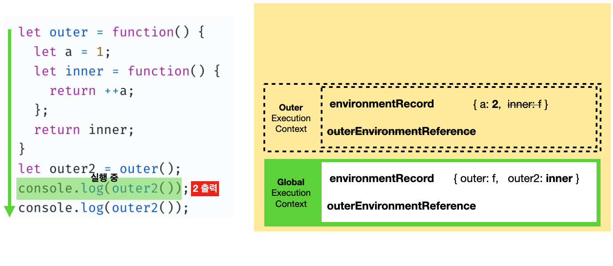

# 클로저란?

**클로저(Closure)란, 내부함수가 외부함수의 지역변수를 참조할 때 외부함수가 소멸(종료)된 후에도 내부함수가 외부함수의 지역변수를 참조할 수 있는 현상을 일컫는다.**

위의 설명을 보고 전혀 감이 오지 않을 것이다. 그게 정상이다. 클로저는 단번에 이해하기 쉬운 개념이 아닌 것 같다.
아래의 한 가지 예제를 통해 클로저를 이해해보도록 하자.

아래의 GIF는 클로저가 발생한 소스코드의 전체 실행 과정인데 이를 한 단계씩 알아볼 것이다.


<br/>

1. 먼저 전역 실행 컨텍스트가 열리고 `environmentRecord`에 전역 공간의 식별 정보를 수집한다.


2. `outer()`를 실행하기 위해서 `Outer` 실행 컨텍스트가 열리고 식별 정보를 `environmentRecord`에 수집한다.


3. `outer()`의 반환 값으로 `inner`함수를 반환하고 `outer2`에 할당한다.


4. 원래는 `outer`함수의 실행이 종료됨과 동시에 `Outer` 실행 컨텍스트도 소멸되어야한다. 하지만 `outer`함수의 지역변수 `a`는 `outer2`에 할당된 `inner`함수를 통해서 참조될 수 있기 때문에(**`a`의 참조 카운트가 남아있다고 표현한다.**) `Outer` 실행 컨텍스트의 `a`는 소멸되지 않고 남아있다.


5. 이제 `outer2`를 실행한다. 이는 할당된 `inner`함수를 실행하는 것과 동일하기 때문에 `Inner` 실행 컨텍스트가 열리고 `outerEnvironmentReference`를 통해서 `Outer` 실행 컨텍스트의 `a`를 찾아서 `1`만큼 증가시킨 `2`를 반환하고 `Inner` 실행 컨텍스트는 소멸된다. 하지만 `Outer` 실행 컨텍스트의 `a`는 여전히 남아있다.


6. 반환 받은 값인 `2`를 콘솔에 출력한다.



7. 5번과 동일하게 동작하지만 `2`를 `1`만큼 증가시킨 `3`을 반환한다. 마찬가지로 `a`의 참조카운트가 유효하기 때문에 `Outer` 실행 컨텍스트의 `a`는 남아 있다.


8. 반환 값인 `3`을 콘솔에 출력한다.


9. 실행이 종료된다. 하지만 `outer2`에 할당된 `inner`함수가 여전히 `Outer` 실행 컨텍스트의 `a`를 참조하고 있다. 그렇기 때문에 `outer2`에 다른 값을 재할당해서 참조를 끊지 않는 이상 Outer 실행 컨텍스트의 `a`값은 계속 남아 있다.


# 클로저를 사용하는 이유?

이러한 클로저를 사용하면 이점은 크게 3가지가 있다.

- 접근 권한 제어
- 지역변수 보호
- 데이터 보존 및 활용

```js
function user(_name) {
  var _logged = true
  return {
    get name() {
      return _name
    },
    set name(v) {
      _name = v
    },
    login() {
      _logged = true
    },
    logout() {
      _logged = false
    },
    get status() {
      return _logged ? 'login' : 'logout'
    },
  }
}

var leo = user('레오')
```

- `leo._name = "다현"` 으로 변경하려해도 변경되지 않는다. (접근 권한 제어, 지역변수 보호)
- `getter` 와 `setter` 를 사용해야 원하는 변수에 접근 가능하다. (데이터 보존 및 활용)

# 참조

- https://bit.ly/3L1uo8d

<br/>
