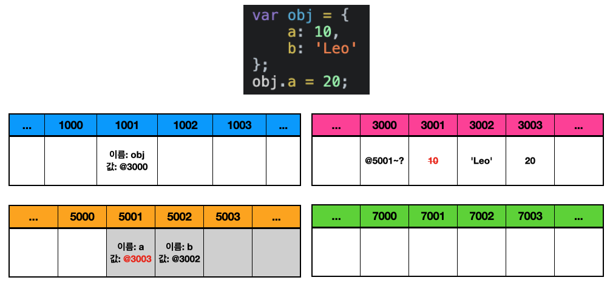

# 데이터 타입의 분류

자바스크립트의 데이터 타입은 크게 2종류로 나누어진다.

기본형 타입(Primitive Type)

- Number
- String
- Boolean
- Null
- Undefined
- Symbol

 

참조형 타입(Reference Type)

- Array
- Function
- RegExp
- Set/WeakSet
- Map/WeakMap

# 메모리 참조 방법

## 기본형 타입

1. 임의의 주소 1001번의 이름을 `식별자 a`를 지정한다.
2. 3001번에 `문자열 Dog`를 저장하고 `식별자 a`를 검색해 값을 3001번으로 지정한다.
3. 3003번에 `문자열 Cat`을 저장하고 `식별자 a`를 검색해 값을 3001번에서 3003번으로 변경한다.
4. 참조 카운트가 0이 된 3001번은 [GC(Garbage Collection)](https://developer.mozilla.org/en-US/docs/Glossary/Garbage_collection)에 의해 초기화된다.

## 참조형 타입

1. 임의의 주소 1001번의 이름을 `식별자 obj`로 지정한다.
2. 저장할 데이터가 많기 때문에 5001번부터 어느 정도의 공간을 확보해두고 그 값을 주소 3000번에 저장한다.
3. 5001번의 이름을 `식별자 a`로 지정하고 3001번에 10을 저장한 다음 5001번의 값을 3001번으로 지정한다.
4. 5002번의 이름을 `식별자 b`로 지정하고 3002번에 `문자열 Leo`를 저장한 다음 5002번의 값을 3002번으로 지정한다.

5. 3003번에 20을 저장한다.
6. `식별자 obj`를 검색해 찾은 다음 그 값인 3000번을 참조해 들어가 5001번까지 참조한다.
7. `식별자 a`를 5001번부터 검색해 찾아 그 값을 3001번에서 3003번으로 변경한다.
8. 3001번은 참조 카운트가 0이 되어 GC(Garbage Collection)에 의해 초기화된다.

# 메모리에 값이 아닌 주소값을 저장하는 이유

자바스크립트는 위의 그림처럼 메모리에 주소값을 저장하기 때문에 기본형 타입은 메모리상에 오직 하나만 존재한다는 특징이 있다. 하지만 이는 데이터를 저장할 때마다 메모리상에 동일한 데이터의 존재 여부를 확인해야한다는 의미이다. 그래서 이런 방법이 최선이 아니라고 생각할 수 있는데 아래의 예시로 살펴보자.

메모리에 직접 값을 저장할 경우에 할당 시에는 동일한 데이터를 찾아볼 필요가 없으니까 빠를 것이다. 하지만 비교 연산에 큰 비용이 발생하게 된다. 비교할 대상의 값이 커지면 커질수록 비용은 순식간에 불어날 것이다.

반면에 메모리에 주소값을 저장하면 데이터 할당 시에 동일한 데이터를 찾아봐야 함으로 시간이 걸리지만 비교할 때는 주소값만 서로 비교해보면 되기 때문에 비용이 들지 않는다. 또한 메모리에 동일한 데이터가 하나만 존재하니 메모리 낭비도 적을 것이다.

|                               | 
메모리에 값을 직접 저장
 | 
메모리에 주소값을 저장 
 |
| ----------------------------- | ---------------------------------------- | ---------------------------------------- |
| 
데이터 할당 
 | 
 빠르다(🐇)
             | 
 느리다(🐢) 
            |
| 
비교 연산
    | 
 느리다(🐢) 
            | 
 빠르다(🐇) 
            |
| 
메모리 낭비
  | 
 크다 
                  | 
 적다 
                  |

# 참조형 타입을 복사할 때 주의해야하는 점

자바스크립트에서는 참조형 타입의 변수를 복사하는 경우에 복사한 참조형 타입의 프로퍼티를 변경하면 원본의 값이 바뀐다. 이게 무슨 의미인지 아래의 예시를 통해 확인해보자.

위의 그림을 보면 `b`가 기본형 타입인 `a`를, `obj2`가 참조형 타입인 `obj1`을 복사하고 있다.

이 때 복사한 `a`의 값과 `obj2`의 프로퍼티를 변경해보면 기본형 타입의 경우에는 값이 변경됨에 따라 값이 함께 바뀐다. 하지만 참조형 타입의 경우에는 기본형 타입보다 한 단계를 더 거쳐서 참조 하기 때문에 값이 변하지 않는다. 이 떄문에 분명 복사된 `obj2`의 프로퍼티를 변경했는데 원본인 `obj1`의 프로퍼티 또한 변경된 것이다. 이 점을 숙지하고 주의하도록 하자.

# 참조

- https://bit.ly/3L1uo8d

 
