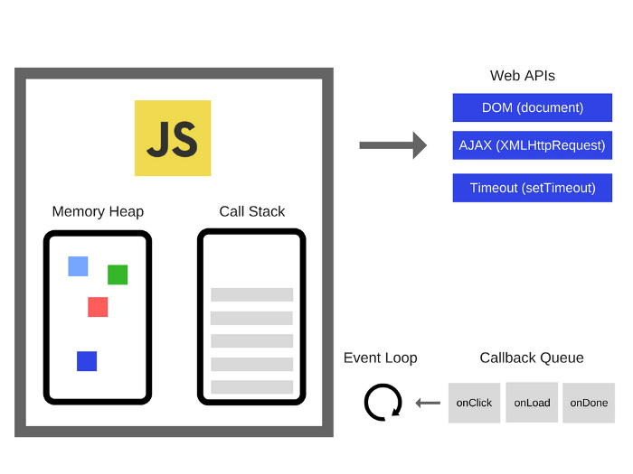

# 이벤트 루프란?

**자바스크립트는 싱글 스레드 언어이다.** 싱글 스레드의 의미는 작업을 하나씩만 수행할 수 있고 다수의 작업을 동시에 수행하는 것은 불가능하다는 것을 말한다. 하지만 브라우저가 동작하는 것을 살펴보면 많은 작업들이 동시에 실행되는 것처럼 보인다. 이를 가능하게 해주는 것이 **이벤트 루프(Event Loop)이며 이벤트 루프는 자바스크립트에게 동시성을 지원해준다.**

하지만 여기서 확실히 짚고가야할 부분은 이벤트 루프가 ECMAScript에 명세되어 있는 개념이 아니라는 것이다. 즉, **이벤트 루프는 자바스크립트를 구동하는 환경인 브라우저나 Node.js에서 제공하는 다양한 기능 중 하나이다.**

# 동작 원리



위 그림은 이벤트 루프를 설명하기 위해서 필요한 브라우저 내부의 요소들이고 자세한 내용은 다음과 같다.

- **자바스크립트 엔진**
  - 자바스크립트 코드를 실행하는 엔진이며 내부에 콜 스택과 힙이라는 영역을 포함하고 있다. 콜 스택은 전에 [실행 컨텍스트](https://leo-xee.github.io/JavaScript/execution-context/)에서 설명했기 때문에 넘어가고 힙은 실행 컨텍스트에서 사용할 변수가 저장되는 메모리 공간으로 이해하면 된다.
- **Web APIs**
  - 브라우저에서 지원하는 API로써 [다양한 작업](https://developer.mozilla.org/en-US/docs/Web/API)을 지원한다.
  - 그 중에 비동기 작업이 필요한 특정 API(DOM API, AJAX, Timer 관련 API)들은 **자바스크립트 엔진과 별개의 스레드에서 동시에 동작하는 백그라운드(Background)라는 영역에서 실행된다.**
- **콜백 큐(테스크 큐)**
  - 백그라운드에서 실행이 완료된 Web APIs 의 콜백이 `push` 되는 큐(Queue)이다.

<br>

기본적인 동작 과정은 다음과 같다.

1. 자바스크립트 엔진이 자바스크립트 파일을 실행
2. 백그라운드에서 실행되어야 할 Web API 발견
3. 해당 API를 백그라운드에서 실행하도록 이동
4. 자바스크립트 파일 실행 재개 + 백그라운드로 이동된 API도 동시에 실행
5. 백그라운드의 API가 실행 완료된 후에 콜백이 태스크 큐로 `push`
6. 이벤트 루프가 테스크 큐에 작업이 있다는 것을 감지하고 콜 스택이 비어 있을 때까지 대기
7. 자바스크립트 파일의 실행이 완료되어 콜 스택이 빔
8. 이벤트 루프가 콜 스택이 비어있음을 감지하고 테스크 큐의 작업을 콜 스택에 `push`
9. 자바스크립트 엔진이 `push` 된 작업을 실행하고 완료된 후에 전체 작업 종료

여기서 알 수 있듯이 **이벤트 루프의 역할은 콜 스택과 테스크 큐를 항상 바라보고 있다가 콜 스택이 비어 있으면 테스크 큐에서 대기하고 있는 콜백을 콜 스택으로 이동시켜주는 것이 전부이다.**

## 매크로태스크 큐와 마이크로태스크 큐


위에서는 태스크 큐가 하나인 것처럼 동작 과정을 설명했지만 사실 태스크 큐는 다음과 같이 2가지 종류로 나누어진다.

- **매크로태스크 큐(Macrotask Queue)**

  - requestAnimationFrame
  - I/O (네트워크나 하드웨어 작업)
  - UI rendering
  - Timer(setTimeout, setInterval, setImmediate)

- **마이크로태스크 큐(Microtask Queue)**
  - process.nextTick
  - Promises
  - queueMicrotask
  - MutationObserver

<br>

**여기서 중요한 점은 마이크로태스크 큐가 매크로태스크 큐보다 우선순위가 높다는 것이다.**

# 동작 예시

이제 브라우저가 비동기를 제어하는 과정과 이벤트 루프의 역할도 알아보았다. 그리고 태스크 큐도 매크로태스크 큐와 마이크로태스크 큐로 나눠진다는 사실을 확인했으니 **마지막으로 다음 예시의 동작을 분석해보고 확실하게 정리해보자.**

```js
console.log('start')

setTimeout(function() {
  console.log('setTimeout')
}, 0)

Promise.resolve()
  .then(function() {
    console.log('promise1')
  })
  .then(function() {
    console.log('promise2')
  })

const deley = () => {
  for (let i = 0; i < 100000; i++) {
    for (let j = 0; j < 100000; j++) {}
  }
}

deley()
console.log('end')
```

```
start
end
promise1
promise2
setTimeout
```

위 예시 코드의 동작 과정은 다음과 같다.

1. 전역 실행 컨텍스트가 생성되고 콘솔에 `start` 를 출력 (`console`의 실행 과정은 생략)
2. `setTimeout` 을 백그라운드로 이동
3. 2개의 `then` 함수가 백그라운드로 이동 **(Promise는 `then`, `catch` 이전까지는 동기적으로 동작)**
4. delay 실행 컨텍스트가 생성되고 delay 함수를 실행
5. 백그라운드의 `setTimeout` 과 2개의 `then` 함수의 실행이 완료
6. `setTimeout` 의 콜백이 매크로태스크 큐로 `push` 되고 대기
7. 2개의 `then` 의 콜백이 마이크로태스크 큐로 `push` 되고 대기
8. delay 함수의 실행이 종료되고 delay의 실행 컨텍스트 소멸
9. 콘솔에 `end`를 출력한다.
10. 이벤트 루프가 콜스택이 비었음을 감지
11. 이벤트 루프가 우선순위가 높은 마이크로태스크 큐의 콜백을 콜 스택으로 이동
12. `promise1`과 `promise2` 를 출력
13. 이벤트 루프가 마이크로태스크 큐가 비었음을 확인하고 매크로태스크 큐의 콜백을 콜 스택으로 이동
14. `setTimeout`을 출력

<br>

# 참조

- https://blog.sessionstack.com/how-javascript-works-event-loop-and-the-rise-of-async-programming-5-ways-to-better-coding-with-2f077c4438b5
- https://meetup.toast.com/posts/89
- https://bit.ly/3An9y0K
- https://www.youtube.com/watch?v=8aGhZQkoFbQ
