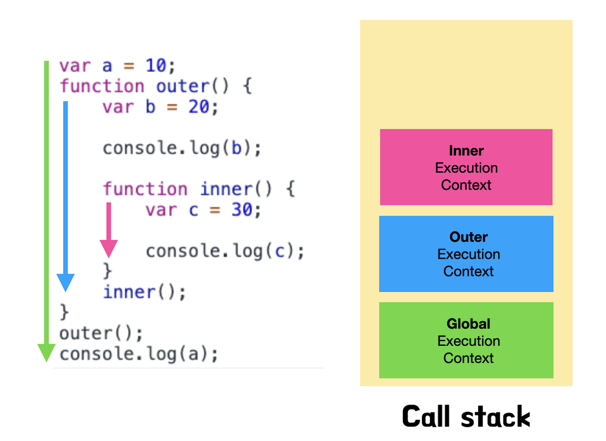

# 실행 컨텍스트란?

**실행 컨텍스트(Execution Context)는 코드가 실행되기 위해 필요한 환경을 의미한다.** 이 개념은 스코프 체인(Scope Chain), 호이스팅(Hoisting), this, 클로저(Closure)등의 동작을 설명할 수 있는 자바스크립트의 핵심 원리이다.

자바스크립트는 실행 컨텍스트(코드가 실행되기 위해 필요한 환경)라는 환경의 기준을 함수로 구분한다. 즉, 새로운 함수가 실행될 때마다 새로운 실행 컨텍스트가 실행되는 것이고 동일한 함수 스코프 내에서 작성된 코드는 동일한 조건에서 실행된다는 의미로도 이해할 수 있다.

그렇다면 `if문`, `for문`, `switch문`, `while문`과 같은 블록 스코프에도 동일하게 적용되는 것일까? 그렇지는 않다. ES6에서 블록 스코프 개념이 등장하면서 `let`과 `const`에 한해서만 블록 스코프라는 별도의 공간을 생성하고는 있지만 별도의 실행 컨텍스트는 생성하지 않는다.

정리하면, 자바스크립트는 오직 함수에 의해서만 실행 컨텍스트를 구분한다는 점이다.

# 콜 스택

**함수가 실행되는 순서를 제어하기 위해서 스택 자료구조를 사용하는데 이를 콜 스택(Call Stack)이라고 부른다.** 아래의 그림과 같이 `전역 함수` - `outer 함수` - `inner 함수` 순으로 각각의 실행 컨텍스트가 콜 스택에 쌓인다.

# 실행 컨텍스트의 내부

콜 스택에 쌓인 실행 컨텍스트의 내부를 자세히 살펴보면 실행 컨텍스트는 3가지의 환경 정보들을 담고 있는 것을 확인할 수 있다.

**`VariableEnvironment`**: 최초 식별자들을 스냅샷으로 저장하고 변화없이 유지

- **`environmentRecord`**: 현재 환경의 최초 식별자들을 스냅샷으로 저장하고 유지
- **`outerEnvironmentReference`**: 외부 환경의 최초 식별자들을 참조해 스냅샷으로 저장하고 유지

**`LexicalEnvironment`**: 함수 내의 식별자들을 저장하고 변화가 생기면 실시간 반영

- **`environmentRecord`**: 현재 환경의 식별자들을 저장하고 변화가 생기면 실시간 반영
- **`outerEnvironmentRecord`**: 외부 환경의 식별자들을 저장하고 변화가 생기면 실시간 반영

**`thisBinding`**: this 편에서 정리할 예정.

위의 큰 구조를 이해한 후에 `VariableEnvironment`는 백업을 위함이라고 생각해두고 값이 실시간으로 변하는 `LexicalEnvironment`에 집중하도록 하자.

# 호이스팅

`LexicalEnvironmet`의 `environmentRecord`는 현재 환경의 식별정보를 수집한다. 다시 말해 현재 환경 내의 코드를 실행하기 전에 변수의 선언이나 함수 선언을 미리 수집하는 것이다. 여기서 오해할 수 있는 부분이 있는데 할당이 아닌 선언 부분만을 미리 수집한다는 것이다. 이 특징을 사람 입장에서 보기에 **선언 부분이 상단으로 끌어올려진 것처럼 느껴진다고해서 추상화한 개념이 우리가 알고 있는 호이스팅(Hoisting)**이다.

이제 호이스팅은 단순히 선언들이 알아서 상단으로 당겨진 후 동작하는 것이 아니라 `environmentRecord`가 먼저 식별정보들을 수집한 뒤에 이 정보들을 가지고 코드를 실행하기 때문에 생기는 현상인 것이다.

# 스코프 체인

**`LexicalEnvironment`의 `outerEnvironmentReference`는 외부 환경의 식별자 정보를 참조한다. 이런 참조가 위의 그림과 같이 연쇄적으로 일어나면서 참조를 하는데 이를 스코프 체인(Scope Chain)이라고 한다.** 이 참조는 내부에서 외부로만 참조하기 때문에 외부에서는 내부의 식별자 정보를 알 수 있는 방법이 없다. 전역 공간에서 내부 함수 내의 변수에 접근할 수 없는 이유도 동일하다.

# 참조

- https://bit.ly/3L1uo8d

 
