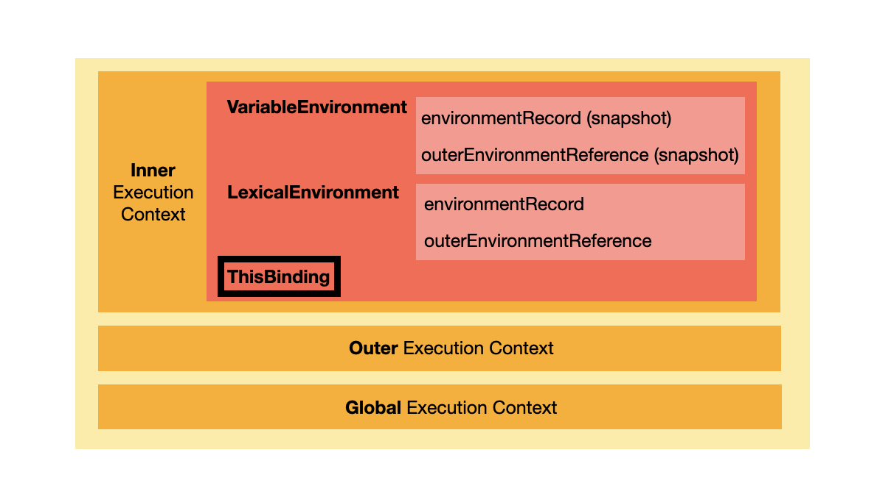
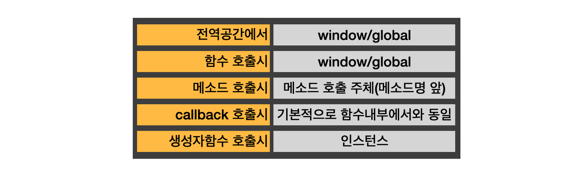

# this란?



자바스크립트는 실행 컨텍스트 내부에 `ThisBinding` 이라는 `this` 를 담당하는 객체가 있기 때문에 `this`의 바인딩은 해당 실행 컨텍스트가 생성될 때 세팅된다. 즉, 실행 컨텍스트는 함수가 호출될 때 생성되기 때문에 `this`는 함수가 호출되는 순간에 결정된다고 할 수 있다. 더나아가 함수가 호출될 때 결정되므로 함수가 호출되는 방식에 따라서 `this`는 얼마든지 달라질 수 있다.

# this의 5가지 경우



## 전역 공간

**전역공간(Global Scope)에서의 `this`는 전역 객체를 가리킨다.** 구체적으로는 브라우저 환경에서는 `window`, Node 환경에서는 `global`를 가리킨다. 참고로 `window`와 `global` 객체는 ECMAscript에 명세된 전역 객체에 대한 내용의 구현체이다.

## 함수 호출 시

**함수를 실행한 부분의 공간은 실질적으로 전역공간이기 때문에 함수 호출 시의 `this`는 전역 객체를 가리킨다.**

```js
function a() {
  console.log(this) // 전역 객체(window/global) 출력
}
a()
```

하지만 아래의 예시를 살펴보자.

```js
function b() {
  console.log(this)
  function c() {
    console.log(this) // 전역 객체(window/global) 출력
  }
  c()
}
b()
```

`함수 c` 를 호출한 부분을 보면 `함수 b`의 내부에서 실행했기 때문에 `함수 c`의 `this`는 `함수 b`가 되어야 했지만 전역 객체가 출력된다.

**이렇게 this 바인딩이 일관성이 없는 이유는 자바스크립트의 아버지인 Brendan Eich가 자바스크립트를 2주도 안 되는 시간 동안 만든 데에 의한 실수라고도 할 수 있다.** 이런 이유 때문에 함수명()과 같이 함수로써 실행된 `this` 는 전역 객체라고 암기하는 게 편한다.

## 메소드 호출 시

**메소드 호출 시에 `this`는 메소드를 호출한 주체(메소드 명 앞)이다.**

```js
var a = {
  b: {
    c: function() {
      console.log(this) // a.b를 출력({c: f()})
    },
  },
}
a.b.c() // 메소드 c를 호출한 주체는 a.b(객체 b)
```

### 메소드 우회 방법

```js
var a = 10
var obj = {
  a: 20,
  b: function() {
    console.log(this.a) // 20 출력

    function c() {
      console.log(this.a) // 10 출력
    }
    c()
  },
}
obj.b()
```

`obj.b()` 는 `obj` 의 메소드를 실행했기 떄문에 이 때의 `this`는 `obj`를 가리킨다. 그래서 `함수 b`의 `this.a`는 `20`을 출력한다. 하지만 `c()`를 호출한 부분을 보면 그냥 함수로써 실행했기 때문에 전역 객체의 `a`의 값인 `10`을 출력한다.

이 문제를 해결하기 위해서는 아래의 예시처럼 우회하는 방법이 있다.(ES6 이전에는 이런 식으로 `this`를 컨트롤 했다.)

```js
var a = 10
var obj = {
  a: 20,
  b: function() {
    var self = this
    console.log(this.a) // 20 출력

    function c() {
      console.log(self.a) // 20 출력!!!
    }
    c()
  },
}
obj.b()
```

나머지는 동일하니 `console.log(self.a)`를 실행하기 위해서 실행 컨텍스트의 `outerEnvironmentRecord` 를 통해서 `var self = this` 의 `this` 를 찾는다. 여기서 `this`는 `obj` 이기 때문에 `10`이 아닌 `20`이 출력된다.

## 콜백 호출 시

**콜백 호출 시에는 기본적으로 함수 호출 시와 동일하게 `this`는 전역 객체를 가리킨다. 하지만 제어권을 가진 함수가 콜백의 `this`를 지정한 경우에는 지정된 `this`를 따른다.**

```js
var callback = function() {
  console.log(this)
}

setTimeout(callback, 1000) // 전역 객체(window/global)
```

하지만 아래의 예시에서 `this`는 전역 객체를 가리키지 않는다.

```js
document.body.innerHTML = '<div class="a">Click</div>'

document.querySelector('.a').addEventListener('click', function() {
  console.log(this) // div.a 출력
})
```

위의 코드를 실행한 결과는 `div.a` 엘리먼트가 출력된다. 그 이유는 `addEventListener 함수`는 콜백을 처리할 때의 `this`를 이벤트가 적용된 엘리먼트를 가리키도록 명시해놨기 때문이다.

정리하면 콜백 호출 시의 `this`는 기본적으로 함수 호출 시의 `this`를 따르되 제어권을 가진 함수가 `this`를 따로 명시한 경우에는 그에 따린다.

## 생성자함수 호출 시

**생성자함수 호출 시에 `this`는 `new 연산자`로 생성된 인스턴스를 가리킨다.**

```js
function Book(title, pages) {
  this.title = title
  this.pages = pages
}

var factfullness = new Book('factfullness', 450)
console.log(factfullness) // Book {title: 'factfullness', pages: 450}
```

```js
function Book(title, pages) {
  this.title = title
  this.pages = pages
}

var factfullness = Book('factfullness', 450)
console.log(window.title, window.pages) // factfullness 450
```

# 참조

- https://bit.ly/3L1uo8d

<br/>
