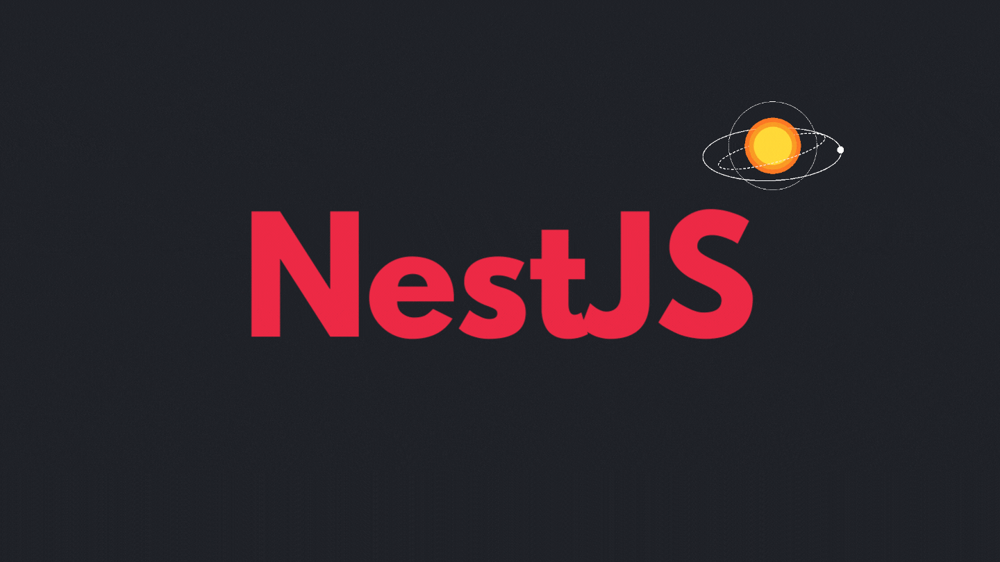
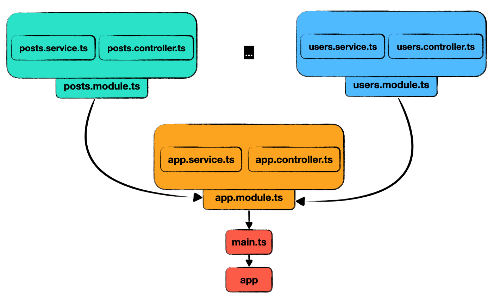

# NestJS란?

**[NestJS](https://nestjs.com/)는 효율적이고 안정적이며 확장에 용이한 Node 기반 서버 애플리케이션을 구축하기 위한 웹 서버 프레임워크이다.** 기존 웹 서버 프레임워크의 경우에는 쉽게 서버를 만들 수 있고 높은 자유도를 가진다는 장점이 있지만 시스템 아키텍처 관점에서의 지원은 거의 없었다. 그렇기 때문에 애플리케이션의 규모가 커질수록 유지보수를 위해 개발자가 직접 신경써야할 점이 많았는데 이런 문제 해결하기 위해서 NestJS가 등장했다.

NestJS는 내부적으로 Express나 Fastify 프레임워크를 래핑해서 이를 기반으로 동작하고 Typescript를 기본으로 지원한다. 그리고 Angular의 아키텍처에 큰 영향을 받아서 Module-Component 기반으로 구성되어서 재활용성이 높아졌다. 또한 AOP(Aspect Oriented Programming), DI(Dependency Injection), IoC(Inversion of Control), Singleton Design Pattern과 같은 객체지향 개념을 도입했다.

이를 통해서 개발자가 프레임워크에 적용된 디자인 패턴에 맞게 코드를 작성해야하지만 확장성과 유지보수의 관점에서 프레임워크의 지원을 확실히 받을 수 있게 되었다. 추가로 Nest CLI를 사용해서 애플리케이션의 구성요소 파일들을 명령어 한 줄로 생성할 수도 있다.

# 구조



## Controller

**Controller는 들어오는 요청(request)을 받아서 처리된 결과를 응답(response)하는 역할을 한다.** 이 과정에서 엔드포인트 라우팅으로 각각의 Controller가 받을 수 있는 요청을 분류한다. 이를 통해 최대한 모듈화된 애플리케이션을 구축할 수 있다.

```ts
/* app.controller.ts */

import { Controller, Get } from '@nestjs/common'
import { AppService } from './app.service'

@Controller()
export class AppController {
  constructor(private readonly appService: AppService) {}

  @Get()
  getHello(): string {
    return this.appService.getHello()
  }
}
```

## Provider

**Provider는 전달 받은 데이터로 비즈니스 로직을 수행하는 역할을 하며 기능에 따라 다양한 Provider들이 존재한다.**

- Service
- Middleware
- Exception Filter
- Pipe
- Interceptor
- Guards

## Module

**Module은 Provider와 Controller를 하나로 묶는 역할을 한다.** 기본적으로 하나의 Module은 다른 Module에서 사용할 수 없도록 캡슐화되어 있는데 Module의 import와 export에 다른 Module을 추가해서 캡슐화를 해제할 수 있다.

```ts
/* app.module.ts */

import { Module } from '@nestjs/common'
import { CatsModule } from './cats/cats.module'
import { AppController } from './app.controller'
import { AppService } from './app.service'

@Module({
  imports: [CatsModule], // AppModule에서 CatsModule을 사용할 수 있도록 캡슐화 해제!!
  controllers: [AppController],
  providers: [AppService],
})
export class AppModule {}
```

# 참조

- [https://docs.nestjs.com/](https://docs.nestjs.com/)

<br>
