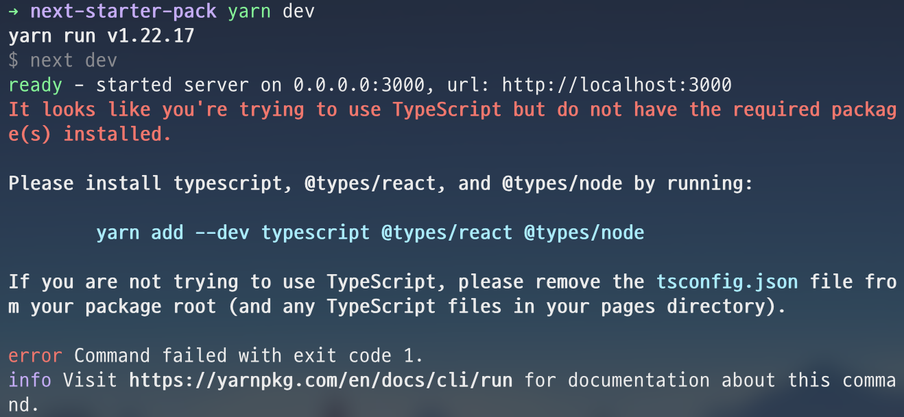

이 글에서 next-create-app을 이용하지않고 Typescript, Jest, Testing-Library, ESLint(Airbnb), Prettier를 사용해서 직접 Next.js(12+) 환경을 구축하는 과정을 정리합니다. 전체 코드는 [여기](https://github.com/Leo-Xee/next-starter-pack)에서 확인할 수 있습니다.

# Next.js

먼저 Next.js를 사용하기 위한 필수 패키지들을 설치한다.

```bash
$ yarn add next react react-dom
```

`package.json` 에 scripts를 다음과 같이 작성한다.

```json
/* package.json */

{
  // ...
  "scripts": {
    "dev": "next dev",
    "build": "next build",
    "start": "next start",
    "lint": "next lint"
  }
}
```

Next.js의 필수 디렉토리인 `pages`와 `public` 을 생성한 다음에 나는 프로젝트의 주요 파일을 `src` 디렉토리 안에서 관리할 것이기 때문에 다음과 같이 `pages` 디렉토리를 이동시킨다. 참고로 `public` 디렉토리는 프로젝트의 루트에 위치해야한다.

```bash
.
├── src
│   └── pages
├── public
├── node_modules
├── yarn.lock
└── package.json
```

- `pages` : 파일기반 라우팅 시스템을 위한 디렉토리
- `public` : 이미지와 폰트와 같은 정적 리소스를 위한 디렉토리

위에서 생성한 `pages` 디렉토리 안에 `index.js` 를 생성하고 다음과 같이 작성한다.

```jsx
/* index.jsx */

function HomePage() {
  return <h1>Welcome to Next.js!</h1>
}

export default HomePage
```

여기까지 완료하고 `yarn dev` 명령어를 실행하면 Next.js 프로젝트가 정상적으로 동작하는 것을 확인할 수 있다. 참고로 Next.js는 Webpack과 Babel등의 기본적인 설정들을 제공해주기 때문에 따로 설정할 필요가 없다.

# TypeScript

Next.js에 Typescript를 적용하기 위해서 다음 명령어로 `tsconfig.json` 파일을 생성하고 프로젝트를 실행시켜본다. 참고로 설정 파일의 내용이 없으면 프로젝트 실행 시에 Next.js에서 설정 기본값을 자동으로 세팅해준다.

```bash
# 파일 생성
$ touch tsconfig.json

# 프로젝트 실행
$ yarn dev
```

명령어를 실행하면 다음 그림과 같이 typescript 관련 패키지들을 설치하라는 메시지를 확인할 수 있다.



위의 메시지와 같이 다음 명령어로 관련 패키지들을 설치하고 다시 프로젝트를 실행시켜보면 정상적으로 동작함과 동시에 `tsconfig.json` 파일의 내용이 자동으로 세팅된 것을 확인할 수 있다.

```bash
$ yarn add -D typescript @types/react @types/node

$ yarn dev
```

Next.js에서 기본적으로 세팅해준 `tsconfig.json`에 내가 사용하는 옵션을 추가한 파일의 내용은 다음과 같다.

```json
/* tsconifg.json */

{
  "compilerOptions": {
    "target": "es5",
    "lib": ["dom", "dom.iterable", "esnext"],
    "allowJs": true,
    "skipLibCheck": true,
    "strict": true,
    "forceConsistentCasingInFileNames": true,
    "noEmit": true,
    "incremental": true,
    "esModuleInterop": true,
    "module": "esnext",
    "moduleResolution": "node",
    "resolveJsonModule": true,
    "isolatedModules": true,
    "jsx": "preserve",
    "noImplicitAny": true,
    "strictNullChecks": true,
    "allowSyntheticDefaultImports": true,
    "noFallthroughCasesInSwitch": true,
    "sourceMap": true,
    "baseUrl": ".",
    "paths": {
      "@/*": ["src/*"]
    }
  },
  "include": ["next-env.d.ts", "**/*.ts", "**/*.tsx"],
  "exclude": ["node_modules"]
}
```

마지막으로 `src` 디렉토리 내부의 `index.jsx` 의 파일명을 `index.tsx` 으로 변경해주면 Typescript 세팅이 완료된 것이다.

# Jest, Testing-library

이제 Next.js에 테스트 환경을 세팅하기 위해서 관련 패키지들을 설치한다. 관련 패키지들의 내용이 궁금하다면 [여기](https://leo-xee.github.io/React/react-setup-jest/)를 확인해도록 하자.

```bash
$ yarn add -D jest @testing-library/react @testing-library/jest-dom @testing-library/user-event jest-environment-jsdom
```

프로젝트의 루트 위치에 `setupTests.ts` 파일을 생성하고 다음과 같이 작성한다.

```jsx
/* jest.setup.js */

import '@testing-library/jest-dom/extend-expect'
```

Next.js 12부터는 Jest의 기본적인 설정을 제공하기 때문에 프로젝트의 루트 위치에 `jest.config.js` 파일을 생성하고 다음과 같이 간략하게 설정을 완료할 수 있다.

```jsx
/* jest.config.js */

const nextJest = require('next/jest')

const createJestConfig = nextJest({
  dir: './',
})

const customJestConfig = {
  setupFilesAfterEnv: ['<rootDir>/jest.setup.js'], // 각각의 테스트 전에 실행할 모듈을 경로
  moduleDirectories: ['node_modules', '<rootDir>/'],
  testEnvironment: 'jest-environment-jsdom',
  moduleNameMapper: {
    '^@/(.*)$': '<rootDir>/src/$1', // tsconfig에서 절대경로 사용 시에 jest가 인식하도록 경로 매핑
  },
}

module.exports = createJestConfig(customJestConfig)
```

`package.json`의 scripts에 다음과 같은 명령어를 추가한다.

```json
/* package.json */

{
  // ...
  "scripts": {
    "dev": "next dev",
    "build": "next build",
    "start": "next start",
    "lint": "next lint",
    "test": "jest --watchAll" // 추가
  }
  // ...
}
```

테스트가 잘 동작하는지 확인하기 위해서 `pages` 디렉토리 내부에 `index.test.tsx` 파일을 생성하고 다음과 작성한다.

```tsx
/* index.test.tsx */

import React from 'react'
import { render, screen } from '@testing-library/react'
import HomePage from './index'

it('Welcome message를 보여준다.', () => {
  render(<HomePage />)
  const element = screen.getByRole('heading', {
    name: 'Welcome to Next.js!',
  })
  expect(element).toBeInTheDocument()
})
```

그 다음 `yarn test` 명령어을 실행하면 정상적으로 동작하는 것을 확인할 수 있다. Next.js 12부터는 테스트에 Rust 컴파일러를 사용하기 때문에 속도가 크게 개선되었다.


# ESLint(Airbnb), Prettier

Next.js에서 제공하는 `lint` 명령어를 사용해서 기본적으로 필요한 ESLint 규칙들을 지정할 수 있다. 하지만 Airbnb 규칙을 사용하는 것을 선호하기 때문에 프로젝트에 airbnb와 next의 규칙을 직접 설치하고 세팅할 것이다.

ESLint와 Prettier 관련 패키지들을 설치한다.

```bash
# eslint와 prettier
$ yarn add -D eslint prettier

# eslint의 formatter을 off하고 prettier를 사용하기 위한 패키지들
$ yarn add -D eslint-config-prettier eslint-plugin-prettier

# typescript를 lint하기 위한 패키지들
$ yarn add -D @typescript-eslint/eslint-plugin @typescript-eslint/parser

# next 규칙 플러그인
$ yarn add -D @next/eslint-plugin-next

# airbnb 규칙
$ yarn add -D eslint-config-airbnb

# airbnb 규칙의 의존성 패키지들
$ yarn add -D eslint-plugin-import eslint-plugin-jsx-a11y eslint-plugin-react eslint-plugin-react-hooks

# airbnb 타입스크립트 규칙
$ yarn add -D eslint-config-airbnb-typescript

# jest를 규칙 플러그인
$ yarn add -D eslint-plugin-jest
```

프로젝트의 루트 위치에 `.eslinitrc.json` 파일을 생성하고 다음과 같이 작성한다.

```json
/* .eslintrc.json */

{
  "root": true,
  "env": {
    "browser": true,
    "es6": true,
    "node": true,
    "jest": true
  },
  "parser": "@typescript-eslint/parser",
  "parserOptions": {
    "ecmaFeatures": {
      "jsx": true
    },
    "ecmaVersion": "latest",
    "sourceType": "module",
    "project": "./tsconfig.json"
  },
  "ignorePatterns": ["jest.*.js"],
  "extends": [
    "airbnb",
    "airbnb-typescript",
    "airbnb/hooks",
    "plugin:@typescript-eslint/recommended",
    "plugin:@typescript-eslint/recommended-requiring-type-checking",
    "plugin:@next/next/recommended",
    "plugin:prettier/recommended",
    "plugin:jest/recommended"
  ],
  "plugins": ["prettier", "@typescript-eslint", "jest", "import"],
  "rules": {
    "prettier/prettier": ["error", { "endOfLine": "auto" }],
    "import/extensions": [
      "error",
      {
        "tsx": "never",
        "ts": "never",
        "js": "never",
        "jsx": "never"
      }
    ],
    "react/react-in-jsx-scope": 0,
    "react/jsx-props-no-spreading": 0
  }
}
```

프로젝트의 루트 위치에 `.prettierrc.json` 파일을 생성하고 다음과 같이 작성한다.

```json
/* .prettierrc.json */

{
  "singleQuote": false,
  "arrowParens": "always",
  "semi": true,
  "useTabs": false,
  "tabWidth": 2,
  "printWidth": 80,
  "trailingComma": "all"
}
```

# 참고

- [https://nextjs.org/docs/getting-started](https://nextjs.org/docs/getting-started)
