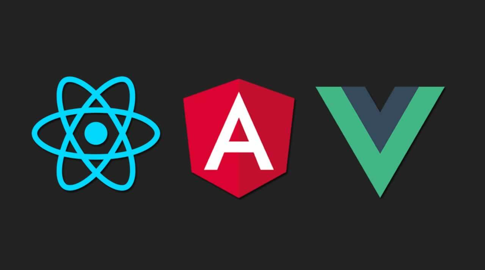

# Next.js란?

**Next.js는 SSR(Server Side Rendering)을 쉽게 구현할 수 있는 개발 환경을 제공하는 React의 프레임워크이다.** 물론 React도 SSR을 고려해서 설계되었기 때문에 React만으로 SSR을 구현할 수도 있지만 이를 위해서 설정하는 과정이 꽤나 복잡하다고 한다. 이외에도 다양한 이유로 현재 Next.js가 많이 사용되는 추세이다.

# Next.js의 등장 배경

**과거의 대부분 웹사이트들은 SSR과 MPA(Multi Page Application) 방식으로 동작해왔었다.** 하지만 우리 기억에도 남아있는 페이지 이동 시에 깜빡거리는 현상과 같은 문제들로 인해 사용자 경험이 좋지 못했고 동시에 스마트폰의 시대가 도래하면서 앱과 같은 사용성의 수요가 커져갔다.


**이런 시기에 AJAX와 jQuery가 등장했고 커뮤니티에서도 많이 사용되면서 클라이언트에서 비동기적으로 JSON 형태의 데이터만을 서버에 요청하고 받아와서 사용자에게 데이터와 함께 웹 페이지를 보여주는 방식이 대세가 되었다.**

하지만 여기서 더 나아가서 클라이언트에서 데이터를 받아오는 것뿐만 아니라 웹페이지도 렌더링해버리자는 요구도 생겨났다.



**이런 요구에 응하면서 등장한 것이 흔히 SPA 3대장이라고 일컫는 React, Angular, Vue와 같은 라이브러리 및 프레임워크이다.**

이들로 인해 최근까지 CSR(Client Side Rendering)이 가능한 SPA(Single Page Application)의 전성기가 이어져왔다.

하지만 욕심은 끝이 없는 법!!! 😈

이런 CSR + SPA 방식에서도 몇 가지 문제가 발생하기 시작하는데 다음과 같다.

- 초기 로딩이 느리다.
- 페이지 캐싱이 잘 안된다.
- SEO(Search Engine Optimization)이 잘 안된다.

지금까지의 과정 속에서 누적되어왔던 문제를 해결하기 위해서 CSR과 SSR의 장점만을 모은 **Vercel의 Next.js가 등장하게 되었다.**

# Next.js의 장점

Next.js의 장점은 다양하지만 크게 3가지를 정리해본다.

## Built-in Routing System

Next.js 는 Page 기반의 라우팅 시스템을 기본적으로 제공한다.

Next.js에서 페이지 라우팅을 구현하기 위해서는 프로젝트 루트 위치에 `pages` 라는 디렉토리를 생성하고 내부에 라우팅될 파일을 작성하면 해당 파일명과 매핑되어서 알아서 라우팅된다. 이는 기존 React에서 `react-router-dom` 라이브러리를 따로 설치하고 따로 구현해야만했던 개발자의 수고를 덜어준다.

```bash
pages
 ├── about.jsx
 ├── index.jsx
 ├── profile.jsx
 └── signup.jsx
```

## Code Splitting

```bash
.
├── .next              # 빌드파일
├── components         # React 컴포넌트 디렉토리
│	  ├── Header.jsx
│		└── Footer.jsx
├── node_modules
├── next.config.js     # Next.js 설정 파일
├── package-lock.json
├── package.json
├── pages              # pages 내부의 각 파일이 URL과 파일명으로 매핑되어 라우팅된다.
│	  ├── _app.jsx       # 서버에서 요청 시에 가장 먼저 실행되는 컴포넌트, 페이지에 적용할 공통 레이아웃을 여기서 적용한다.
│	  ├── _document.jsx  # _app.jsx 다음으로 실행되며 공통적으로 사용할 <Head>, <body>등과 같은 태그들을 커스텀할 때 사용한다.
│	  ├── _error.js      # error가 발생했을 때 처리하는 페이지
│	  ├── about.jsx
│	  ├── index.jsx
│	  ├── profile.jsx
│		└── signup.jsx
├── static             # 이미지와 같은 리소스를 저장하는 디렉토리
├── redux
├── yarn-error.log
└── yarn.lock
```

## Server Side Rendering

Next.js는 SSR, SSG를 지원하고 다양한 옵션을 제공한다.

`getStaticProps`, `getStaticPaths`, `getServerSideProps`등과 같은 API를 개발자에게 제공함으로써 특정 페이지를 그냥 CSR로 처리할지, SSR로 처리할지 또는 서버에 HTML을 미리 만들어두거나 `Pre-Rendering` 할 것인지... 등의 다양한 옵션을 해당 페이지의 특성에 맞게 개발자가 개발할 수 있도록 도와준다.

이 외에도 이미지, 폰트 최적화등 다양한 기능들을 제공한다.

<br>
