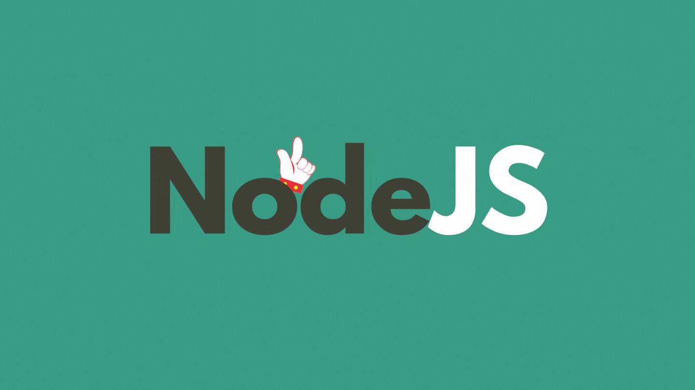

# Concurrently란?

**[Concurrently](https://www.npmjs.com/package/concurrently)는 여러 개의 명령어를 동시에 실행할 수 있도록 해주는 패키지이다.** 이 패키지를 사용하면 frontend와 backend에서 개발용 서버를 따로 실행할 필요도, 터미널의 로그를 따로 확인할 필요도 없다.

# 설치하기

현재 나의 디렉토리 구조는 다음과 같다. backend에는 Express 서버 프로젝트가, frontend에는 React 프로젝트가 들어있다. 보통 하나의 프로젝트 안에는 이와 동일한 구조를 가지고 있을 것이다. 먼저 둘 중에 `concurrently`를 설치할 디렉토리로 이동한다. 일반적으로 backend 프로젝트에 설치한다.

```bash
.
├── backend
└── frontend
```

이동한 디렉토리에서 `Concurrently`를 개발용 의존성으로 설치한다. 나는 backend 프로젝트에 설치했다.

```bash
$ npm install concurrently -D
$ yarn add concurrently -D
```

# 사용하기

backend의 `package.json`의 `scripts`에 다음과 같이 입력한다.

여기서 주의해야할 점은 현재 `concurrently`가 설치된 곳이 backend이기 때문에 frontend의 `scripts`를 실행할 때는 현재 위치를 기준으로 경로 설정을 해줘야한다는 것이다. 그리고 npm과 yarn의 경로 설정 방법은 서로 다르다.

## NPM

```bash
"concurrently \" npm <command1> \"  \" npm <command2> \" ... "
```

```json
/* package.json */

{
  /* ... */
  "scripts": {
    "start": "nodemon index.js",
    "dev": "concurrently \" npm run start \"  \" npm run start --prefix ../frontend  \""
  }
  /* ... */
}
```

## Yarn

```bash
"concurrently \" yarn <command1> \"  \" yarn <command2> \" ... "
```

```json
/* package.json */

{
  /* ... */
  "scripts": {
    "start": "nodemon index.js",
    "dev": "concurrently \" yarn run start \"  \" yarn --cwd ../frontend run start \""
  }
  /* ... */
}
```

이제 backend 디렉토리에서 `scripts`의 `dev`를 실행하면 `concurrently`로 2개의 명령어를 동시에 실행해서 backend의 Express 프로젝트와 frontend의 React 프로젝트가 동시에 실행되는 것을 확인할 수 있다.


<br/>
