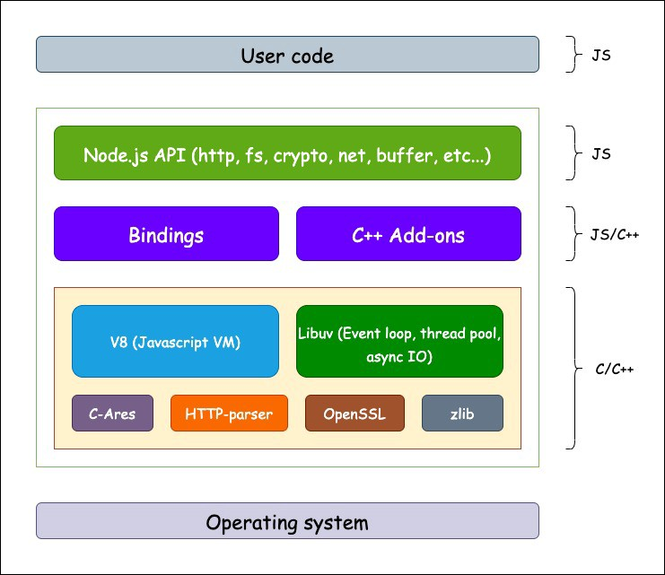

# Node.js란?

**Node.js는 2009년 Ryan Dahl이 고안해 낸 서버사이드 자바스크립트 언어이며 구글의 V8 엔진을 기반으로한 시스템이다.** 이벤트 기반으로 개발이 가능하며 Non-Blocking I/O를 지원하기때문에 비동기식 프로그래밍이 가능하다. 또한 자바스크립트의 표준 라이브러리인 CommonJS의 스펙을 따르고 있다. 참고로 최근에 Ryan Dahl이 Deno라는 Node.js를 크게 개선한 언어를 릴리즈한 바가 있다.

# 내부 구조

Node.js는 JavaScript와 C++로 작성되었고 구글의 V8엔진을 사용함으로써 성능 문제를 개선했다. 또한 Libuv 라이브러리를 사용해서 이벤트 기반 Non-Blocking I/O 모델을 구현했다.



# 특징

## 싱글 스레드와 이벤트 기반의 비동기 I/O


자바스크립트는 싱글 스레드로 동작하기 때문에 비동기 작업이 불가능하다. 이를 위해 Node.js는 내부의 비동기 I/O를 처리하는 Libuv의 이벤트 루프(Event Loop)를 사용해서 비동기 작업이 가능하도록 지원한다.

## 내장 객체와 모듈

### process

**process는 현재 실행 중인 노드 프로세스에 대한 정보를 담고 있다.**

- `version` : 설치된 노드 버전
- `arch` : 프로세서 아키텍쳐 정보
- `platform` : 운영체제 플랫폼 정보
- `pid` : 현재 프로세스 아이디
- `uptime()` : 프로세스 시작 이후부터의 시간
- `execPath` : 노드의 경로
- `cwd()` : 현재 프로세스가 실행되는 위치
- `cpuUsage()` : 현재 CPU의 사용량
- `env` : 시스템 환경 변수들이 포함된 객체(비밀키를 보관하는 용도로 사용)
- `nextTick(callback)` : 이벤트 루프가 다른 콜백 함수들보다 nextTick의 콜백 함수를 먼저 처리(보통의 경우 Promise가 우선처리됨)
- `exit(code)` : 현재의 프로세스를 멈춤(code가 0이거나 없으면 정상종료 아니면 비정상 종료)

### os

**os는 운영체제의 정보를 담고 있다.**

- `type` : 운영체제의 종류
- `uptime()` : 운영체제 부팅 이후부터의 시간
- `hostname()` : 컴퓨터의 이름
- `release()` : 운영체제의 버전
- `homedir()` : 홈 디렉토리의 경로
- `tmpdir()` : 임시 파일 저장 경로
- `cpus()` : 컴퓨터의 코어 정보
- `freemem()` : 사용가능한 메모리 정보
- `totalmem()` : 전체 메모리 용량

### path

**path는 폴더와 파일의 경로를 쉽게 조작하도록 도와주는 모듈이다.**

- `sep` : 경로의 구분자(Windows: \, POSIX: /)
- `delimiter` : 환경 변수 구분자(Windows: ;, POSIX: :)
- `dirname(path)` : 파일이 위치한 폴더경로를 보여줌
- `extname(path)` : 파일의 확장자를 보여줌
- `basename(path, ext)` : 파일의 이름만 보여줌
- `parse(path)` : 파일의 경로를 root, dir, base, ext, name로 분리
- `format(obj)` : parse()한 객체를 파일 경로로 합침
- `normalize(path)` : \나 /가 반복되거나 혼용된 주소를 정상적인 경로로 변환
- `isAbsolute(path):` 파일의 경로가 절대경로인지 상대경로인지 ture/false로 보여줌
- `relative(path1, path2)` : 첫 번째 경로에서 두 번째 경로로 가는 방법을 보여줌
- `join(path, ...)` : 여러 경로를 합쳐줌
- `resolve(path, ...)` : 여러 경로를 합쳐줌

<br>

> join과 resolve의 차이
>
> `/` 를 join은 상대 경로로 처리하지만 resolve는 절대 경로로 처리한다.
>
> ```bash
> path.join("/a", "/c", "b") // /a/c/b
> path.resolve("/a", "/c", "b") // /c/b
> ```

### url과 searchParams

**url는 인터넷 주소를 쉽게 조작할수 있도록 도와주는 모듈이다.** url 처리 방식에는 기존 노드 방식과 WHATWG방식으로 2가지가 있다. WHATWG를 권고하지만 호환성 때문에 가끔 기존 노드 사용이 필요하다.

```js
const url = require('url')

const { URL } = url
const myUrl = new URL('https://leo-xee.github.io/')
const formattedUrl = url.format(myUrl)
const parsedUrl = url.parse(myUrl)

console.log(myUrl)
console.log('url.format(): ', formattedUrl)
console.log('url.parse(): ', parsedUrl)
```

- url 모듈 안에 URL 생성자가 있는데 이 생성자에 주소를 넣으면 주소가 객체로 정리된다.

<br>

**searchParams란 WHATWG방식에서 querystring 처리를 도와주는 객체이다.**

```js
const url = require('url')

const { URL } = url
const myUrl = new URL(
  'https://search.naver.com/search.naver?where=nexearch&sm=top_hty&fbm=1&ie=utf8&query=%EC%95%84%EC%9D%B4%EC%9C%A0'
)
console.log(myUrl.searchParams)

/* 결과
URLSearchParams {
  'where' => 'nexearch',
  'sm' => 'top_hty',
  'fbm' => '1',
  'ie' => 'utf8',
  'query' => '아이유' }
*/
```

- `getAll(key)` : 키에 해당하는 모든 값을 가져옴.
- `get(key)` : 키에 해당하는 첫 번째 값을 가져옴.
- `has(key)` : 해당 키가 있는지 확인
- `delete(key)` : 해당 키를 삭제
- `append(key, value)` : 해당 키를 추가하고 있으면 하나 더 추가
- `toString()` : searchParams 객체를 다시 문자열로 변환

### fs

**fs는 파일 시스템에 접근하는 모듈이다.**

```js
const fs = require('fs')

fs.readFile('./readMe.txt', (err, data) => {
  if (err) throw err
  console.log(data)
  console.log(data.toString())
})

/* 결과
<Buffer eb 82 98 eb 8a 94 20 eb a0 88 ec 98 a4 ec 9e 85 eb 8b 88 eb 8b a4 2e>
나는 레오입니다.
*/
```

위와 같은 콜백 방식 대신 아래와 같이 프로미스 방식으로 사용하면 더 편하다.

```js
const fs = require('fs').promises

fs.readFile('./readMe.txt')
  .then(data => {
    console.log(data)
    console.log(data.toString())
  })
  .catch(err => {
    console.error(err)
  })

/* 결과
<Buffer eb 82 98 eb 8a 94 20 eb a0 88 ec 98 a4 ec 9e 85 eb 8b 88 eb 8b a4 2e>
나는 레오입니다.
*/
```

### 기타 모듈들

- `assert` : 값을 비교해서 프로그램의 정상 동작을 테스트할 때 사용
- `dns` : 도메인 이름에 대한 IP주소르 얻을 때 사용
- `net` : HTTP보다 low level인 TCP나 IPC 통신할 때 사용
- `string_decoder` : 버퍼 데이터를 문자열로 변경할 때 사용
- `dgram` : UDP 관련 작업 시에 사용
- `v8` : v8 엔진에 직접 접근할 때 사용
- `vm` : 가상 머신에 직접 접근할 때 사용

이 외에도 다양함 모듈들이 있는데 이는 [공식 홈페이지](https://nodejs.org/en/docs/) 참고하기!!

# 참조

- https://medium.com/softup-technologies/node-js-internals-an-introduction-to-nodes-runtime-and-architecture-d6ec295c05ab
