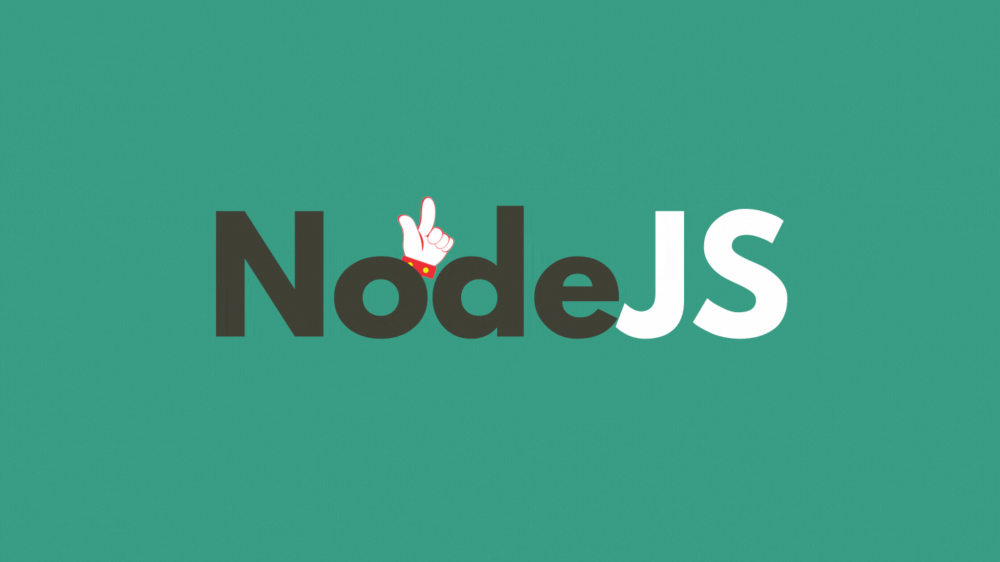

# NVM이란?

**NVM(Node Version Manager)은 말그대로 Node.js의 버전을 관리해주는 시스템이다.** 자바스크립트 기반의 프로젝트를 하다보면 특정 패키지의 의존성 문제가 발생하는 경우가 있는데 이 경우에 NVM을 사용하면 쉽게 버전 관련 이슈를 해결할 수 있다.

NVM을 사용하면 얻을 수 있는 이점을 정리하면 크게 다음과 같이 3가지가 있다.

- 하나의 로컬 머신에서 다양한 Node.js의 버전을 관리할 수 있다.
- 명령어로 쉽게 Node.js 버전을 확인하고 스위칭할 수 있다.
- 별칭을 사용해서 Node.js의 디폴트 버전을 제어할 수 있다.

# 설치

NVM을 설치하기 위해서 다음 명령어를 터미널에 입력하고 스크립트를 실행하면 된다.

```bash
$ curl -o- https://raw.githubusercontent.com/nvm-sh/nvm/v0.39.1/install.sh | bash

# or

$ wget -qO- https://raw.githubusercontent.com/nvm-sh/nvm/v0.39.1/install.sh | bash
```

# 주요 명령어

NVM 사용을 위한 주요 명령어는 다음과 같다.

```bash
# node.js의 특정 버전 설치
$ nvm install <version>

# node.js의 최근 LTS 버전 설치
$ nvm install --lts

# node.js의 특정 버전 삭제
$ nvm uninstall <version>

# 설치된 node.js의 리스트 확인
$ nvm list
$ nvm ls

# 현재 버전 확인
$ nvm current

# 설치한 node.js의 특정 버전의 사용
$ nvm use <installed version>

# node.js의 특정 버전을 디폴트로 사용
$ nvm alias default <installed version>
```

<br>

# 참조

- https://github.com/nvm-sh/nvm#intro
