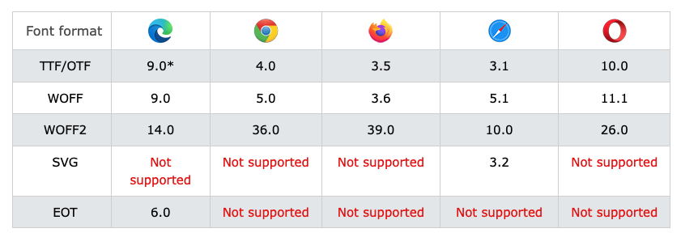

# 웹 폰트를 적용하는 방법

애플리케이션에 웹 폰트를 적용하는 방법은 크게 2가지가 있다.

1. CDN을 사용하는 방법 : `<link ... />`, `@import`
2. Local의 폰트파일을 직접 사용하는 방법 : `@font-face`

웹 폰트를 CDN으로 사용하는 것이 편하지만 해당 폰트가 적용된 요소를 렌더링하는 속도가 느려지는 경향이 있기 때문에 이 포스트에서는 Local에 다운받은 웹 폰트파일을 적용하는 방법을 정리한다.

# 웹 폰트 다운 받기

먼저 원하는 폰트를 WOFF와 WOFF2 형식으로 다운로드 받는다. ( [내가 다운 받은 곳](https://www.onlinewebfonts.com/fonts) )

WOFF(Web Open Font Format)는 웹 표준을 관리하는 W3C에서 권장하는 폰트 형식이다. 이외에 브라우저의 폰트 형식 지원여부는 다음과 같다.



# React 프로젝트에 웹 폰트 적용하기

다운로드 받은 폰트를 프로젝트의 다음과 같은 위치에 저장한다.

```bash
src
└── styles
    └─ fonts
       ├── Roboto.ttf
       ├── Roboto.woff
       ├── Roboto.woff2
       ├── index.css   # css의 경우
       └── index.js    # styled-components를 사용하는 경우
```

## CSS

fonts 디렉토리에 `index.css`를 생성하고 다음과 같이 작성한다.

```css
/* index.css */

@font-face {
  font-family: 'Roboto';
  src: url('./Roboto.woff') format('woff'), url('./Roboto.woff2') format('woff2'),
    url('./Roboto.ttf') format('truetype');
}
```

프로젝트에 작성한 폰트 설정파일을 적용하기 위해서 다음과 같이 코드를 추가한다.

```jsx
/* /src/index.js */

import React from 'react'
import ReactDom from 'react-dom'
import App from './App'
import './styles/fonts'

ReactDom.render(
  <React.StrictMode>
    <App />
  </React.StrictMode>,
  document.getElementById('root')
)
```

## Styled-Components

fonts 디렉토리에 `index.js`를 생성하고 다음과 같이 작성한다.

```js
/* /src/styles/fonts/index.js */

import { createGlobalStyle } from 'styled-components'
import RobotoWoff from './Roboto.woff'
import RobotoWoff2 from './Roboto.woff2'
import RobotoTtf from './Roboto.ttf'

export default createGlobalStyle`
  @font-face {
    font-family: "Roboto";
    src: url(${RobotoWoff}) format("woff"),
         url(${RobotoWoff2}) format("woff2"),
         url(${RobotoTtf}) format("truetype");
  }
`
```

프로젝트에 작성한 폰트 설정파일을 적용하기 위해서 다음과 같이 코드를 추가한다.

```js
/* /src/index.js */

import React from 'react'
import ReactDom from 'react-dom'
import App from './App'
import GlobalStyle from './styles/global/GlobalStyle'
import GlobalFonts from './styles/fonts'

ReactDom.render(
  <React.StrictMode>
    <GlobalFonts />
    <GlobalStyle />
    <App />
  </React.StrictMode>,
  document.getElementById('root')
)
```

# 출처

- https://dev.to/alaskaa/how-to-import-a-web-font-into-your-react-app-with-styled-components-4-1dni
- https://d2.naver.com/helloworld/4969726
