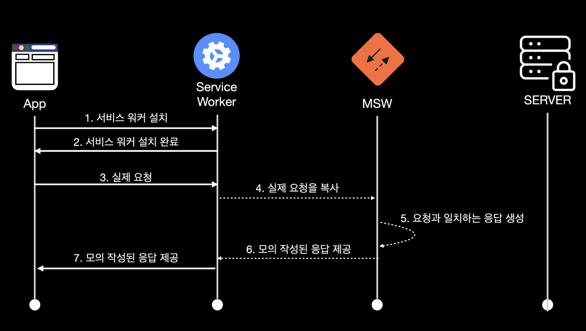
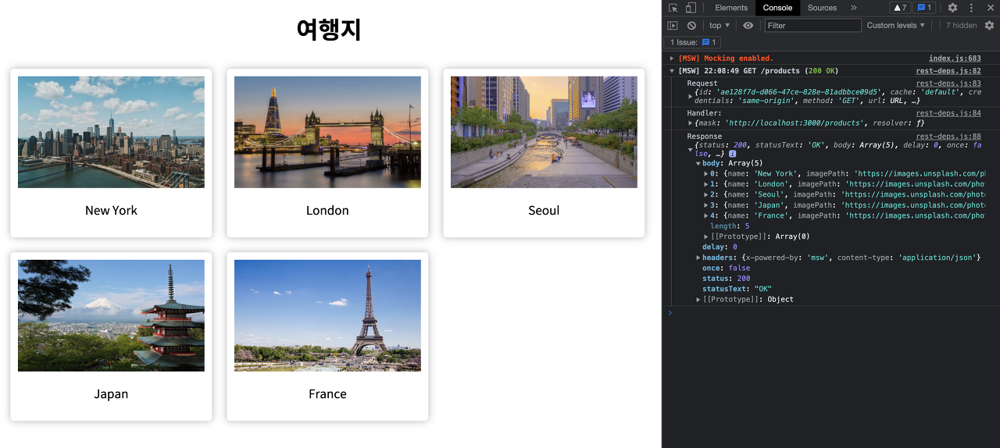
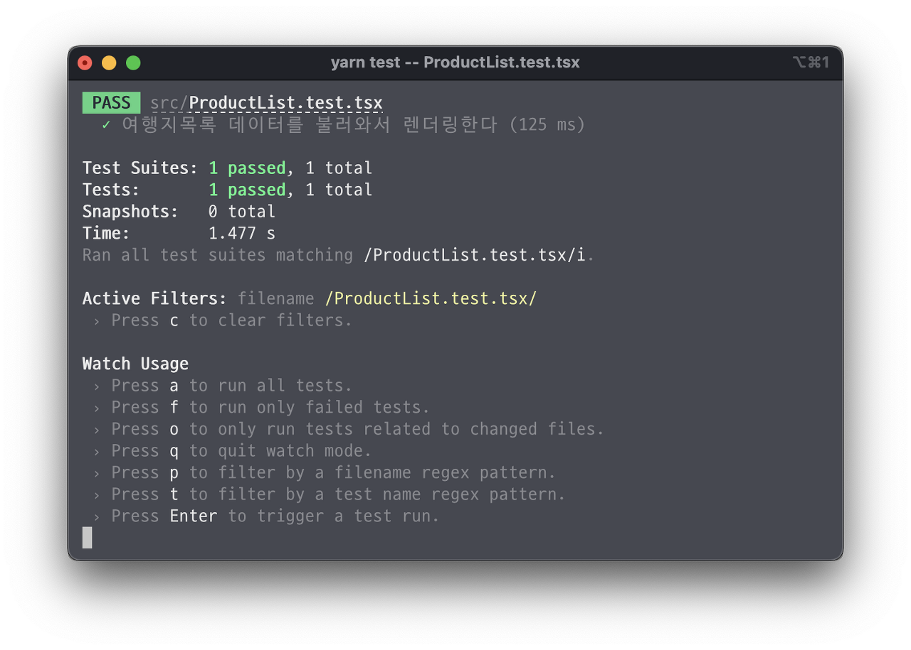

프론트엔드 테스트에 대해서 공부하다가 MSW라는 유용한 라이브러리를 알게되어 이에 대한 개념과 간단하게 사용한 내용을 정리합니다.

# MSW란?

**[MSW(Mock Service Worker)](https://mswjs.io/)는 API를 모킹하는 라이브러리이다.** 이는 Service Worker API를 활용해서 네트워크 레벨에서 실제 HTTP 요청을 가로챈 다음에 개발자가 미리 작성한 모의 응답(Mocking response)을 보내주는 역할을 한다.



## MSW 사용의 장점

MSW 사용의 장점을 알아보기 위해서는 서비스 개발 과정의 대략적인 이해가 필요하다.

먼저 서비스 개발의 이상적인 과정은 기획서를 기반으로 백엔드에서 API를 완성한 후 프론트엔드에서 완성된 API를 토대로 개발하는 것이다. 하지만 이는 현실에서 절대 불가능하다. 왜냐하면 프론드엔드 혼자 놀고 있기에는 너무나 비효율적이기 때문이다.

그래서 일반적으로 프론트엔드는 프로젝트 초기에 백엔드와 합의해서 대략적인 API 명세를 합의하고 이와 부합한 목 데이터(Mock Data)를 사용해서 개발을 함께 진행한다. 하지만 개발 중에 API 명세는 빈번하게 변경되고 백엔드의 개발이 완료된 후에 프론트엔드에서는 목 데이터를 사용한 코드를 실제 API와 다시 연결해주는 추가적인 작업이 강요된다.

이런 비효율적인 문제를 MSW가 해결해준다. **MSW를 사용하면 개발 중에 API의 엔드포인트와 데이터 구조가 변경되더라도 프론트엔드에서 즉각적으로 대응할 수 있고 이미 실제 API의 엔드포인트와 데이터 구조를 반영해서 개발하고 있기 때문에 추가적인 작업도 불필요해진다.**

## Service Worker란?

**[Service Worker](https://developers.google.com/web/fundamentals/primers/service-workers?hl=ko)는 브라우저의 메인 쓰레드와 분리된 쓰레드인 백그라운드에서 자바스크립트를 실행할 수 있는 기술 중 하나이다.** MSW는 이 기술을 기반으로 동작하기 때문에 애플리케이션의 동작을 방해하지 않고 별도로 네트워크 요청을 감시하고 있다가 요청이 발생하면 이를 가로채서 미리 작성된 모의 응답을 제공해준다.

# MSW 사용

**이제 MSW를 사용한 간단한 여행지 애플리케이션 예제를 통해서 이해해보도록 하자.** 참고로 이 예제는 CRA의 Typescript 템플릿을 사용했다.

먼저 MSW 패키지를 사용하기 위해서 개발 의존성으로 설치한다.

```bash
$ yarn add -D msw
```

패키지 설치를 완료했다면 `src/mocks` 디렉토리 안에 `handler.ts` 파일에 다음과 같은 내용을 작성한다.

```ts
/* /src/mocks/handler.ts */

import { rest } from 'msw'

export type Product = {
  name: string
  imagePath: string
}

export const handlers = [
  rest.get('http://localhost:3000/products', (req, res, ctx) => {
    return res(
      ctx.delay(1000),
      ctx.status(200),
      ctx.json([
        {
          name: 'New York',
          imagePath:
            'https://images.unsplash.com/photo-1499092346589-b9b6be3e94b2?ixlib=rb-1.2.1&ixid=MnwxMjA3fDB8MHxwaG90by1wYWdlfHx8fGVufDB8fHx8&auto=format&fit=crop&w=1171&q=80',
        },
        {
          name: 'London',
          imagePath:
            'https://images.unsplash.com/photo-1543832923-44667a44c804?ixlib=rb-1.2.1&ixid=MnwxMjA3fDB8MHxwaG90by1wYWdlfHx8fGVufDB8fHx8&auto=format&fit=crop&w=1344&q=80',
        },
        {
          name: 'Seoul',
          imagePath:
            'https://images.unsplash.com/photo-1601621915196-2621bfb0cd6e?ixlib=rb-1.2.1&ixid=MnwxMjA3fDB8MHxwaG90by1wYWdlfHx8fGVufDB8fHx8&auto=format&fit=crop&w=1172&q=80',
        },
        {
          name: 'Japan',
          imagePath:
            'https://images.unsplash.com/photo-1526481280693-3bfa7568e0f3?ixlib=rb-1.2.1&ixid=MnwxMjA3fDB8MHxwaG90by1wYWdlfHx8fGVufDB8fHx8&auto=format&fit=crop&w=1171&q=80',
        },
        {
          name: 'France',
          imagePath:
            'https://images.unsplash.com/photo-1431274172761-fca41d930114?ixlib=rb-1.2.1&ixid=MnwxMjA3fDB8MHxwaG90by1wYWdlfHx8fGVufDB8fHx8&auto=format&fit=crop&w=1170&q=80',
        },
      ])
    )
  }),
]
```

- 이 파일은 HTTP 요청을 가로채서 제공할 모의 응답을 핸들링하는 역할을 한다. 여기서는 클라이언트에서 `/products` 로 `GET` 요청을 보내면 이를 가로채서 1초의 딜레이 후에 응답코드 200번으로 다음과 같은 JSON 데이터로 응답한다.

<br/>

그 다음에 `ProductList.tsx` 라는 파일을 생성하고 `/products` 엔드포인트에서 `GET` 요청으로 데이터를 받아와서 리스트 형태로 뿌려주는 코드를 다음과 같이 작성한다.

```tsx
/* /src/components/ProductList.tsx */

import React, { useState, useEffect } from 'react'
import axios from 'axios'

import ErrorBanner from './ErrorBanner'
import { Product } from '../mocks/handlers'

function ProductList() {
  const [items, setItems] = useState<Product[]>([])
  const [loading, setLoading] = useState(false)
  const [error, setError] = useState(false)

  useEffect(() => {
    loadItems()
  }, [])

  const loadItems = async () => {
    try {
      setLoading(true)
      let res = await axios.get<Product[]>(`http://localhost:3000/products`)
      setLoading(false)
      setItems(res.data)
    } catch (err) {
      setError(true)
    }
  }

  if (loading) return <div>로딩 중입니다.</div>
  if (error) return <ErrorBanner msg="에러가 발생했습니다." />

  return (
    <ul>
      {items.map((item, idx) => (
        <li key={idx}>
          
          {item.name}
        </li>
      ))}
    </ul>
  )
}

export default ProductList
```

이렇게 MSW의 `handler.ts`와 `ProductList.tsx` 파일을 모두 작성한 다음 **애플리케이션을 실행시켜보면 제대로 동작하지 않을 것이다.**
그 이유는 아직 브라우저와 MSW를 통합하는 세팅을 하지 않았기 때문이다. 이제 통합해보도록 하자!!

# 통합

## 브라우저와 통합

### Service Worker 생성

MSW는 브라우저와 쉽게 통합할 수 있도록 명령어를 제공한다. React 프로젝트의 `public` 디렉토리 위치를 지정해서 다음 명령어를 실행하면 `public` 디렉토리 내부에 `mockServiceWorker.js` 가 생성될 것이다.

```bash
$ npx msw init < PUBLIC_DIR > --save
```

### 브라우저에 등록

`src/mocks` 디렉토리 내부에 `browser.ts` 파일을 생성하고 다음과 같이 작성한다.

```ts
/* /src/mocks/browser.ts */

import { setupWorker, SetupWorkerApi } from 'msw'
import { handlers } from './handlers'

export const worker: SetupWorkerApi = setupWorker(...handlers)
```

그 다음에 `src/index.tsx` 파일에 개발 모드일 때 MSW가 실행되도록 다음과 같이 코드를 추가해준다.

```tsx
/* /src/index.tsx */

import React from 'react'
import ReactDOM from 'react-dom'

import App from './App'

// MSW 실행을 위한 코드 추가
if (process.env.NODE_ENV === 'development') {
  const { worker } = require('./mocks/browser')
  worker.start()
}

ReactDOM.render(
  <React.StrictMode>
    <App />
  </React.StrictMode>,
  document.getElementById('root')
)
```

### 동작 확인

이제 브라우저와의 모든 통합이 완료되었으므로 애플리케이션을 다시 실행해보면 `handler.ts`에 작성했던 로직에 따라 1초의 딜레이 이후에 여행지리스트가 정상적으로 렌더링되는 것을 확인할 수 있다. 또한 콘솔창을 열어보면 MSW의 모킹 중이라는 강조된 로그와 함께 실제 요청과 모의 응답의 데이터를 모두 확인할 수 있다.



## Node와 통합

MSW를 사용한 애플리케이션을 브라우저에서만 확인하기 위해서는 브라우저와의 통합만 해도 충분하다. 하지만 `jest`와 `@testing-library` 를 사용한 프론트엔드 테스트에도 적용하기 위해서는 MSW를 Node와도 통합해줘야한다.

### 서버 생성

`/src/mocks` 디렉토리 내부에 `server.ts` 파일을 생성하고 다음과 같이 작성한다.

```ts
/* /src/mocks/server.ts */

import { setupServer } from 'msw/node'
import { handlers } from './handlers'

export const server = setupServer(...handlers)
```

### API Mocking 설정

각 테스트 케이스마다 API 모킹을 따로 해줘야 서로 영향을 주지 않기 때문에 정상적인 테스트를 위해 `src/setupTests.ts` 파일에 다음과 같이 코드를 추가한다.

```ts
/* /src/setupTests.ts  */

import '@testing-library/jest-dom'
import { server } from '../src/mocks/server'

// 테스트 시작 전 서버 대기 시작
beforeAll(() => server.listen())

// 다른 테스트에 영향이 가지 않도록 매번 핸들러 리셋
afterEach(() => server.resetHandlers())

// 테스트 종료 후에 서버 클린업
afterAll(() => server.close())
```

# 동작 확인

이제 Node와의 통합도 완료되었다. 이제 작성한 테스트 코드에서도 MSW를 통해서 응답 받은 데이터를 다음과 같이 사용할 수 있다. (참고로 `handler.ts`에서 작성한 `delay` 코드를 제거해야 아레의 테스트 케이스가 통과한다.)

```tsx
/* src/components/ProductList.test.tsx */

import { render, screen } from '@testing-library/react'
import ProductList from './ProductList'

it('여행지목록 데이터를 불러와서 렌더링한다', async () => {
  render(<ProductList />)

  const SeoulImage = await screen.findByRole('img', { name: 'Seoul' })
  expect(SeoulImage).toBeInTheDocument()
})
```



# 참조

- https://mswjs.io/docs/
- https://tech.kakao.com/2021/09/29/mocking-fe/
- https://blog.mathpresso.com/msw로-api-모킹하기-2d8a803c3d5c
- https://blog.mathpresso.com/모던-프론트엔드-테스트-전략-1편-841e87a613b2

<br/>
