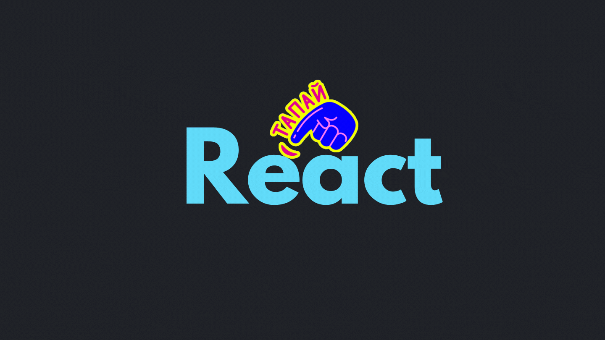

# React Portals란?

**Portal은 자식 컴포넌트를 부모 컴포넌트의 외부에 위치한 DOM 노드 안에서 렌더링할 수 있도록 하는 기능이며 React의 16버전에서 추가되었다.** 주로 모달이나 툴팁등에 사용한다.

```jsx
import { createPortal } from 'react-dom'

createPortal(child, container)
```

`createPortals` 함수는 첫 번째 인자로 렌더링할 React 컴포넌트나 DOM 요소를 받고 두 번째 인자는 렌더링될 DOM 노드를 받는다

# Portals로 Modal 만들기

Portals가 어떻게 동작하는지 간단한 Modal을 만들어보며 알아보자.

일반적으로 React 프로젝트의 결과물은 다음과 같은 코드로 인해서 `public` 디렉토리 내에 존재하는 `index.html` 파일의 `id=”root”` 인 DOM 요소의 내부에 렌더링된다.

```jsx
/* index.jsx */

import React from 'react'
import ReactDOM from 'react-dom'
import App from './App'

ReactDOM.render(<App />, document.getElementById('root'))
```

하지만 특정한 상황에서는 부모 컴포넌트의 외부에 자식 컴포넌트를 렌더링해야할 경우가 있다. 예를 들면, 화면 최상위에 보여지는 모달의 경우이다. 시각적으로 화면 최상위에서 보여지는데 React의 계층 구조에는 종속되어 있는 모습이 생각해보면 적합하지 않다.


이 경우에 Portals를 사용하면 Modal 컴포넌트를 부모 컴포넌트의 외부에서 렌더링할 수 있다.

먼저, public 디렉토리의 `index.html`에 `id=”modal"`인 DOM 요소를 추가한다.

```html
<!-- public/index.html -->

<!DOCTYPE html>
<html lang="en">
  <head>
    ...
  </head>
  <body>
    <noscript>You need to enable JavaScript to run this app.</noscript>
    <div id="root"></div>
    <div id="modal"></div>
  </body>
</html>
```

Props로 children을 받아서 `id=”modal”` 인 DOM 요소에 렌더링해주는 ModalPortal 컴포넌트를 만든다.

```jsx
/* src/ModalPortal.jsx */

import ReactDom from 'react-dom'

const ModalPortal = ({ children }) => {
  const el = document.getElementById('modal')
  return ReactDom.createPortal(children, el)
}

export default ModalPortal
```

ModalPortal 컴포넌트로 Modal 컴포넌트를 감싸준다.

```jsx
/* App.jsx */

import React, { useState } from 'react'

import Modal from './components/Modal'
import ModalPortal from './components/ModalPortal'

function App() {
  const [isModalOn, setIsModalOn] = useState(false)

  const onOpen = () => {
    setIsModalOn(true)
  }

  const onClose = () => {
    setIsModalOn(false)
  }

  return (
    <>
      <h2>React Portal Example</h2>
      <button type="button" onClick={onOpen}>
        Open
      </button>
      {isModalOn && (
        <ModalPortal>
          <Modal onClose={onClose} />
        </ModalPortal>
      )}
    </>
  )
}

export default App
```

```jsx
/* src/Modal.jsx */

import React from 'react'
import './modal.css'

const Modal = ({ onClose }) => {
  return (
    <div className="modal_wrapper">
      <div className="modal_content">
        <h2>Modal</h2>
        <button type="button" onClick={onClose}>
          Close
        </button>
      </div>
    </div>
  )
}

export default Modal
```

```css
/* modal.css */

.modal_wrapper {
  display: flex;
  justify-content: center;
  align-items: center;
  background-color: rgba(0, 0, 0, 0.25);
  position: fixed;
  top: 0;
  left: 0;
  width: 100%;
  height: 100%;
}

.modal_wrapper .modal_content {
  display: flex;
  flex-direction: column;
  justify-content: center;
  align-items: center;
  background-color: white;
  padding: 1rem;
  border-radius: 10px;
  width: 250px;
}
```

**이제 Modal 컴포넌트가 `root`가 아닌 `modal` 이라는 `id`를 가진 DOM 요소 내부에 렌더링된 것을 확인할 수 있다.**


# 참조

- https://ko.reactjs.org/docs/portals.html#gatsby-focus-wrapper
- https://blog.bitsrc.io/understanding-react-portals-ab79827732c7

<br/>
