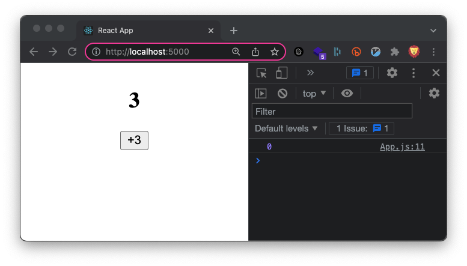

# useState의 setter는 어떻게 동작하는가?

**useState의 setter 함수인 setState는 비동기적(Asynchronous)으로 동작한다.** 다시말하면 `setState` 함수의 실행이 완료될 때까지 기다려주지 않고 다음 코드가 곧바로 실행된다는 의미이다. 그렇다면 이런 특징이 `state`에 어떤 영향을 주는 걸까? 다음 예시를 통해서 천천히 살펴보자.

이 예제에서는 버튼을 클릭하면 이벤트 핸들러 함수 내에서 `setCount` 함수가 3번 호출되어서 `count`의 상태값이 3씩 증가하길 예상하는 것이 일반적일 것이다.

```jsx
import React, { useState } from 'react'

export default function App() {
  const [count, setCount] = useState(0)

  const plus = () => {
    setCount(count + 1) // 0 + 1
    setCount(count + 1) // 0 + 1
    setCount(count + 1) // 0 + 1   <- 이 코드만 적용됨
    console.log(count) // 0
  }

  return (
    <>
      <h2>{count}</h2>
      <button onClick={plus}>+3</button>
    </>
  )
}
```


하지만 이상하게도 `h2` 태그의 `count` 값은 1로 렌더링되었고 이벤트 핸들러 내부의 로그는 0이 찍혀있다...

**이렇게 동작하는 이유는 `setState` 함수가 비동기적으로 동작하고 React가 하나의 이벤트 핸들러 함수 내의 로직을 모두 읽을 때까지 기다린 다음에 일괄 처리(Batch)해 한번에 렌더링하기 때문이다.**

그래서 이벤트 핸들러 함수인 `plus` 내부의 `count`는 아직 `state`가 변경 및 렌더링되기 전이기 때문에 항상 0이 되고 `count` 값이 동일하니 마지막 `setCount` 함수만 실행되는 것 같이 동작한다.

그렇다면 React는 왜 이런식으로 동작하도록 설계되었을까?

# setState가 비동기적으로 동작하는 이유

React의 `setState`는 비동기적으로 동작하고 하나의 이벤트 핸들러 함수 내의 로직을 일괄 처리(Batch)해 한번에 렌더링한다고 했다. **이렇게 설계된 이유는 리렌더링을 효율적으로 수행하기 위해서이다.**

React 애플리케이션은 수 많은 컴포넌트와 상태값으로 이루어져있다. 이런 상황에서 단 하나의 상태가 변화할 때마다 관련된 뷰를 매번 리렌더링하는 것은 비효율과 함께 성능상의 문제를 야기한다.

# 연속된 setState를 처리하는 방법

하나의 이벤트 핸들러 함수 내에 연속된 `setState`를 사용해야하는 상황이 생길 수 있다. 이 경우에는 다음과 같이 인자로 값이 아닌 함수를 전달하면 된다.

```jsx
import React, { useState } from 'react'

export default function App() {
  const [count, setCount] = useState(0)

  const plus = () => {
    setCount(prev => prev + 1) // 0 + 1
    setCount(prev => prev + 1) // 1 + 1
    setCount(prev => prev + 1) // 2 + 1
    console.log(count) // 0
  }

  return (
    <div className="App">
      <h2>{count}</h2>
      <button onClick={plus}>+3</button>
    </div>
  )
}
```



위 예시의 경우에 `setCount`의 인자로 함수를 전달하면 함수의 인자로 이전 상태값이 전달된다. 이렇게 사용하더라도 `setCount`는 동일하게 비동기적으로 동작하지만 React는 이벤트 핸들러 내의 모든 `setCount`가 순서대로 모두 처리된 다음에 렌더링이 시작되는 것을 보장한다.

추가적으로 대기 큐에 대한 내용이 있는데 시간 날 때 참조 링크의 내용을 읽고 숙지하도록 하자!

# 참조

- https://beta.reactjs.org/reference/usestate
- https://beta.reactjs.org/learn/queueing-a-series-of-state-updates
- https://beta.reactjs.org/learn/state-as-a-snapshot

<br/>
