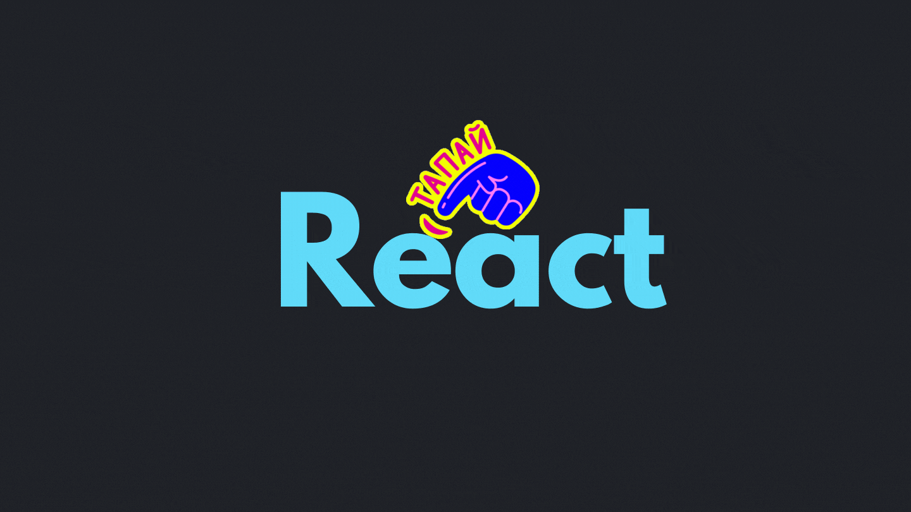
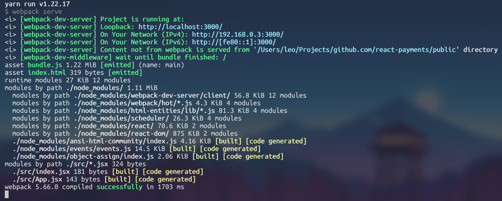
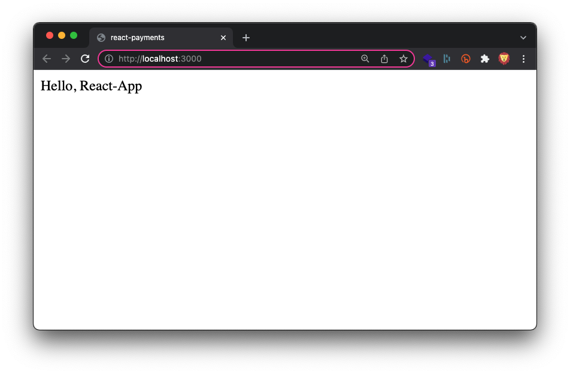

이 글에서는 CRA를 사용하지 않고 웹팩으로 React 개발환경을 구축하는 과정을 정리합니다. 이 과정을 위해서는 Node와 npm 혹은 yarn이 필요합니다. 참고로 Node에는 기본적으로 npm이 포함됩니다. 이 글에서는 yarn을 사용하지만 npm과 큰 차이가 없기에 따라오시기에는 큰 무리는 없을 거라 예상합니다.

# 시리즈

- 밑바닥부터 React 개발 환경 구축하기 - 1. Webpack
- [밑바닥부터 React 개발 환경 구축하기 - 2. Typescript](https://leo-xee.github.io/React/react-setup-ts/)
- [밑바닥부터 React 개발 환경 구축하기 - 3. Eslint와 Prettier](https://leo-xee.github.io/React/react-setup-eslint/)

# 프로젝트 생성

프로젝트 디렉토리를 생성하고 npm 명령어로 프로젝트를 시작한다.

```bash
$ mkdir react-app
$ cd react-app
$ yarn init -y
```

프로젝트를 구성할 디렉토리들을 생성한다.

```bash
$ mkdir dist public src
```

- `dist` : webpack으로 번들링한 결과물을 위한 디렉터리
- `src`: React 앱의 모든 구성 요소를 위한 디렉터리
- `public` : 정적 파일을 위한 디렉토리

<br/>

`public` 디렉토리에 `index.html`을 만든다.

```html
<!-- public/index.html -->

<!DOCTYPE html>
<html lang="en">
  <head>
    <meta charset="UTF-8" />
    <meta name="viewport" content="width=device-width, initial-scale=1.0" />
    <title>react-app</title>
  </head>
  <body>
    <div id="root"></div>
  </body>
</html>
```

# React 설치

React를 사용하기 위한 필수 패키지들을 설치한다.

```bash
$ yarn add react react-dom
```

- `react` : React의 코어
- `react-dom` : React가 DOM에 접근 가능

# Babel 설치 및 설정

## 설치

**Babel은 모던 자바스크립트 코드(ES6 이상)를 레거시한 브라우저나 환경에서도 동작할 수 있도록 변환해주는 JS 컴파일러이다.** React는 기본적으로 JSX와 ES6를 사용하기 때문에 브라우저 호환성을 위해서 React 소스코드를 변환해줄 컴파일러와 설정을 위한 라이브러리의 설치가 필요하다.

```bash
$ yarn add -D @babel/core @babel/preset-env @babel/preset-react
```

- `@babel/core` : Babel의 코어
- `@babel/preset-env` : ES6를 ES5로 변환
- `@babel/preset-react` : React의 문법(JSX..)을 자바스크립트로 변환

## 설정

프로젝트의 루트 위치에 `babel.config.json` 파일을 생성하고 다음과 같이 설정한다.

```json
/* babel.config.json */

{
  "presets": ["@babel/preset-react", "@babel/preset-env"]
}
```

# Webpack 설치 및 설정

## 설치

### 코어

자바스크립트 모듈 번들러인 Webpack의 핵심 패키지들을 설치한다.

```bash
$ yarn add -D webpack webpack-cli webpack-dev-server
```

- `webpack` : webpack의 코어
- `webpack-cli` : 터미널 환경에서 webpack을 사용 가능
- `webpack-dev-server`: 메모리에 webpack을 빌드해서 개발 서버를 제공

### 로더

**로더는 번들링될 각 모듈들을 처리한다.** 로더를 사용하면 Webpack이 자바스크립트 뿐만 아니라 타입스크립트, CSS, 이미지 파일등의 리소스를 자바스크립트에서도 로딩할 수 있다. 다음과 같이 Webpack에 필요한 로더를 설치한다.

```bash
$ yarn add -D babel-loader style-loader css-loader file-loader
```

- `babel-loader` : Babel을 webpack에 적용해서 자바스크립트를 변환
- `css-loader` : CSS 파일을 자바스크립트에서 로딩할 수 있도록 변환
- `style-loader` : 자바스크립트로 변경된 스타일을 동적으로 DOM에 추가
- `file-loader` : 이미지와 같은 파일을 자바스크립트에서 로딩할 수 있도록 변환

### 플러그인

**플러그인은 번들링의 결과물을 처리한다.** HTML에 번들링된 자바스크립트 파일을 삽입해주기 위해 다음의 플러그인을 설치한다.

```bash
$ yarn add -D html-webpack-plugin copy-webpack-plugin
```

- `html-webpack-plugin` : HTML 파일에 번들링된 자바스크립트 파일을 삽입
- `copy-webpack-plugin` : 정적 파일을 빌드 디렉터리에 복사

## 설정

프로젝트 루트 위치에 `webpack.config.js` 파일을 생성하고 다음과 같이 설정한다.

```js
/* webpack.config.js */

const HtmlWebpackPlugin = require('html-webpack-plugin')
const CopyWebpackPlugin = require('copy-webpack-plugin')
const path = require('path')

module.exports = {
  mode: 'development', // 번들링할 모드를 설정(devlopment || production || none)
  entry: './src/index.jsx', // 번들링의 시작 파일 설정
  /* 번들링된 결과물의 파일명과 경로 설정 */
  output: {
    filename: 'bundle.js',
    path: path.resolve(__dirname, 'dist'),
  },
  /* plugin 적용 및 옵션 설정 */
  plugins: [
    new HtmlWebpackPlugin({
      template: './public/index.html',
      filename: './index.html',
    }),
    new CopyWebpackPlugin({
      patterns: [
        { from: '/src/assets', to: 'assets/', noErrorOnMissing: true },
      ],
    }),
  ],
  resolve: {
    modules: [path.resolve(__dirname, 'src'), 'node_modules'],
    extensions: ['.js', '.jsx'],
  },
  /* webpack-dev-server의 옵션 설정 */
  devServer: {
    client: {
      overlay: true, // 브라우저에 에러 표시
      progress: true, // 진행상황 표시
    },
    compress: true,
    hot: true, // 저장할 때마다 수정사항 반영
    open: true, // 브라우저 자동 실행
    port: 3000, // 실행할 포트 설정
  },
  /* 로더 적용 및 옵션 설정 */
  module: {
    rules: [
      {
        test: /\.(js|jsx)$/,
        exclude: /node_modules/,
        use: ['babel-loader'],
      },
      {
        test: /\.css$/,
        use: ['style-loader', 'css-loader'],
      },
      {
        test: /\.(png|svg|jpg|gif)$/,
        use: {
          loader: 'file-loader',
          options: {
            name: '[name].[ext]',
          },
        },
      },
    ],
  },
}
```

# React 컴포넌트 생성

src 디렉토리에 `index.jsx`와 `App.jsx`를 다음과 같이 생성한다.

```jsx
/* src/index.jsx */

import React from 'react'

const App = () => {
  return <div>Hello, React-App</div>
}

export default App
```

```jsx
/* src/App.jsx */

import React from 'react'
import ReactDom from 'react-dom'
import App from './App'

ReactDom.render(<App />, document.getElementById('root'))
```

# package.json의 script 작성

```json
/* package.json */

{
  /* ... */
  "scripts": {
    "dev": "webpack serve",
    "build": "webpack --config webpack.config.js --mode production"
  }
}
```

# 실행

자! 이제 CRA을 사용하지 않고 React 개발 환경을 세팅하기 위한 모든 설치와 설정을 마쳤다. `package.json`의 `script`에 등록한 `dev` 명령어를 실행해보자.

```bash
$ yarn dev
```

다음과 같이 잘 실행되고 파일을 수정하고 저장할 때마다 반영되는 것을 확인할 수 있다.





# 참조

- https://webpack.js.org/
- https://babeljs.io/
- https://jeonghwan-kim.github.io/series/2019/12/10/frontend-dev-env-webpack-basic.html
- https://dev.to/riddhiagrawal001/create-react-app-without-create-react-app-2lgd

<br/>
