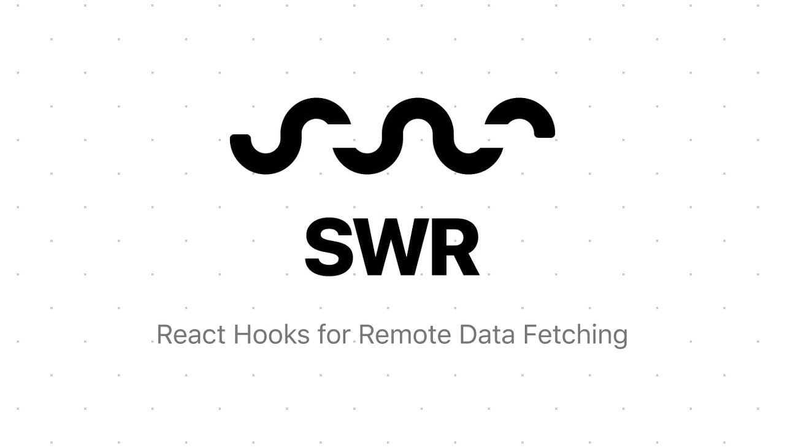

# SWR이란?



**SWR(Stale-While-Revalidate)은 데이터 패칭, 캐싱, 업데이트등의 서버 상태를 관리해주는 라이브러리이며 Next.js로 유명해진 Vercel에 만들어서 관리하고 있다.**

SWR을 사용하면 항상 데이터 패칭 후에 `useEffect` 내부에서 해당 컴포넌트의 `state` 에 동기화 해줘야하는 로직을 생략할 수 있는 등 서버 상태 관련 로직의 복잡도를 크게 낮춰주는 이점이 있다. 이와 동일한 역할을 하는 라이브러리로 React-Query와 RTK Query가 있다.

## useSWR

useSWR은 데이터를 GET하기 위해 사용한다.

```js
// 기본 구조
const { data, error, isValidating, mutate } = useSWR(key, fetcher, options)

// key로 문자열을 받는 구조
const { data } = useSWR('/users', getUsers)

// key로 배열을 받는 구조
const { data } = useSWR(['/user', nickname], () => getUserByNickname())

// 조건부로 실행하는 구조
// nickname이 null이면 fetcher가 동작하지 않음.
const { data } = useSWR(nickname ? ['/user', nickname] : null, () =>
  getUserByNickname()
)
```

- **`key`**

  - 데이터의 GET 요청들을 구분하는 key이다.
  - SWR은 key값을 사용해서 각 요청을 구분해서 캐시를 관리한다.
  - 그렇기 때문에 단일 리소스에 대한 요청의 경우에는 배열 형태의 key값을 사용해서 각 요청마다 구분해줘야한다.

- **`fetcher`**

  - 요청에 사용할 비동기함수를 받는다.
  - 당연하지만 Promise를 반환한다.

- **`options`**
  - useSWR에서 사용할 옵션 객체를 받으며 주요 옵션은 다음과 같다.
  - `onSuccess` : 요청 성공 시에 수행할 콜백 함수를 정의
  - `onError` : 요청 실패 시에 수행할 콜백 함수를 정의
  - `onErrorRetry` : 에러 재시도시 사용할 핸들러

## 서버 상태 변경

**SWR은 React-Query의 `useMutation`과 같이 서버 상태 변경을 담당하는 Hook이 없다.** 그 이유는 SWR이 데이터 패칭에 중점을 맞췄기 때문이라고 한다. 이와 관련된 이슈는 [여기](https://github.com/vercel/swr/issues/93)를 참고했다.

**최근에는 SWR v2.0에서 `useSWRMutation`으로 이를 지원할 예정이라고 한다.** 그래서 현재로써는 서버 상태의 변경을 담당하는 REST API 메소드인 `POST`, `PUT`, `PATCH`, `DELETE` 를 사용할 때 `fetch` 나 `axios` 를 사용해서 리소스를 변경한 후에 `mutate` 함수를 사용해서 해당 요청의 캐시를 갱신해줘야 한다.

서버 상태를 변경하는 예제는 상황마다 다양하니 [공식 문서](https://swr.vercel.app/ko/docs/mutation)를 참고하자.

<br>

# 참조

- https://swr.vercel.app/ko/docs/getting-started

<br>
