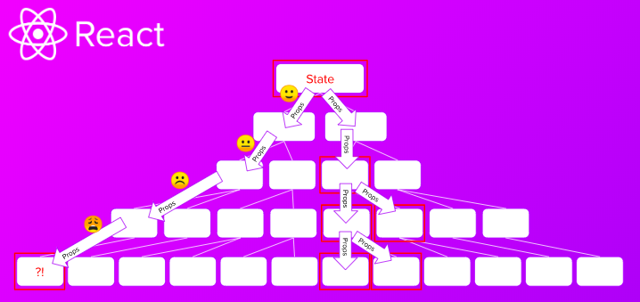
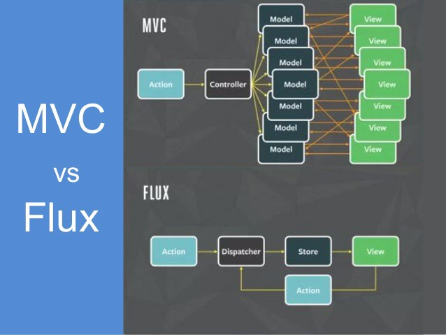
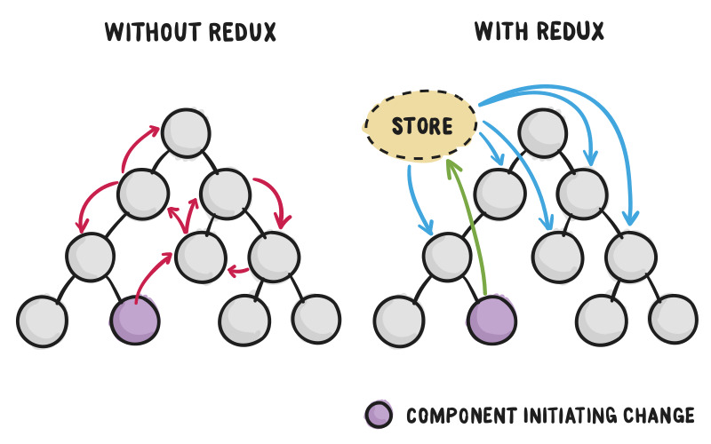
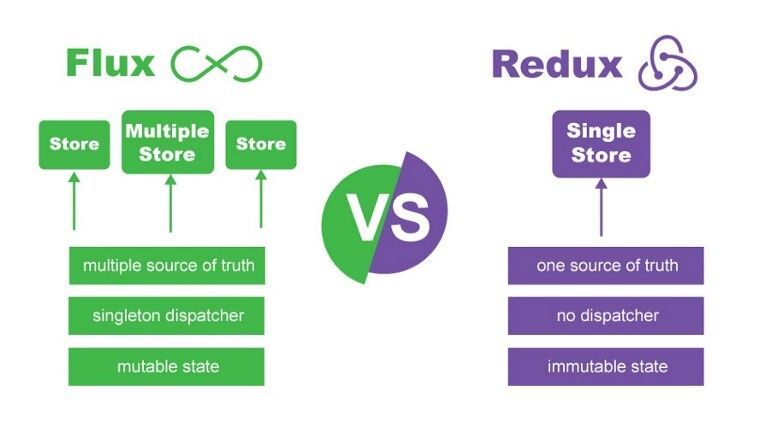

# 컴포넌트 패턴의 문제점

angular.js를 시작으로 React.js와 Vue.js의 인기가 상승하면서 컴포넌트 단위로 개발해 조립하는 방식인 Component 패턴이 현재 프론트엔드 개발의 주류가 되었다. 하지만 애플리케이션의 크기가 커지고 구조가 복잡해지면서 하나의 컴포넌트에서 다른 컴포넌트로 데이터를 전달할 때 그 사이에 있는 모든 컴포넌트들이 해당 데이터를 props로 전달해줘야하는 문제가 발생한다.

**이런 문제를 Props Drilling Problem 이라고 한다.** Facebook은 이 문제 때문에 새로운 기능을 추가할 때마다 동일한 버그가 발생해서 이를 매번 고쳐야했던 비효율이 발생했다. 그런 와중에 이를 해결할 Flux라는 새로운 아키텍쳐를 개발했다.

# Flux 아키텍처

**[Flux](https://facebook.github.io/flux/)는 Facebook에서 클라이언트-사이드 애플리케이션을 만들기 위해서 사용하는 애플리케이션 아키텍처이다.** 기존 MVC 패턴의 문제를 해결하기 위해 단방향 데이터 흐름(unidirectional data flow)을 활용해 React를 보완하는 역할을 한다.

# Redux의 등장

Facebook에서 Flux 아키텍처를 발표한 후에 Flux의 구현체도 발표했는데 이는 완전한 구현체라고 부르기에는 무리가 있었다. 그래서 이 시기에는 많은 Flux 구현체들이 등장했는데 그 중에 널리 사용된 것들 중 하나가 [Dan Abramov](https://overreacted.io/)가 개발한 Redux이다.

Flux의 구현체인 Redux의 인기가 높아지면서 사실상 공식 구현체가 되었다. Redux 덕분에 규모가 큰 애플리케이션 내에서 컴포넌트들사이에서 데이터를 전달할 때 발생하는 문제점과 비효율을 하나의 중앙 저장소와 단방향 데이터 흐름의 구조를 통해 처리함으로 해결할 수 있게 되었다. **하지만 Redux가 Flux와 완전히 동일한 것은 아니다.**

# Flux와 Redux의 차이

Flux가 `여러 개의 Store`와 `dispatcher`라는 개념을 가지고 있는 반면에 Redux는 `dispatcher`라는 개념이 따로 존재하지 않고 `오직 하나의 Store`를 가지며 불변한 상태를 기반으로 동작한다.

이런 Redux만의 특징은 Flux의 장점은 그대로 차용하면서 쉽게 사용가능하고 예측 가능한 애플리케이션을 개발할 수 있도록 도와준다.

 
