이 글에서는 MacOS에서 Homebrew를 사용해서 구글의 크롬 브라우저와 같은 `third-party application` 을 설치하는 방법을 정리합니다.

# Homebrew란?

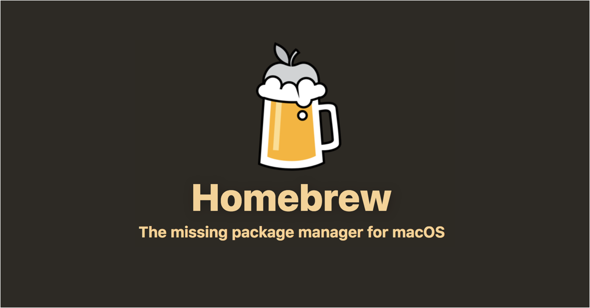

**Homebrew란, Max Howell이 루비를 기반으로 만들어서 2009년에 릴리즈한 MacOS용 패키지관리 애플리케이션이다.** 릴리즈 이전에는 다양한 패키지관리 애플리케이션들이 존재했지만 현재는 Homebrew가 표준으로 자리잡은 상황이다. Homebrew는 주로 CLI(Command Line Interface)부류의 애플리케이션들을 설치하는데 사용되지만 이제 Cask와 Mas를 통해서 Web에서 다운받을 수 있는 GUI(Graphic User Interface) 애플리케이션과 AppStore에서 다운받을 수 있는 애플리케이션들까지 모두 설치할 수 있다.

- `Homebrew` : CLI기반 애플리케이션(Python, node ...)
- `Cask` : GUI기반 애플리케이션(Chrome, VSC, Webstorm, Notion...)
- `Mas` : Appstore의 애플리케이션(KakaoTalk ...)

# 주요 명령어

- Homebrew에서는 각 패키지를 formula라고 한다.
- brew로 설치된 패키지들은 기본적으로 `/usr/local/Cellar` 에 위치하게 된다.

```bash
$ brew info <formula> : 패키지 정보 확인

$ brew search <formula> : 패키지 검색

$ brew install <formula> : 패키지 설치

$ brew list : 설치된 패키지 목록 확인

$ brew update : brew의 버전을 업데이트

$ brew option <formula> : 해당 패키지의 옵션상태 확인

$ brew upgrade <formula> : 해당 패키지를 최신버전으로 업데이트

$ brew outdated : 업데이트가 필요한 패키지 목록 확인

$ brew uninstall <formula> : 해당 패키지 삭제

$ brew remove <formula> : 해당 패키지 완전 삭제

$ brew edit <formula> : 해당 패키지 수정

$ brew update-reset : 패키지 복구
```

# 설치

Homebrew 설치는 [여기](https://brew.sh/)에서 설치 링크를 복사해서 터미널에 붙여넣어서 설치하면된다. 링크는 아래와 동일하다.

```bash
$ /bin/bash -c "$(curl -fsSL https://raw.githubusercontent.com/Homebrew/install/HEAD/install.sh)"
```

# 설치 확인

다음 명령어로 설치 여부를 확인할 수 있다.

```bash
$ brew doctor
```

## git 설치

이제 brew 명령어를 사용해서 git을 설치해보자.

일단 현재 git 버전을 확인해보니 2.24.3이다. MacOS는 기본적으로 git을 내장하고 있지만 이는 구형버전이기 때문에 최신 버전의 git을 설치하고 적용해보자.

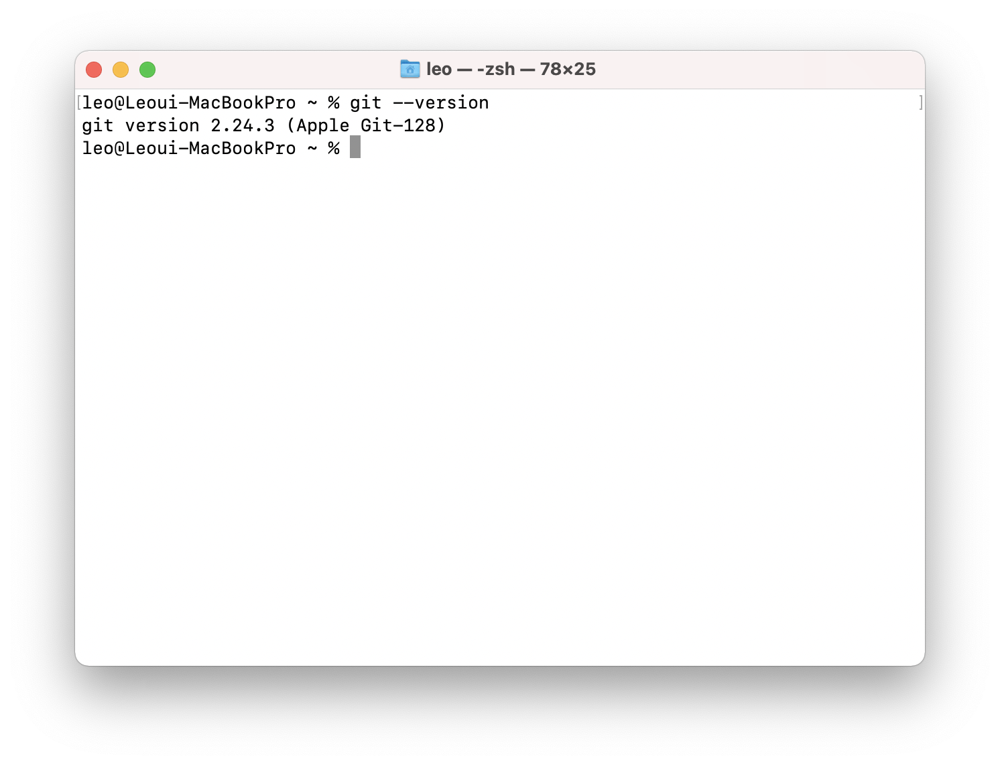

- brew를 이용해서 git 설치 : `brew install -s git`

<br>

> -s 옵션을 공식문서에서 찾아보니 기존에 동일한 애플리케이션이 설치되었더라도 install을 해주고 관련 Dependencies를 함꼐 설치해주는 것 같다.

<br>

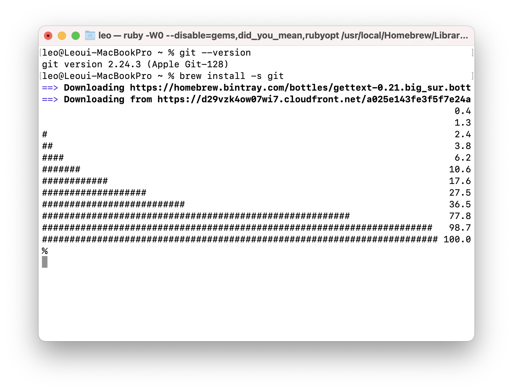

설치를 완료했지만 `git --version` 으로 확인해보면 이전과 동일한 버전이 나올 것이다. 이제 설치한 최신의 git을 사용하도록 `~/.bash_profile` 을 아래와 같이 수정하자.

```bash
export PATH=usr/local/bin:/usr/local/bin:/usr/bin:/bin:/usr/sbin:/sbin
```

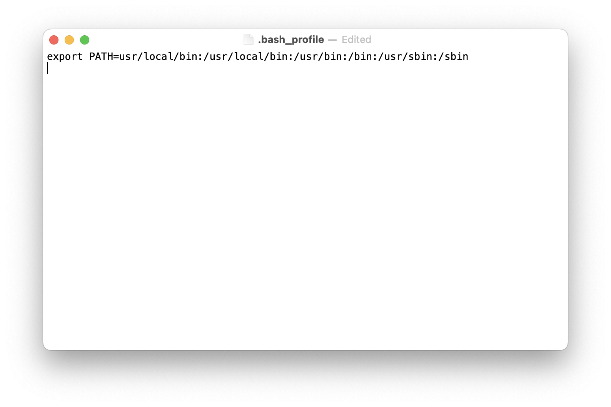

수정한 이후 다시 확인해보면 설치한 최신버전을 확인할 수 있을 것이다.

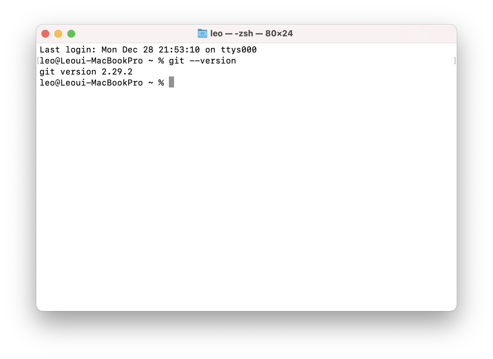

# Cask

이제 cask를 설치하고 이를 이용해서 Chrome 브라우저를 설치해보자.

## 설치

먼저 `brew install cask` 명령어를 사용해서 설치를 진행한다.

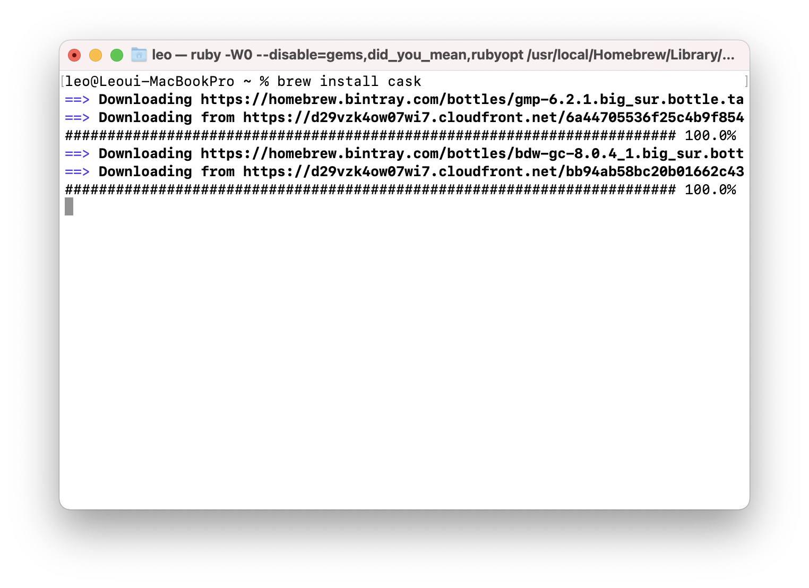

## Chrome 검색

`brew search chrome`을 터미널에 입력해서 설치할 chrome 키워드를 확인한다. 그럼 google-chrome이라는 정확한 명칭을 확인할 수 있다.

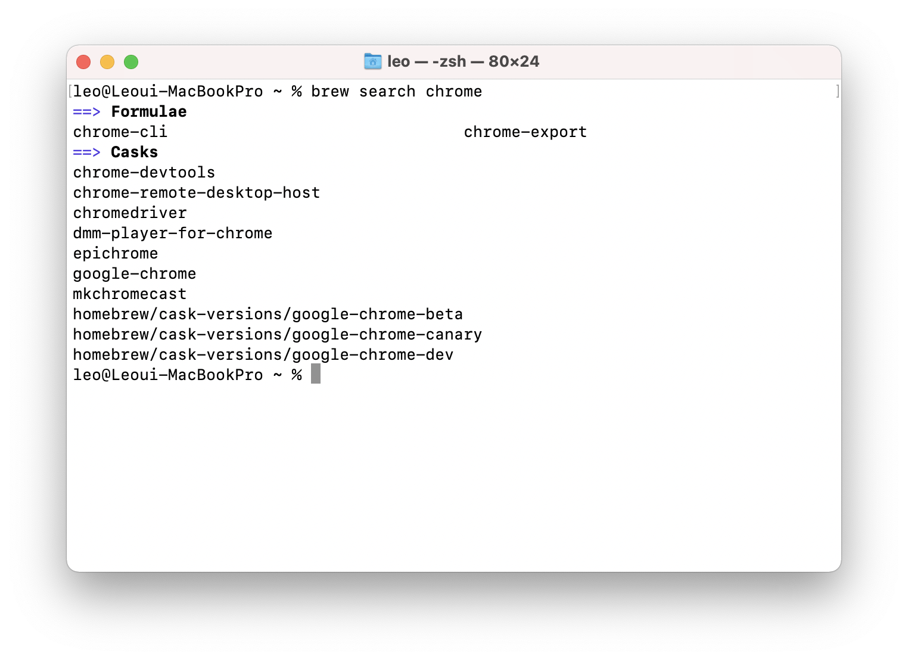

## Chrome 설치

`brew cask install google-chrome` 을 입력해서 Chrome을 설치한다. 하지만 Error가 발생한다. 그래서 알려주는대로 `brew install --cask google-chrome` 를 사용하니 잘 설치되는 것을 볼 수 있다. 아마 기존의 cask 명령어 형식이 최근에 변경된 것 같다.

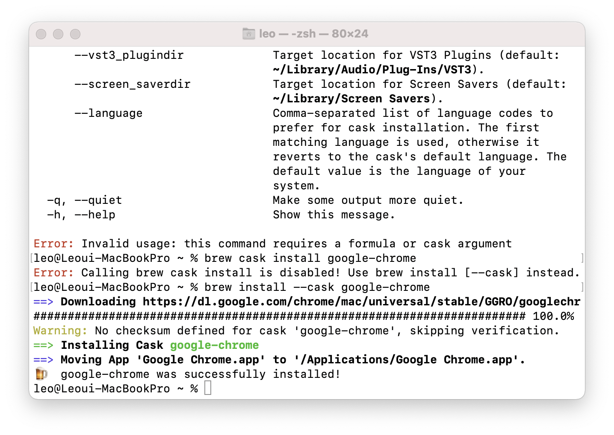

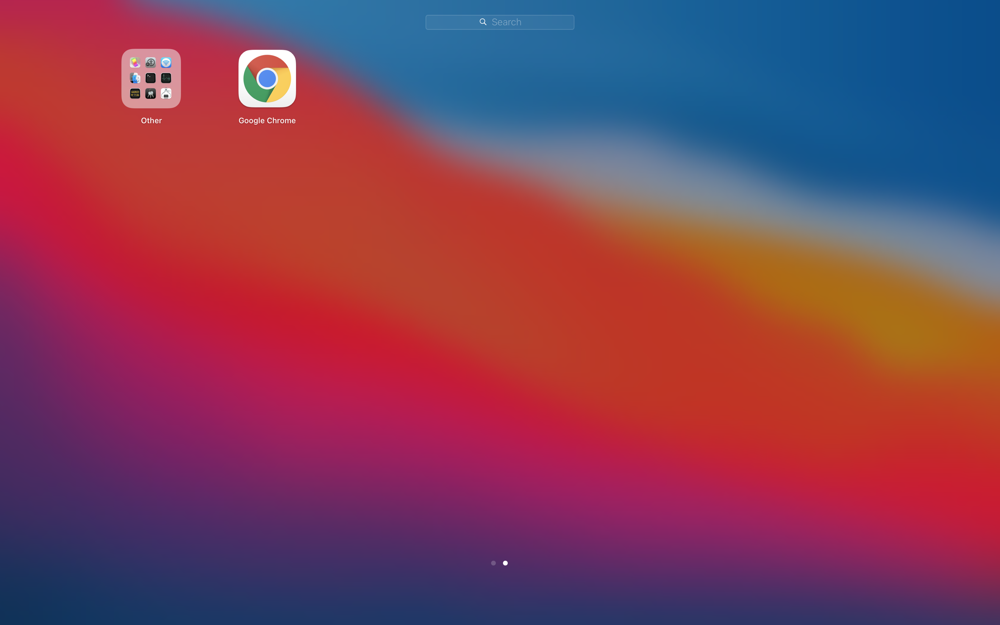

# Mas

이제 Mas를 설치하고 앱스토어에서 설치할 수 있는 카카오톡을 설치해보자.

> Mas를 사용해서 애플리케이션을 설치하기 전에 AppStore에 자신의 계정을 로그인해줘야한다.

## 설치

아래의 명령어로 mas를 설치한다.

```bash
$ brew install mas
```

## 카카오톡 검색

검색한 결과 일련번호와 함께 카카오톡을 찾을 수 있다.

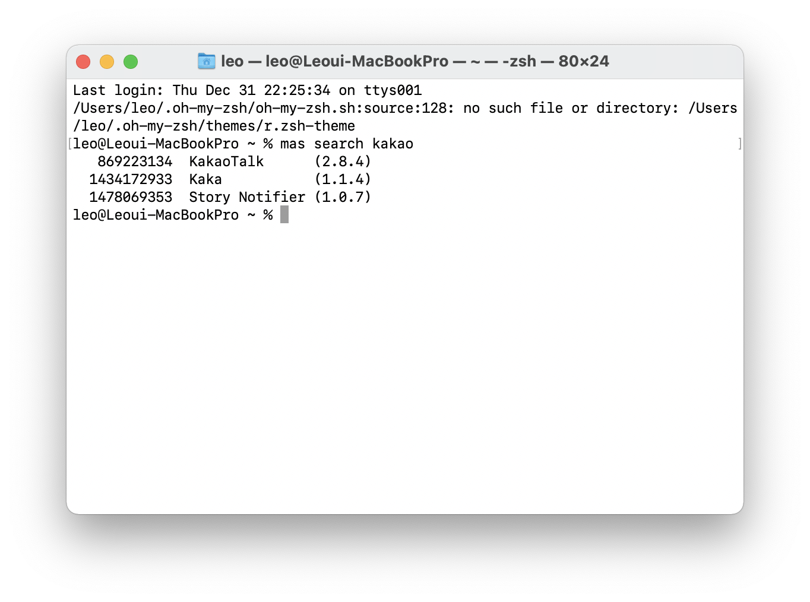

## 카카오톡 설치

`mas install [일련번호]`를 사용하면 카카오톡이 설치된 것을 확인할 수 있다.

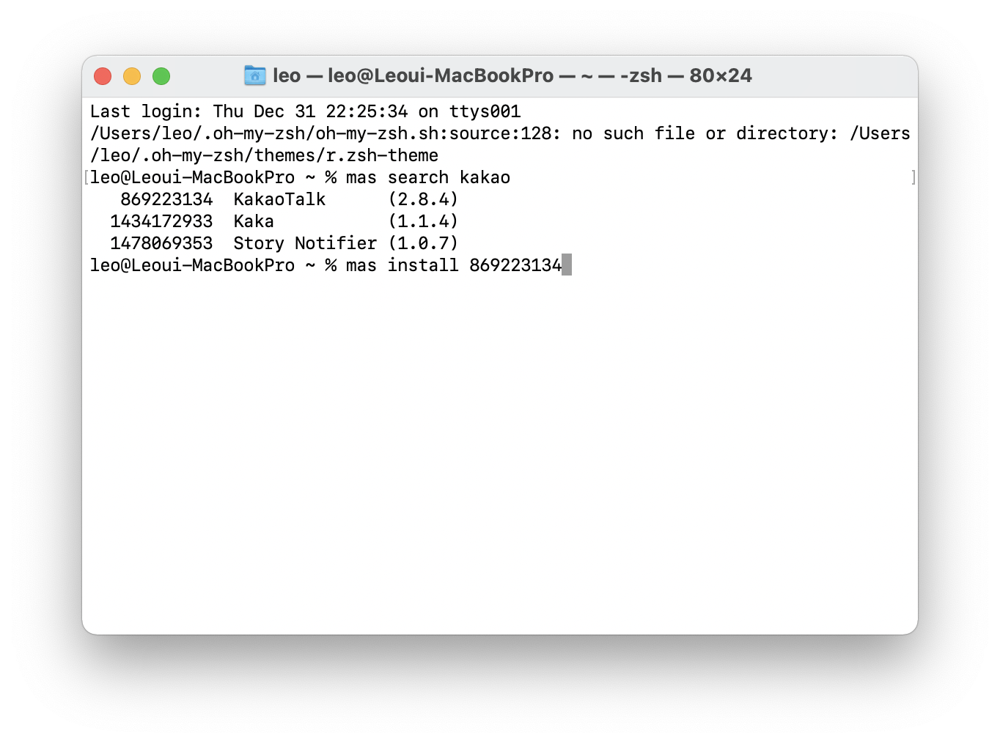

# brewFile

Homebrew로 패키지들을 관리하면 편한 이유는 여기에 있다. brewFile을 사용하면 한번에 원하는 패키지들을 설치하고 관리할 수 있다.

## brewFile 생성

```bash
$ brew bundle dump
```

명령어를 사용하면 홈디렉토리 위치에 brewFile이 생성된 것을 확인 할 수 있다. 이 파일은 내가 설치한 모든 패키지들을 담고 있고 더 필요한 패키지는 추가로 작성하고 반대로 필요없는 패키지는 삭제하는 등 수정이 가능하다.

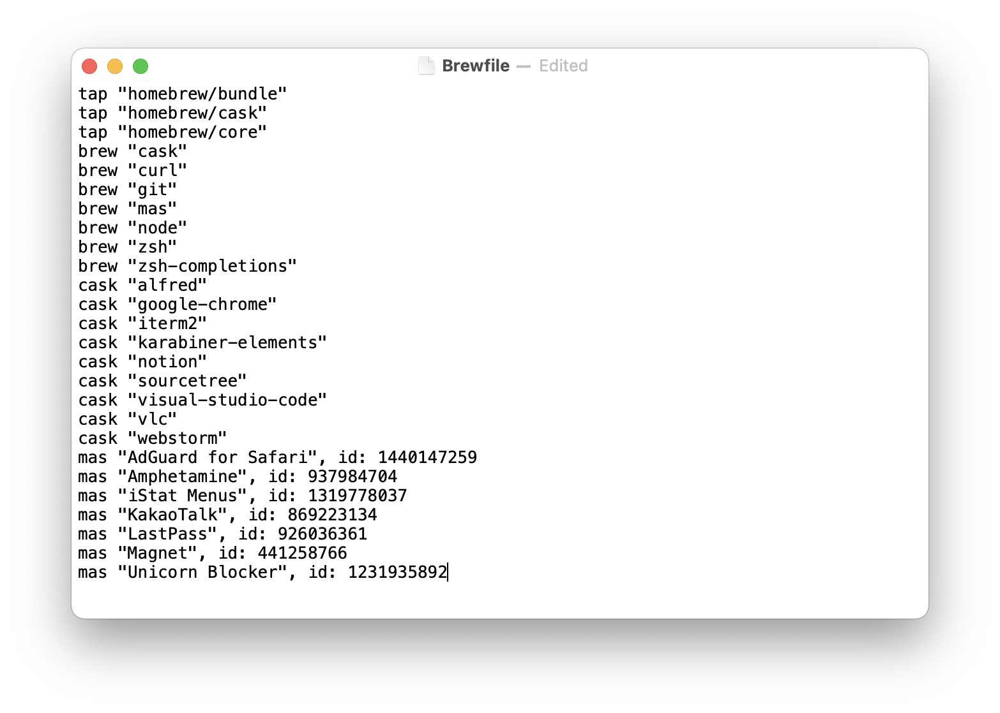

## brewFile 실행

```bash
$ brew bundle
```

brewFile이 위치한 곳에서 해당 명령어를 사용하면 brewFile에 작성된 애플리케이션들이 모두 설치된다.

<br>
