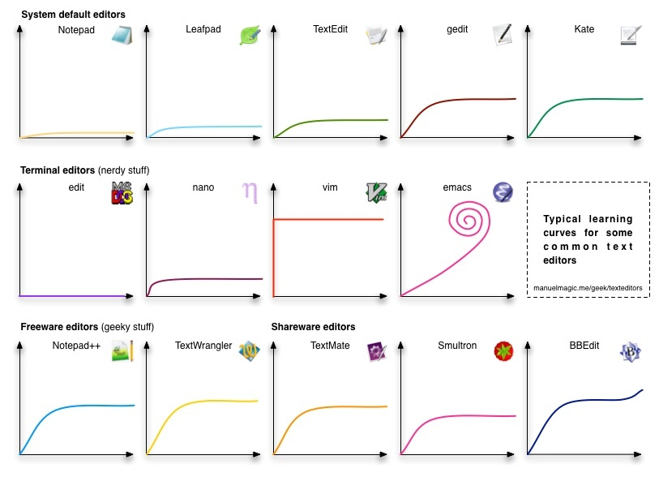
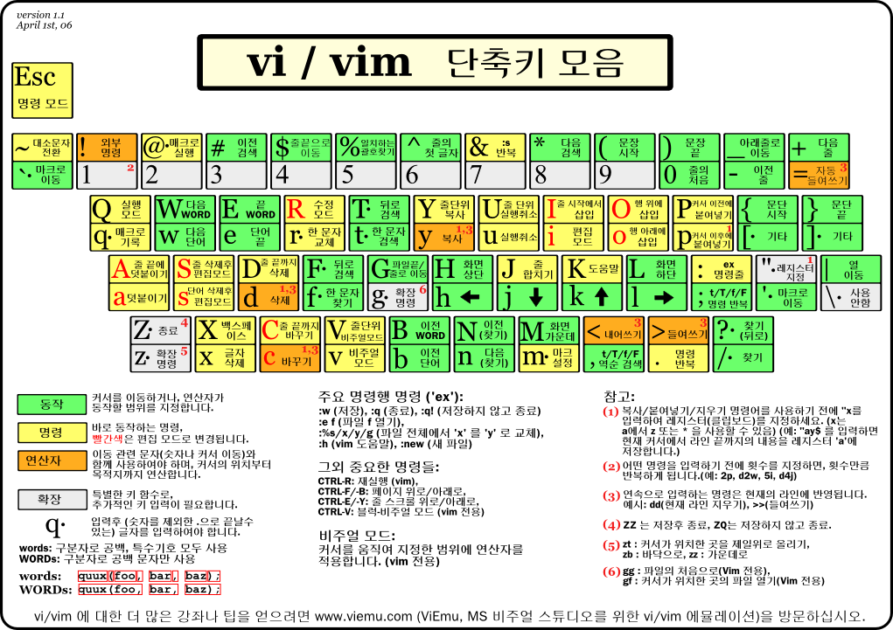

이 글에서는 Vim의 개념에서 시작해서 내가 Vim에 입문하게 된 계기와 연습 방법 그리고 주로 사용하는 단축키를 정리합니다.

# Vim이란?

**Vim(VI iMproved)은 리눅스 이전의 유닉스에서 사용하던 텍스트 에디터인 vi(visual editor)를 업그레이드한 버전이다.**

사실 Vim은 배우기에 매우 어렵다고 악명이 높은 텍스트 에디터이다. 이를 반증하듯이 관련된 재밌는 밈들이 많은데 다음 그림이 그 중 하나이다.

- `emacs`한테는 무슨 일이 있는 걸까...?

# Vim에 입문하게 된 3가지 이유

Vim이 어렵기로 악명 높은데도 내가 입문하게 된 이유는 다음과 같다.

1. 서버 환경에서 파일을 작성하고 수정하는 것에 익숙해질 수 있다는 점이 매력적이였음.
2. 코드 작성 중에 화살표 키나 마우스로 동선이 이탈되는게 비효율적이라고 생각함.
3. 해외 라이브 코딩 영상들을 볼 때 멋있어 보였음.

이러한 이유로 지금도 Vim을 애용하고 있지만 대부분의 하드 유저처럼 터미널 환경에서 개발 환경을 구축해놓고 사용하지는 않는다. **나는 IDE(VSCode)에 Vim 플러그인을 활용하는 조합을 좋아하는 편이다.**

사실 유튜브를 보다가 [devaslife](https://www.youtube.com/c/devaslife)라는 분을 발견해서 Neovim을 사용해서 동일한 개발 환경을 구축해보려고 긴 시간 삽질해봤었는데 결과물을 직접 사용해보니 깔끔한 걸 선호하는 내 취향이 아니였다. 결과적으로 현재로써 나의 생각은 `IDE + vim > vim >> IDE` 정도로 생각하고 있다. 근데 하나의 단점이 있다면 한글을 사용해야할 때 좀 불편하다. 영어권 사람들은 좋겠다..

# 연습 방법

내가 Vim을 처음 맞닥뜨렸을 때 가장 헷갈렸던 점이 화살표를 `hjkl`키로 사용한다는 점이 었는데 지금은 익숙해져서 훨씬 편하지만 그 때는 참 어려웠다. 초기에 익숙해지기 위한 여러 방법과 사이트를 찾아다녔는데 지금 생각해봤을 때 주로 도움이 된 소스는 다음과 같은 것들이었다. **나의 경우, 초기에 특히 Vimtutor랑 어드벤처가 도움이 되었다.**

- Vimtutor
- [Vim 어드벤처](https://vim-adventures.com/)
- [VimGolf](https://www.vimgolf.com/)

# 주요 단축키 정리

단축키는 내가 일일이 작성하는 것보다 아래의 2가지 소스가 제일 활용도가 높은 것 같다.

## 주요 단축키 모음

## Vim Cheat Sheet

- https://vim.rtorr.com/lang/ko

# 참조

- https://medium.com/@jungseobshin/vim-%EB%B0%B0%EC%9A%B0%EB%8A%94-%EB%B2%95-4%EC%A3%BC-%EA%B3%84%ED%9A%8D-77f3f7e263f7

 
