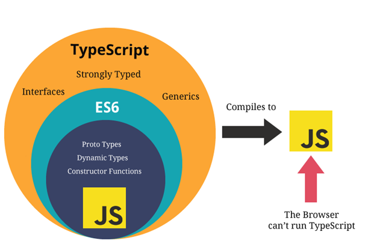

# 타입스크립트란?

**타입스크립트(Typescript)는 자바스크립트에 타입을 추가한 언어이다.** 자바스크립트를 확장한 언어라고 해서 주로 **자바스크립트의 상위집합(SuperSet)**이라고 한다. 타입스크립트가 하나의 언어이기는 하지만 Node나 브라우저는 자바스크립트만을 인식하기 때문에 타입스크립트를 자바스크립트로 변환하는 과정이 필요한데 이를 컴파일(Compile)이라고 한다.



타입스크립트를 사용하는 이유는 크게 2가지이다. **에러의 사전방지와 개발 생산성 향상이다.**

자바스크립트는 동적 타입 언어로써 런타임에 타입이 확정된다. 이런 특성 때문에 많은 사람이 협업하는 엔터프라이즈 환경에서 타입관련 에러가 많이 발생하는데 타입스크립트를 사용하면 이를 크게 방지할 수 있다.

또한 자바스크립트의 경우에 VSC와 같은 IDE에서 제대로된 자동완성 및 가이드가 잘 동작하지 않는다. 하지만 타입스크립트는 타입 추론을 통해 보다 스마트하게 이 기능을 지원하기 때문에 개발 생산성을 크게 향상 시킬 수 있다.

<br/>

## 설치하기

타입스크립트는 자바스크립트로 컴파일해야만 Node나 브라우저에서 동작할 수 있기 때문에 이를 수행할 패키지를 전역으로 설치한다

```bash
$ npm install -g typescript
```

## 적용하기

설치를 완료했다면 직접 `tsconfing.json` 파일을 생성하거나 다음 명령어를 사용해 설정파일을 생성할 수 있다.

```bash
$ tsc --init
```

```json
/* tsconfig.json */

{
  "compilerOptions": {
    "target": "es5",
    "module": "commonjs",
    "strict": true,
    "esModuleInterop": true
  }
}
```

## 컴파일하기

`tsconfig.json` 파일의 작성을 완료했다면 다음 명령어를 사용해서 `app.ts`를 `app.js`로 변환할 수 있다.

```bash
$ tsc app.ts
```

# 기초 문법

## 기본 타입

타입스크립트의 기본 타입은 `Boolean`, `Number`, `String`, `Object`, `Array`, `Tuple`, `Enum`, `Any`, `Void`, `Null`, `Undefined`, `Never` 로 12가지가 있다.

```ts
// String
let name: string = 'leo'

// Number
let year: number = 2021

// Boolean
let isLoggedIn: boolean = false

// Object
let person: { name: string; age: number } = {
  name: 'thor',
  age: 1000,
}

// Array
let arr: string[] = ['Ryan', 'Apeach', 'Con']
let arr: Array<string> = ['Ryan', 'Apeach', 'Con']

// Tuple: 길이가 고정되고 각 요소의 타입이 지정된 배열
let arr: [string, number, boolean] = ['leo', 2021, false]

// Enum: 특정 값들의 집합
enum KakaoFriends {
  Ryan,
  Apeach,
  Con,
}
let myFriend: KakaoFriends = KakaoFriends.Apeach

// Any: 모든 타입을 허용
let name: any = 'leo'
let year: any = 2021
let isMale: any = true

// Void: 변수에는 undefined와 null만 할당하고 함수에는 반환 값을 설정할수 없는 타입
let unuseful: void = undefined
function justLog(): void {
  console.log('hi')
}

// Never: 함수의 끝에 절대 도달하지 않는 의미를 가진 타입
function loop(): never {
  while (true) {}
}
```

## 함수 타입

타입스크립트에서 함수는 `매개 변수 타입`, `반환 타입`, `구조 타입`으로 크게 3가지 타입으로 정의할 수 있다.

```ts
// 매개 변수 a, b와 반환 타입을 지정
function sum(a: number, b: number): number {
  return a + b
}
sum(10, 20) // 30
sum(10) // error

// 구조 타입(인자의 개수를 제한하고 필요 시에 옵셔널 파라미터(?)로만 사용 허용)
function sum(a: number, b?: number): number {
  if (b) {
    return a + b
  }
  return a
}

sum(10, 20, 30) // Error
sum(10, 20) // 30
sum(10) // 10

// Rest 문법으로 두 번째의 인자부터는 모두 배열로 받는 것도 가능
function sum(a: number, ...nums: number[]): number {
  const totalOfNums = 0
  for (let key in nums) {
    totalOfNums += nums[key]
  }
  return a + totalOfNums
}

sum(1, 2, 3, 4, 5, 6, 7, 8, 9, 10) // 55
```

<br/>
