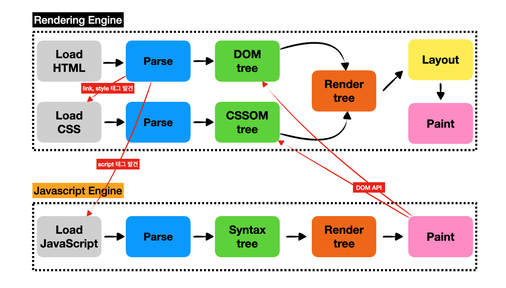
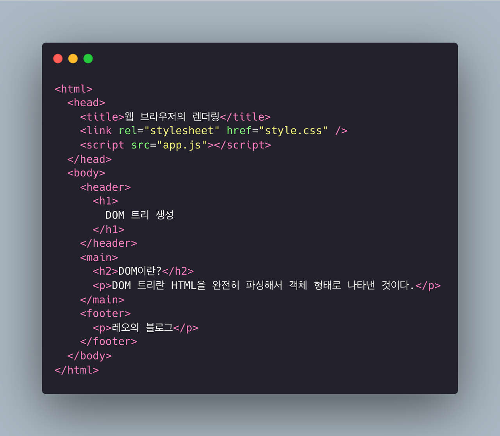
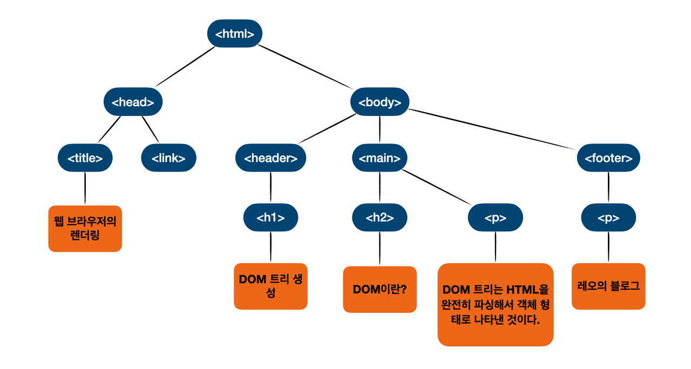
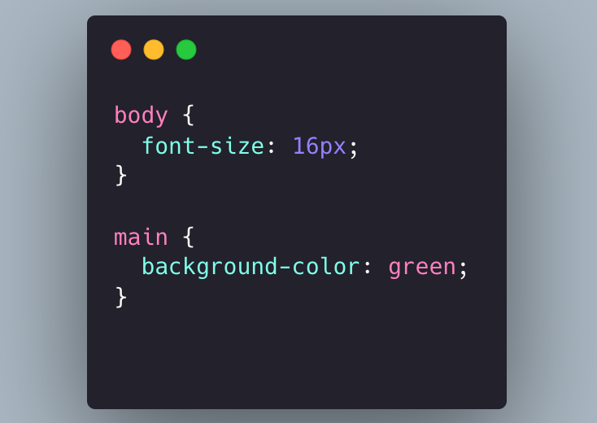
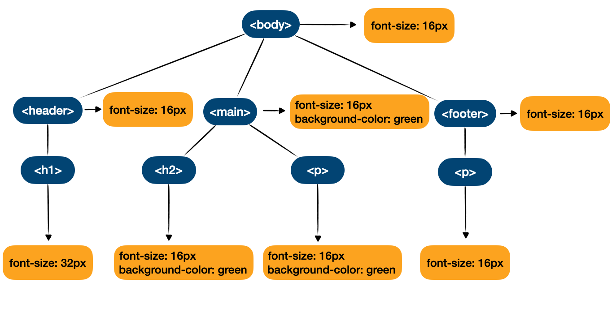
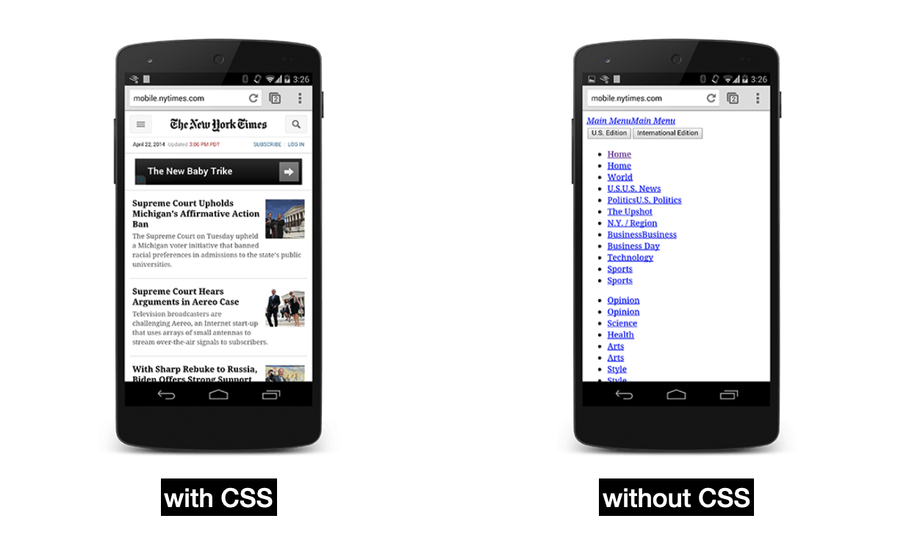
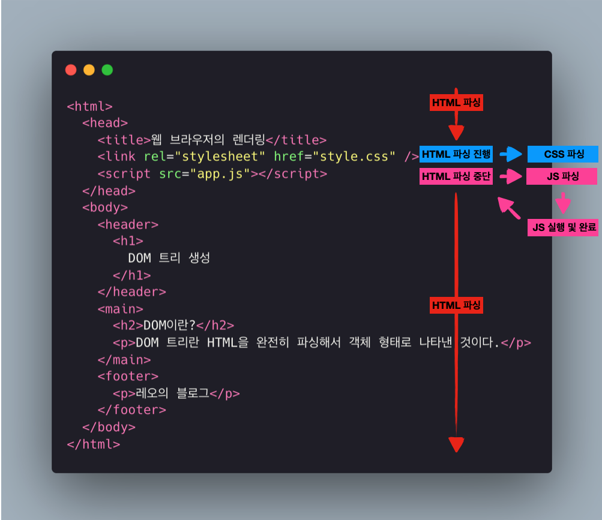
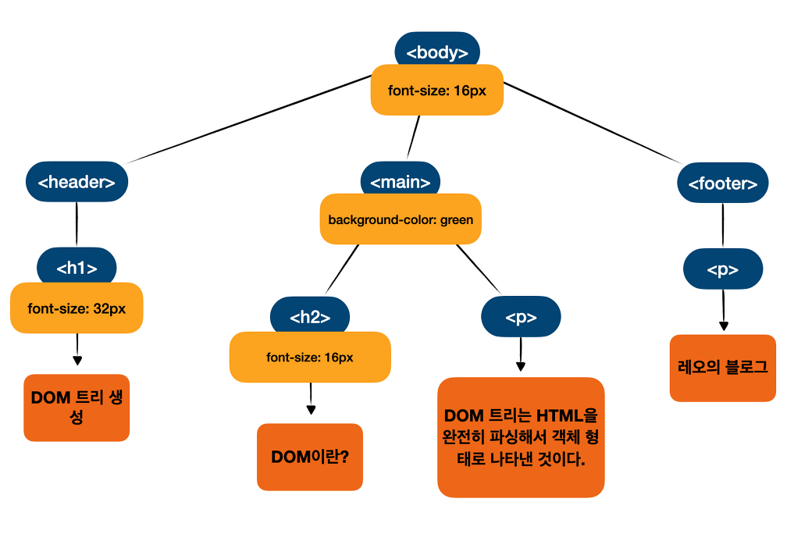

# Critical Rendering Path

일단 웹 브라우저가 웹 페이지를 출력하기 위해서는 서버로부터 HTML 파일을 다운받아서 사용자의 화면에 픽셀을 그려내기까지 많은 과정을 거친다. 이렇게 **웹 브라우저가 웹페이지를 최초로 그려내기 위해 필요한 일련의 과정을 Critical Rendering Path(CRP)라고 한다.**



이 과정은 크게 6단계로 구성되며 다음과 같다.

1. DOM 트리 생성
2. CSSOM 트리 생성
3. Javascript 실행
4. Render 트리 생성
5. Layout 구성
6. Painting

# DOM 트리 생성

**브라우저의 렌더링 엔진은 HTML을 파싱해서 브라우저가 이해할 수 있는 트리 형태의 자료구조인 DOM을 생성한다.**

여기서 DOM(Document Object Model)은 HTML을 완전히 파싱해서 객체 형태로 나타낸 것이다. 이는 최상위 요소인 `<html>` 부터 시작해서 웹 페이지 안에 있는 요소의 속성과 텍스트를 위한 노드들로 구성되며 다른 요소들의 내부에 중첩된 요소들은 서로 부모-자식 관계를 가진다.

다음의 HTML 파일을 DOM으로 생성해보면



다음과 같은 DOM이 생성된다.



# CSSOM 트리 생성

**브라우저의 렌더링 엔진이 HTML을 한 줄씩 파싱하면서 DOM을 생성하다가 `link` 태그나 `style` 태그를 만나면 DOM 생성과 동시에 CSS 파일을 로드한 후 로드된 CSS 파일과 `style` 태그 내의 CSS를 파싱해서 CSSOM(CSS Object Model)을 생성한다.**

정리하면 HTML 파싱을 진행하다가 CSS 관련 태그를 만나면 HTML 파싱 및 DOM 생성과 CSS 파싱 및 CSSOM 생성이 병렬적으로 동작한다.

위에서 사용했던 HTML의 `style.css`로 CSSOM를 생성해보면



다음과 같은 CSSOM이 생성된다.



위에서 언급한 병렬적 동작에 대해서 추가적으로 설명해보자면, **HTML과 CSS는 Render Blocking Resource(렌더 차단 리소스)이기 때문이다.**

이 의미는 DOM과 CSSOM이 생성 완료되기 전까지는 파싱까지는 완료하되 화면에 렌더링은 하지 않는다는 뜻이다. 그렇다면 그 이유는 대체 무엇일까?



HTML의 경우에는 DOM이 생성이 완료되지 않으면 렌더링할 것이 전혀 없기 때문에 그 이유가 납득이 된다. 하지만 CSS의 경우에는 이해가 잘 되지 않을 수 있다.

**그 이유는 CSS가 완전히 파싱되어서 CSSOM의 생성이 완료되기도 전에 렌더링을 해버린다면 위 그림과 같이 스타일이 적용되지 않은 페이지를 사용자에게 그대로 보여줄 것이다.** 이 페이지는 한눈에 봐도 사용성이 크게 떨어진다. 그래서 웹 브라우저는 DOM과 CSSOM의 생성이 완료될 때까지 렌더링을 차단하는 것이다.

# 자바스크립트 실행

HTML과 CSS를 동시에 파싱하다가 `script` 태그를 만나면 일단 진행하던 파싱을 중단한다. 그 이유는 **자바스크립트가 Parser Blocking Resource(파서 차단 리소스)이기 때문이다.**

이 말은 HTML을 파싱하다가 `script` 태그를 만나면 진행하던 파싱을 중단(Blocking)하고 자바스크립트 파일을 로드한 다음 자바스크립트 엔진에 제어권을 넘겨서 자바스크립트 파싱과 실행을 한 후에 완료되면 렌더링 엔진으로 다시 제어권을 넘겨서 파싱이 중단된 지점부터 다시 파싱을 시작해서 DOM과 CSSOM 생성을 재개한다는 의미이다.



하지만 자바스크립트가 HTML 파싱을 중단시키면서 크게 2가지 문제가 야기된다.

**첫 번째는 자바스크립트 파일을 로드하고 실행을 완료할 때까지 사용자의 화면에는 아무것도 렌더링되지 않는다는 문제이다.** 특히 파일을 로드하는 과정은 네트워크 I/O 인데 사용자의 환경에 따라 매우 긴 시간이 소요될 수 있다.

**두 번째는 자바스크립트 파일 내부에서 DOM API를 사용하는 경우에 참조에러가 발생한다는 문제이다.** 이는 당연하다. 자바스크립트 파일을 실행하는 시점에서는 아직 DOM이 구성되기 전이기 때문에 존재하지 않는 요소에 대한 접근은 에러를 발생시킨다.

이런 문제들을 해결하기 위해서 일반적으로 `script` 태그는 `body` 태그의 마지막에 위치시키거나 HTML5에서 추가된 `script` 태그의 `async`나 `defer` 속성을 사용한다.

# 렌더 트리 생성

DOM과 CSSOM의 생성과 자바스크립트 파일의 실행이 완료되었다면 자바스크립트 파일 내에 DOM API를 사용한 내용도 DOM과 CSSOM 트리에 반영되었을 것이다. **이제 DOM과 CSSOM을 조합해서 최종적으로 웹 페이지에 렌더링될 트리를 생성하는데 이를 렌더 트리(Render tree)라고 한다.** 렌더 트리는 사용자의 눈에 보이는 내용만을 포함하고 CSS의 ₩display: none₩과 같이 보이지 않는 요소는 포함하지 않는다.

지금까지의 예시의 DOM과 CSSOM으로 렌더 트리를 생성하면 다음과 같다.



# Layout 구성

**렌더 트리의 생성이 완료되면 다음과 같이 주로 `head` 태그 내에 작성하는 `viewport` 관련 `meta` 태그의 내용을 기준으로 각 HTML 요소들의 레이아웃(위치와 크기)을 계산한다.** 일반적으로 `viewport` 값은 사용자의 장치의 너비와 동일한 크기로 지정되어 있다.

```html
<meta name="viewport" content="width=device-width, initial-scale=1.0" />
```

# Painting

**마지막으로 Painting 단계는 웹 페이지에서 눈에 보이는 요소들을 화면에 출력될 픽셀들로 변환한다.** Painting에 시간이 얼마나 소요될지는 DOM의 크기와 CSSOM의 스타일 종류에 따라 달라지는데 예컨대 DOM의 내용이 많을 수록, CSSOM의 단순한 단색 배경보다는 복잡한 그라데이이션 배경을 사용할 수록 더 많은 시간이 소요된다.

# Reflow와 Repaint

P**ainting 단계까지 완료되면 웹 페이지의 렌더링이 모두 완료된 것이다.** 하지만 그 이후에 사용자의 이벤트가 발생해서 미리 작성된 자바스크립트 내의 DOM API가 실행되면 이로 인해 변경된 내용이 DOM과 CSSOM에 적용된 후 다시 렌더 트리를 생성하고 Layout 구성과 Painting 과정을 다시 거치게 된다.

**여기서 Layout을 다시 구성하는 과정을 리플로우(Reflow)라고 한다.** 이는 레이아웃을 다시 계산하는 것을 말하며 다음과 같은 상황이 발생한 경우에 한해서 실행된다.

- 자바스크립트에 의한 노드 추가 및 삭제
- 브라우저 창의 라사이징에 의한 `viewport` 크기 변경
- HTML 요소의 레이아웃에 변경을 발생시키는 스타일의 변경

<br/>

그리고 **Painting을 다시하는 과정을 리페인트(Repaint)라고 한다.** 이는 재결합된 렌더 트리를 기반으로 다시 Painting 하는 것을 말한다.

**여기서 포인트는 Reflow와 Repaint가 항상 동기적으로 같이 동작하지는 않는다는 점이다.** 레이아웃에 영향이 없는 렌더 트리의 변경일 경우에는 Repaint만 동작한다. 그리고 Reflow와 Repaint을 포함하는 리렌더링은 성능적으로 많은 리소스를 사용하는 작업이기 때문에 최대한 리렌더링이 발생하지 않도록 관리하는 것이 필수적이다.

# 참조

- https://bit.ly/357q8Vs
- https://developers.google.com/web/fundamentals/performance/critical-rendering-path/render-blocking-css?hl=ko

<br/>
