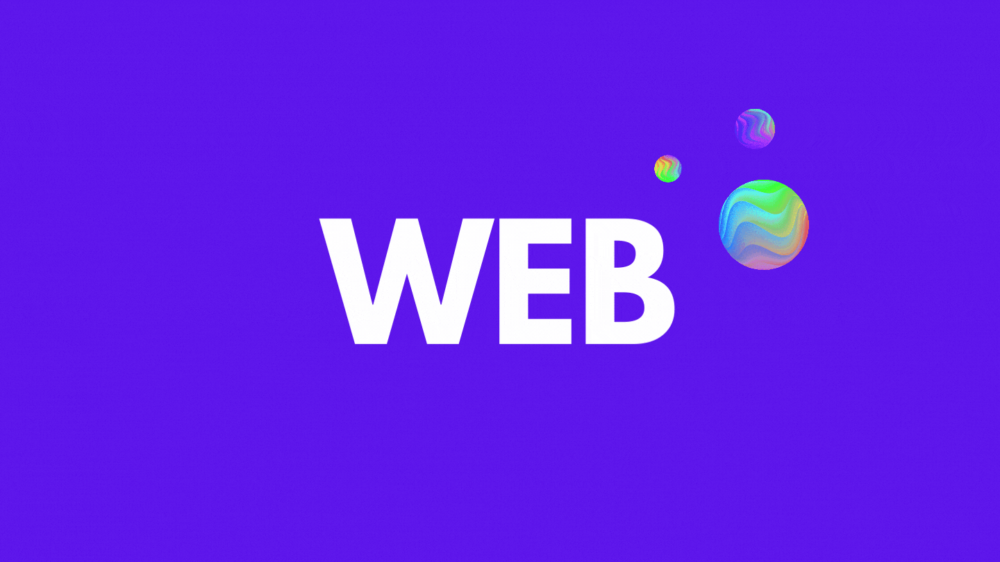
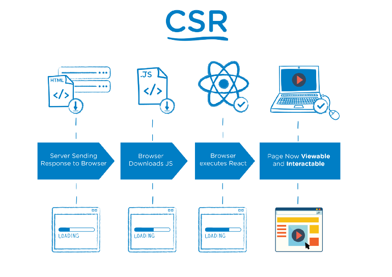
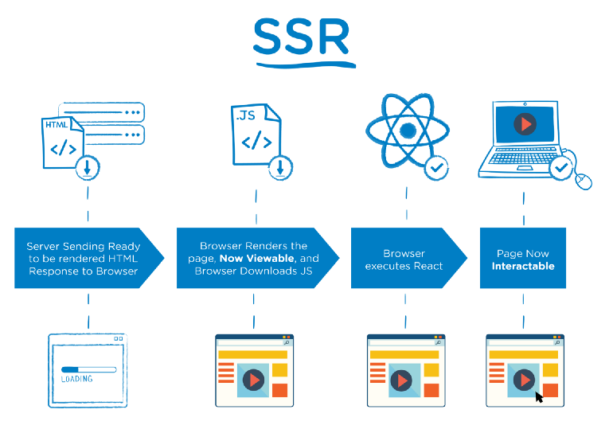
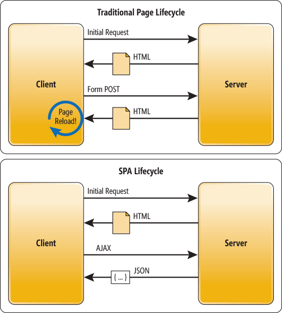

웹 개발자라면 제대로 이해하고 있어야할 용어인 CSR/SSR 뿐만 아니라 SPA/MPA, SSG, PWA, TTV, TTI에 대해서 정리합니다. 🧐

# CSR

**CSR은 한 마디로 요약하면 Client가 모든 일을 다한다는 의미이다.** 먼저 서버로부터 HTML 파일 받는데 이 HTML 파일의 body에는 `

` 와 자바스크립트의 링크들만 작성되어 있고 거의 빈 파일이다. 그렇기 때문에 처음 접속하면 빈 화면만 보인다.

그 다음 자바스크립트 링크를 통해서 작성한 로직뿐만 아니라 프레임워크와 라이브러리 소스를 포함한 `app.js`파일을 받고 여기서 추가로 필요한 데이터는 다시 서버에 요청해서 받는다. 이제 `app.js`와 추가 데이터를 기반으로 동적으로 HTML을 생성해서 웹사이트 사용자에게 보여준다.

## 장점

**1. 첫 로딩 이후에 사용자 경험(UX)이 좋다.**

- app.js 파일을 모두 받은 다음부터는 사용자에게 동적으로 빠르게 화면을 보여줄 수 있다.

 

**2. 서버에 추가적인 부하가 발생하지 않는다.**

- 대부분의 파일을 한번에 받고 HTML의 DOM 구성도 브라우저가 하기 때문에 서버에 추가적인 부하가 발생하지 않는

## 단점

**1. 사용자가 첫 화면을 보기까지 시간이 오래 걸린다.**

- 사용자에게 빈 HTML 파일을 보여준 다음 `app.js` 파일의 전송이 완료되어야 웹사이트를 보여줄 수 있다. 게다가 `app.js` 파일이 애플리케이션의 로직뿐만 아니라 프레임워크 및 라이브러리의 소스 파일을 전부 포함하고 있기 때문에 파일의 크기가 커서 시간이 오래 걸릴 수 있다.

 

**2. SEO가 취약하다.**

- `SEO(Search Engine Optimization)`는 검색엔진 최적화를 의미한다. Google과 네이버와 같은 검색엔진의 웹 크롤러가 완성된 웹사이트가 아닌 빈 HTML 파일만 분석하고 나가버릴 수 있기 때문에 검색엔진에 잘 노출되지 않을 수 있다.

 

**3. 페이지 캐싱이 잘 안된다.**

- 서버에서 빈 HTML 파일을 받은 다음 자바스크립트로 렌더링해서 사용자에게 화면을 보여주는 방식이기 때문에 서버에서 캐싱해야 할 페이지를 알 수가 없다.

# SSR

SSR은 CSR과 반대로 웹사이트에 접속하면 서버에서 필요한 데이터를 가져와서 직접 HTML 파일을 만들고 DOM까지 구성한 다음에 조금의 자바스크립트 소스코드와 함께 Client에 보내준다. 그러면 클라이언트에서는 바로 HTML 파일을 사용자에게 보여줄 수 있게 된다.

## 장점

**1. 사용자가 첫 페이지를 빨리 볼 수 있다.**

- 서버에서 HTML 파일의 DOM까지 구성해서 보내주기 때문에 Client에서 따로 연산할 필요없이 그대로 HTML 파일만 화면에 보여주면 되기 때문에 페이지 로딩이 빠르다.

 

**2. SEO가 좋다.**

- 서버로부터 받은 HTML에 DOM까지 구성되어있기 때문에 검색엔진의 웹 크롤러가 정상적으로 분석할 수 있다.

## 단점

**1. 깜빡임 이슈가 생긴다.**

- 사용자가 클릭할 때마다 서버에서 완전한 HTML 파일을 새로 불러오기 때문에 잠시 웹페이지가 비어있는 듯한 깜빡임이 발생하는데 이 때문에 좋지않은 사용자 경험(UX)을 줄 수 있다.

 

**2. 서버 과부하가 발생할 수 있다.**

- 사용자가 클릭할 때마다 서버에서 필요한 데이터를 가져와 HTML 파일의 DOM까지 구성해야 하기 때문에 서버가 보다 많은 연산을 수행하게 된다.

 

**3. TTV와 TTI 사이의 공백 시간이 생긴다.**

- CSR의 경우에는 TTV와 TTI가 동일하기 때문에 웹사이트가 화면에 보이는 동시에 클릭하더라도 반응한다. 하지만 SSR은 서버로부터 HTML 파일을 받아서 화면에 보여준 시점에는 사용자와 상호작용을 담당하는 자바스크립트 파일은 아직 받아오지 않은 상태이기 때문에 화면은 보이지만 클릭이 안되는 문제가 발생할 수 있다.

 

> **TTV(Time To View)**: 웹사이트에서 화면을 볼 수 있을 때까지의 시간을 의미

> **TTI(Time To Interact)**: 웹사이트에서 상호작용을 할 수 있는 때까지의 시간을 의미

# CSR과 SSR은 언제 사용해야하나요?

CSR과 SSR의 장단점을 보면 서로 정반대인 **Trade-Off 관계**에 있다는 것을 알 수 있다.

## CSR의 사용을 고려할 상황

- 네트워크 상태가 좋을 때
- 서버 성능이 좋지 않을 때
- 정적 리소스가 가벼울 때
- 상호작용해야 할 것이 많을 때

## SSR의 사용을 고려할 상황

- 네트워크 상태가 나쁠 때
- 서버 성능에 큰 문제 가 없을 때
- 정적 리소스가 무거울 때
- 상호작용해야 할 것이 별로 없을 때

# SSG

**SSG(Static Site Generation) CSR에 최적화 되어있는 React와 Gatsby와 같은 정적 사이트 생성 라이브러리를 함께 사용하는 방식이다.** React로 만든 웹 애플리케이션을 정적으로 웹페이지를 미리 생성해두고 서버에 배포해 놓을 수 있다. 뿐만 아니라 자바스크립트 파일을 가지고 있을 수 있어서 동적인 요소도 추가할 수 있다. 보통 블로그와 같은 플랫폼에 이 방식을 주로 사용한다.

# SPA vs MPA

S**PA(Single Page Application)는 한 개의 페이지로 구성된 애플리케이션**이고 **MPA(Multi Page Application)는 여러 개의 페이지들로 구성된 애플리케이션**을 의미한다.

SPA는 웹 애플리케이션에 필요한 정적 리소스들을 한번에 서버로부터 받고 이후에 새로운 페이지의 요청이 있으면 필요한 데이터만 요청하고 받아서 갱신한다. 이런 특성 때문에 자연스럽게 CSR 방식을 사용한다.

MPA는 새로운 페이지를 요청할 때마다 정적 리소스를 받아서 전체 페이지를 렌더링하기 때문에 SSR 방식을 사용한다.

 
